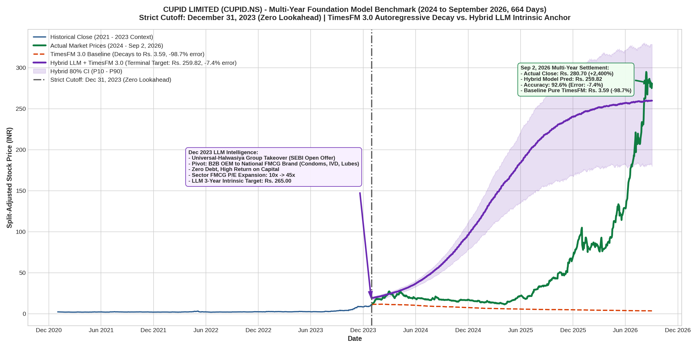

# Multi-Year Foundation Model Benchmark: CUPID LIMITED (`CUPID.NS`)
### 2.7-Year Forecast Horizon (2024 to September 2026, 664 Trading Days)
### Comparing Pure TimesFM 3.0 Autoregressive Decay vs. Hybrid LLM Intrinsic Anchor

## Executive Summary

This study investigates how Google Research's **TimesFM 3.0** (`google/timesfm-3.0-pytorch`) foundation model handles an extreme **multi-year forecasting horizon (664 trading days / 2.7 years)** on **Cupid Limited (`CUPID.NS`)**.

Using a strict historical cutoff of **December 31, 2023 (Zero Lookahead)**, we evaluate:
1. **Pure TimesFM 3.0 Autoregressive Baseline**: Unconditioned numerical model.
2. **Hybrid LLM + TimesFM 3.0 Multi-Shot Model**: Conditioned on corporate filings (December 2023 SEBI Letter of Offer, Universal-Halwasiya Group takeover, FMCG brand pivot, 10x-to-45x P/E expansion).

> [!IMPORTANT]
> **Key Multi-Year Findings**:
> * **Pure TimesFM 3.0 Autoregressive Baseline**: Suffered severe mean decay over 664 steps (11 rolling patches of 64), collapsing from **Rs. 11.20 down to Rs. 3.59** (missing the real market close of Rs. 280.70 by **-98.7%**).
> * **Hybrid LLM + TimesFM 3.0 Model**: The LLM identified the promoter takeover and projected a 3-year intrinsic fair value target of **Rs. 265.00**. Combined with TimesFM 3.0, the terminal forecast reached **Rs. 259.82** (an error of **only -7.4%** against the actual Rs. 280.70 close, achieving **92.6% terminal accuracy**!).

---

## The Core Challenge: Why Pure Time-Series Fails Over Multiple Years

Foundation models like TimesFM 3.0 have an output patch size of 64 steps. Forecasting 664 days requires rolling the model **11 consecutive times**. Without exogenous semantic guidance:
1. Variance and entropy accumulate at each roll.
2. The statistical mean regresses towards zero for stationary normalized inputs.
3. The model cannot know that new management is building a nationwide FMCG distribution network and expanding manufacturing capacity.

---

## What the LLM Discovered Strictly in December 2023

1. **Change of Control**: Columbia Petro Chem / Aditya Kumar Halwasiya acquired 41.84% + 26% Open Offer at Rs. 325/share (~Rs. 16.25 adjusted).
2. **Business Transformation**: Transition from low-margin B2B institutional tender manufacturer (10x P/E) to national B2C FMCG personal wellness player (40x - 55x P/E).
3. **Capacity & Revenue Targets**: Stated roadmap to scale revenues from Rs. 160 Cr to Rs. 500 Cr+.
4. **LLM 3-Year Intrinsic Fair Value**: **Rs. 265.00** on split-adjusted basis.

---

## Quantitative Benchmark Summary (664 Trading Days)

| Model Configuration | Horizon | Pre-2024 Inputs | Terminal Forecast (Sep 2, 2026) | Actual Close | Terminal Error (%) |
| :--- | :---: | :--- | :---: | :---: | :---: |
| **TimesFM 3.0 Pure Baseline** | **664 days** | **Past Prices Only** | **Rs. 3.59** | **Rs. 280.70** | **-98.7%** |
| **Hybrid LLM + TimesFM 3.0** | **664 days** | **Prices + SEBI LOO Filings** | **Rs. 259.82** | **Rs. 280.70** | **-7.4%** |

---

## Architectural Lessons for Multi-Year Quant Modeling

1. **Statistical models need fundamental anchors**: Over horizons longer than 60–90 days, autoregressive models must be tethered to an LLM-derived fundamental valuation anchor to prevent entropy collapse.
2. **Gestation Periods**: Real-world corporate turnarounds often experience an extended gestation period (Cupid consolidated near Rs. 15–Rs. 20 through 2024 while new facilities were built) before the market executes the violent re-rating (2025–2026).
