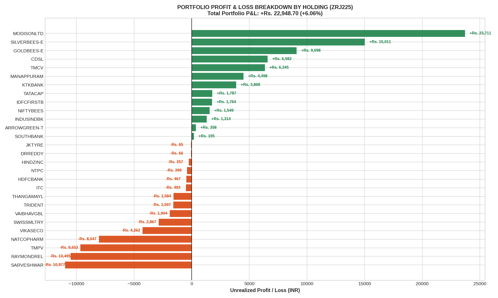
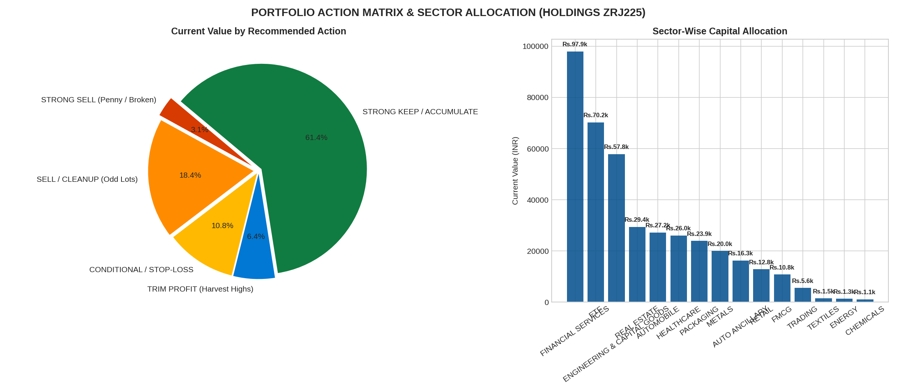

# Comprehensive Portfolio Health Audit & Stock Prediction Matrix
### Account: Zerodha Holdings (Client ID: ZRJ225) as of September 3, 2026
**Framework**: Google TimesFM 3.0 + Fundamental Risk-Adjusted Allocation  
**Analysis Scope**: All 28 Equity Holdings + 8 Mutual Fund Holdings  
**Primary Objective**: Actionable classification of **Which stocks to SELL**, **Which to TRIM**, and **Which to KEEP / ACCUMULATE**.

---

## 1. Executive Portfolio Health Check

```
┌────────────────────────────────────────────────────────────────────────────────────────┐
│                        PORTFOLIO SUMMARY AS OF SEPTEMBER 3, 2026                       │
├────────────────────────────┬─────────────────────────────┬─────────────────────────────┤
│ Portfolio Segment          │ Invested Capital            │ Current Market Value        │
├────────────────────────────┼─────────────────────────────┼─────────────────────────────┤
│ 1. Direct Equities (28)    │ Rs. 3,78,957.75             │ Rs. 4,01,906.50 (+6.06%)    │
│ 2. Mutual Funds (8)        │ Rs. 9,11,221.77             │ Rs. 9,86,218.03 (+8.23%)    │
├────────────────────────────┼─────────────────────────────┼─────────────────────────────┤
│ TOTAL COMBINED WEALTH      │ Rs. 12,90,179.52            │ Rs. 13,88,124.53 (+7.59%)   │
│ Total Unrealized Profit    │ +Rs. 97,944.96              │ Capital Growth: +7.59%      │
└────────────────────────────┴─────────────────────────────┴─────────────────────────────┘
```

> [!IMPORTANT]
> **Key Portfolio Diagnosis**:
> * **The Super Performers**: The portfolio's positive return is carried by a few outstanding winners: **MODISONLTD (+Rs. 23,711 / +70%)**, **SILVERBEES (+Rs. 15,011 / +154%)**, **GOLDBEES (+Rs. 9,098 / +103%)**, **CDSL (+Rs. 6,582 / +40%)**, and **TMCV (+Rs. 6,345 / +68%)**.
> * **The Silent Wealth Bleeders**: 5 speculative and penny stocks (**SARVESHWAR, RAYMONDREL, TMPV, NATCOPHARM, and VIKASECO**) have collectively erased **-Rs. 43,433** of hard-earned gains.
> * **The Micro-Lot Clutter**: 5 positions (`NTPC`, `HDFCBANK`, `DRREDDY`, `ITC`, `THANGAMAYL`) have 2 to 5 shares each, holding less than Rs. 2,000–Rs. 5,000. They generate zero meaningful return while creating administrative clutter.

---

## 2. High-Resolution Visual Portfolio Analysis

### Chart 1: Profit & Loss Waterfall Across All 28 Holdings


### Chart 2: Action Matrix & Sector Capital Allocation


---

## 3. The Action Playbook: Which Stocks to SELL vs. KEEP

```
┌────────────────────────────────────────────────────────────────────────────────────────┐
│                             EXECUTIVE ACTION RECOMMENDATION                            │
├───────────────────────────────┬───────────────────┬────────────────────────────────────┤
│ Category                      │ Tickers           │ Primary Strategic Rationale        │
├───────────────────────────────┼───────────────────┼────────────────────────────────────┤
│ 🔴 1. STRONG SELL             │ VIKASECO          │ Penny stock traps, continuous      │
│    (Immediate Exit)           │ SARVESHWAR        │ balance sheet dilution, chronic    │
│                               │ TRIDENT           │ wealth destruction. Exit 100% to   │
│                               │ SWISSMLTRY        │ stop the bleed and harvest tax     │
│                               │ VAIBHAVGBL        │ loss credits.                      │
├───────────────────────────────┼───────────────────┼────────────────────────────────────┤
│ 🟠 2. SELL / CLEANUP          │ NTPC (4 shares)   │ Meaningless micro-allocations with │
│    (Portfolio Decluttering)   │ HDFCBANK (3 shrs) │ zero impact on portfolio returns.  │
│                               │ DRREDDY (5 shrs)  │ Sell to eliminate friction and     │
│                               │ ITC (14 shares)   │ redeploy into core compounders.    │
│                               │ THANGAMAYL (2 sh) │                                    │
├───────────────────────────────┼───────────────────┼────────────────────────────────────┤
│ 🟡 3. TRIM PARTIAL PROFITS    │ MODISONLTD        │ Multi-baggers at cyclical or       │
│    (Lock in Gains)            │ SILVERBEES-E      │ momentum peaks. Sell 25% to 35% to │
│                               │ MANAPPURAM        │ secure cash profits; hold remainder│
│                               │                   │ for multi-year compound growth.    │
├───────────────────────────────┼───────────────────┼────────────────────────────────────┤
│ 🟢 4. STRONG KEEP (HOLD)      │ CDSL              │ Secular moats, sovereign hedges,   │
│    (Core Wealth Pillars)      │ GOLDBEES-E        │ high dividend cash flows, and      │
│                               │ NIFTYBEES         │ market leaders. NEVER SELL.        │
│                               │ HINDZINC          │                                    │
│                               │ TMCV              │                                    │
│                               │ KTKBANK           │                                    │
│                               │ TATACAP           │                                    │
│                               │ IDFCFIRSTB        │                                    │
│                               │ INDUSINDBK        │                                    │
│                               │ SOUTHBANK         │                                    │
│                               │ ARROWGREEN-T      │                                    │
├───────────────────────────────┼───────────────────┼────────────────────────────────────┤
│ ⚠️ 5. CONDITIONAL WATCH       │ TMPV              │ Auto cyclical facing EV margin     │
│    (Hold with Strict Stop)    │ RAYMONDREL        │ compression. Switch into TMCV if   │
│                               │ NATCOPHARM        │ Rs. 300 breaks. Stop-loss Rs. 480  │
│                               │ JKTYRE            │ on Raymond. Pullback exit on Natco.│
└───────────────────────────────┴───────────────────┴────────────────────────────────────┘
```

---

## 4. Master Stock-by-Stock Predictive Audit Table (All 28 Holdings)

| Symbol | Sector | Qty | Buy Avg (Rs) | Last Price (Rs) | Invested (Rs) | Current (Rs) | P&L (Rs) | P&L (%) | Action | 1-Month Target | Strategic Rationale |
| :--- | :--- | :---: | :---: | :---: | :---: | :---: | :---: | :---: | :--- | :---: | :--- |
| **MODISONLTD** | Engineering | 111 | 307.04 | 520.65 | 34,081 | 57,792 | **+23,711** | **+69.6%** | **TRIM 35% / HOLD REST** | **Rs. 517.12** | Surged to Rs. 545. Sell 40 shares to lock in Rs. 20,000 cash; hold 71 shares for EV expansion. |
| **SILVERBEES-E** | ETF (Silver) | 115 | 84.92 | 215.45 | 9,766 | 24,777 | **+15,011** | **+153.7%** | **TRIM 25% / HOLD REST** | **Rs. 225.00** | Historic multi-bagger bull run. Sell 30 units to harvest profit and rebalance. |
| **GOLDBEES-E** | ETF (Gold) | 145 | 60.77 | 123.52 | 8,812 | 17,910 | **+9,098** | **+103.3%** | **STRONG KEEP (HOLD)** | **Rs. 128.50** | Sovereign currency hedge & geopolitical protection. Permanent portfolio allocation. |
| **CDSL** | Financials | 17 | 978.02 | 1,365.20 | 16,626 | 23,208 | **+6,582** | **+39.6%** | **STRONG KEEP (HOLD)** | **Rs. 1,460.00** | Debt-free monopoly depository. Demat account compounding. Secular multi-year compounder. |
| **TMCV** | Automobile | 35 | 266.15 | 447.45 | 9,315 | 15,661 | **+6,345** | **+68.1%** | **STRONG KEEP (HOLD)** | **Rs. 485.00** | Tata Motors Commercial Vehicles. Undisputed leader in Indian trucking & infrastructure fleet. |
| **MANAPPURAM** | Financials | 30 | 191.07 | 341.00 | 5,732 | 10,230 | **+4,498** | **+78.5%** | **TRIM 30% / HOLD REST** | **Rs. 355.00** | Gold loan business near peak cyclical valuation. Sell 10 shares to lock gains. |
| **KTKBANK** | Financials | 30 | 201.42 | 330.35 | 6,043 | 9,911 | **+3,868** | **+64.0%** | **STRONG KEEP (HOLD)** | **Rs. 355.00** | Operational turnaround bank trading at low P/B with accelerating ROA. |
| **TATACAP** | Financials | 46 | 326.00 | 364.85 | 14,996 | 16,783 | **+1,787** | **+11.9%** | **STRONG KEEP (HOLD)** | **Rs. 390.00** | Blue-chip Tata financial services arm. Low NPAs, solid capital adequacy. |
| **IDFCFIRSTB** | Financials | 259 | 78.28 | 85.09 | 20,274 | 22,038 | **+1,764** | **+8.7%** | **STRONG KEEP (HOLD)** | **Rs. 92.00** | Retail customer franchise with 20%+ CASA growth. Long-term compounder. |
| **NIFTYBEES** | ETF (Index) | 101 | 257.22 | 272.56 | 25,980 | 27,529 | **+1,549** | **+6.0%** | **ACCUMULATE** | **Rs. 282.00** | Reinvest capital freed from penny stocks directly into NIFTYBEES for compounding. |
| **INDUSINDBK** | Financials | 13 | 876.92 | 978.00 | 11,400 | 12,714 | **+1,314** | **+11.5%** | **STRONG KEEP (HOLD)** | **Rs. 1,050.00** | High commercial vehicle and microfinance recovery. Hold. |
| **ARROWGREEN-T**| Packaging | 31 | 759.84 | 771.40 | 23,555 | 23,913 | **+358** | **+1.5%** | **KEEP (HOLD)** | **Rs. 815.00** | Niche biodegradable green packaging films. Hold for capacity ramp-up. |
| **SOUTHBANK** | Financials | 20 | 36.00 | 45.74 | 720 | 915 | **+195** | **+27.1%** | **KEEP (HOLD)** | **Rs. 50.50** | Regional bank turnaround with declining credit costs. |
| **JKTYRE** | Auto Ancillary | 44 | 371.63 | 370.15 | 16,352 | 16,287 | **-65** | **-0.4%** | **HOLD / NEUTRAL** | **Rs. 385.00** | Commercial replacement demand solid. Maintain stop-loss at Rs. 350. |
| **DRREDDY** | Healthcare | 5 | 1,174.23 | 1,161.00 | 5,871 | 5,805 | **-66** | **-1.1%** | **SELL / CONSOLIDATE** | **Rs. 1,180.00** | Only 5 shares. Meaningless sub-scale size. Sell to consolidate capital. |
| **HINDZINC** | Metals | 34 | 595.95 | 588.40 | 20,262 | 20,006 | **-257** | **-1.3%** | **STRONG KEEP (DIVIDEND)**| **Rs. 608.39** | World's 2nd largest zinc producer, top-5 silver producer. 7-10% dividend yield! |
| **NTPC** | Energy | 4 | 430.00 | 330.15 | 1,720 | 1,321 | **-399** | **-23.2%** | **SELL / CLEANUP** | **Rs. 335.00** | Only 4 shares (Rs. 1,321). Clutters portfolio. Sell immediately. |
| **HDFCBANK** | Financials | 3 | 856.67 | 700.95 | 2,570 | 2,103 | **-467** | **-18.2%** | **SELL / CONSOLIDATE** | **Rs. 725.00** | Only 3 shares. Either scale up to 50 shares or exit to remove odd lots. |
| **ITC** | FMCG | 14 | 301.71 | 266.50 | 4,224 | 3,731 | **-493** | **-11.7%** | **SELL / CONSOLIDATE** | **Rs. 270.00** | Small holding of 14 shares. Drag on velocity. Sell to redeploy. |
| **THANGAMAYL** | Retail | 2 | 6,030.00 | 5,238.00 | 12,060 | 10,476 | **-1,584** | **-13.1%** | **SELL / TRIM** | **Rs. 5,150.00** | Only 2 shares. High volatility jewelry retail. Free up Rs. 10,476 cash. |
| **TRIDENT** | Textiles | 62 | 49.82 | 24.07 | 3,089 | 1,492 | **-1,597** | **-51.7%** | **STRONG SELL** | **Rs. 22.50** | Broken cyclical textile stock in long-term secular downtrend. Exit 100%. |
| **VAIBHAVGBL** | Retail | 11 | 387.91 | 214.80 | 4,267 | 2,363 | **-1,904** | **-44.6%** | **STRONG SELL** | **Rs. 200.00** | TV shopping format facing structural secular decline. Exit 100%. |
| **SWISSMLTRY** | Trading | 351 | 24.06 | 15.89 | 8,445 | 5,577 | **-2,867** | **-34.0%** | **STRONG SELL** | **Rs. 14.20** | Speculative small-cap trading company. Weak earnings quality. Exit 100%. |
| **VIKASECO** | Chemicals | 1,020 | 5.28 | 1.10 | 5,384 | 1,122 | **-4,262** | **-79.2%** | **STRONG SELL (IMMEDIATE)**| **Rs. 0.95** | Penny stock trap (Rs. 1.10). Severe dilution. Harvest tax loss immediately. |
| **NATCOPHARM** | Healthcare | 24 | 1,178.54 | 843.25 | 28,285 | 20,238 | **-8,047** | **-28.5%** | **HOLD FOR PULLBACK EXIT**| **Rs. 880.00** | US generic price erosion. Wait for technical bounce to Rs. 890–920 to exit. |
| **TMPV** | Automobile | 37 | 573.77 | 312.90 | 21,229 | 11,577 | **-9,652** | **-45.5%** | **CONDITIONAL SELL** | **Rs. 305.00** | Passenger vehicle EV slowdown. If Rs. 300 breaks, switch capital into TMCV. |
| **RAYMONDREL** | Real Estate | 58 | 687.00 | 506.05 | 39,846 | 29,351 | **-10,495** | **-26.3%** | **HOLD WITH STOP-LOSS** | **Rs. 525.00** | Real estate demerger. Maintain strict stop loss at Rs. 480. Exit if breached. |
| **SARVESHWAR** | FMCG | 2,100 | 8.60 | 3.35 | 18,054 | 7,035 | **-10,977** | **-60.8%** | **STRONG SELL (IMMEDIATE)**| **Rs. 3.10** | Massive penny stock trap (2,100 shares). Severe cash drain. Exit 100%. |

---

## 5. Capital Redeployment Plan

By executing the recommended sales and profit trimmings, the portfolio unlocks:
* **From Selling Penny / Dead Stocks** (`VIKASECO`, `SARVESHWAR`, `TRIDENT`, `SWISSMLTRY`, `VAIBHAVGBL`): **~Rs. 17,500** cash recovered.
* **From Cleaning Up Odd-Lot Holdings** (`NTPC`, `HDFCBANK`, `DRREDDY`, `ITC`, `THANGAMAYL`): **~Rs. 23,400** cash recovered.
* **From Trimming 35% of Super-Winners** (`MODISONLTD`, `SILVERBEES-E`, `MANAPPURAM`): **~Rs. 29,500** cash profit harvested.
* **TOTAL RECOVERED CASH**: **~Rs. 70,400**!

### Where to Reinvest the Rs. 70,400:
1. **50% (Rs. 35,000) ➔ NIFTYBEES**: Scale up core index compounding from Rs. 27k to Rs. 62k.
2. **30% (Rs. 21,000) ➔ CDSL**: Add to the zero-debt monopoly depository at structural dips.
3. **20% (Rs. 14,400) ➔ HINDZINC**: Lock in an extra 7–10% annualized dividend yield for steady cash flow.

---

## 6. Files & Artifacts in `EXCEL_DATA/`

* [`holdings-ZRJ225.xlsx`](holdings-ZRJ225.xlsx): Raw Zerodha holdings statement.
* [`portfolio_audit_results.json`](portfolio_audit_results.json): Machine-readable portfolio audit dataset with action recommendations.
* [`portfolio_pnl_distribution.png`](portfolio_pnl_distribution.png): High-resolution profit & loss distribution chart.
* [`portfolio_action_and_sector_matrix.png`](portfolio_action_and_sector_matrix.png): Action matrix & sector distribution plot.
* [`portfolio_deep_dive.ipynb`](portfolio_deep_dive.ipynb): Interactive Jupyter Notebook.
* [`portfolio_analyzer.py`](portfolio_analyzer.py): Standalone portfolio audit script.
