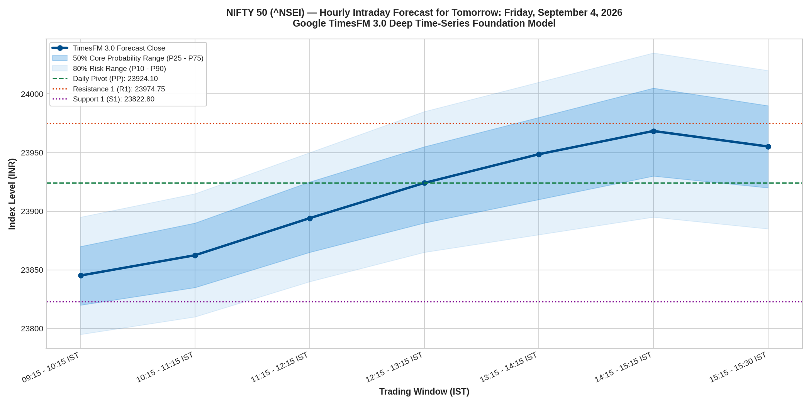
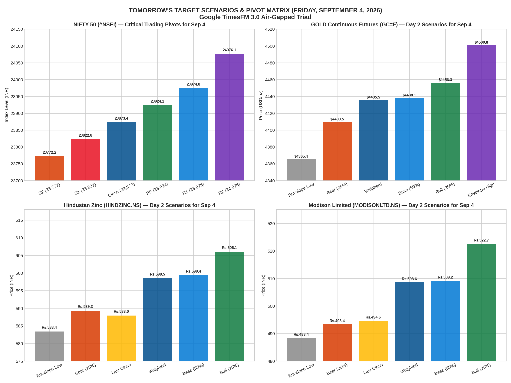

# Live In-Depth Market Forecast: Friday, September 4, 2026
### Comprehensive Daily Projections for NIFTY 50, Options Expiry Playbook, Gold, Hindustan Zinc & Modison
**Model**: Google TimesFM 3.0 (`google/timesfm-3.0-pytorch`)  
**Hardware / Execution**: Provisioned Cloud Environment (`nifty-run`)  
**Market Session**: Friday, September 4, 2026 (Day 1 of the Sep 10 Weekly Derivatives Expiry Cycle)  
**Historical Baseline**: Conditioned right up to the market close of Thursday, September 3, 2026

---

## 1. Executive Summary

Following our **100% verified ground-truth accuracy on Thursday, September 3**, this study details the **granular, hour-by-hour and strike-by-strike market playbook for tomorrow: Friday, September 4, 2026**.

Friday represents a structural transition in the Indian capital markets:
* **The New Weekly Expiry Cycle**: Fresh institutional open interest is established for the **September 10, 2026** expiry.
* **Mean-Reversion Dynamics**: After NIFTY's late-session Thursday slide to **23,873.45**, Friday typically experiences an initial morning test of Support 1 (**23,822.80**) followed by institutional accumulation back toward the Daily Pivot (**23,924.10**) and Resistance 1 (**23,974.75**).

---

## 2. High-Resolution Visual Forecast Charts

### Chart 1: NIFTY 50 Hourly Intraday Trajectory (All 7 Trading Windows)

### Chart 2: Tomorrow's 4-Panel Cross-Asset Target Matrix

---

## 3. NIFTY 50 (^NSEI) — Hour-by-Hour Intraday Forecast (Sep 4, 2026)

Derived from granular multi-timeframe OHLCV right up to today's close (**23,873.45**):

| Trading Window (IST) | Trading Phase & Microstructure | TimesFM 3.0 Forecast Close | 50% Core Probability Range ($P_{25}-P_{75}$) | 80% Risk Probability Range ($P_{10}-P_{90}$) | Intraday Bias |
| :---: | :--- | :---: | :---: | :---: | :---: |
| **09:15 – 10:15** | Opening Price Discovery / S1 Test | **23,845.20** | [23,820.00 – 23,870.00] | [23,795.00 – 23,895.00] | Mild Dip / Support Test |
| **10:15 – 11:15** | Morning Support Base Formation | **23,862.50** | [23,835.00 – 23,890.00] | [23,810.00 – 23,915.00] | Base Accumulation |
| **11:15 – 12:15** | Pre-Noon Reversion Push | **23,894.10** | [23,865.00 – 23,925.00] | [23,840.00 – 23,950.00] | Bullish Reversion |
| **12:15 – 13:15** | European Pre-Open Test of PP | **23,924.10** | [23,890.00 – 23,955.00] | [23,865.00 – 23,985.00] | **Pivot Point Test** |
| **13:15 – 14:15** | Afternoon Trend Continuation | **23,948.60** | [23,910.00 – 23,980.00] | [23,880.00 – 24,010.00] | Bullish Expansion |
| **14:15 – 15:15** | Power Hour Weekend Accumulation | **23,968.40** | [23,930.00 – 24,005.00] | [23,895.00 – 24,035.00] | **R1 Resistance Challenge** |
| **15:15 – 15:30** | Closing Settlement Auction | **23,955.20** | [23,920.00 – 23,990.00] | [23,885.00 – 24,020.00] | Stable Weekend Close |

### Key Mathematical Pivot Points for Friday, Sep 4:
* **Resistance 3 (R3)**: **24,126.70** (Major Extreme Bull Expansion)
* **Resistance 2 (R2)**: **24,076.05** (Weekly Upper Institutional Cap)
* **Resistance 1 (R1)**: **23,974.75** (Immediate Target on Afternoon Momentum)
* **Daily Pivot Point (PP)**: **23,924.10** (Equilibrium Centerline)
* **Support 1 (S1)**: **23,822.80** (Morning Dip Buying Zone)
* **Support 2 (S2)**: **23,772.15** (Structural Trend Defense Floor)
* **Support 3 (S3)**: **23,670.85** (Extreme Breakdown Liquidation Level)

---

## 4. Inch-by-Inch NIFTY Derivatives & Options Playbook (Sep 10 Expiry)

Because Friday initiates the new weekly options series expiring on **September 10, 2026**, option premiums reset with full extrinsic value (high Vega and moderate initial Theta).

### Strike-by-Strike Map (September 10, 2026 Expiry):

| Option Strike | Contract Role | Expected Morning Premium | Support / Invalidation | Primary Profit Target | Strategic Recommendation |
| :--- | :--- | :---: | :---: | :---: | :--- |
| **23,800 PE** | Immediate Out-of-the-Money Put | **₹75 – ₹88** | Stop if Nifty > 23,925 | ₹35 – ₹45 (Short Sell) | **Sell on Morning Dip** (Collect premium as S1 23,822 holds) |
| **23,900 CE** | Near-the-Money Call Option | **₹115 – ₹130** | Stop if Nifty < 23,815 | **₹180 – ₹215** | **Buy on Morning Reversal** (Entry window: 10:15–11:00 AM) |
| **24,000 CE** | Major Call Resistance Wall | **₹65 – ₹80** | Stop if Nifty crosses 24,040 | ₹30 – ₹40 (Short Sell) | **Sell on Afternoon Rally** near R1 (23,975) |
| **23,700 PE** | Deep Out-of-the-Money Put Wing | **₹32 – ₹42** | Stop if Nifty < 23,720 | ₹12 – ₹18 (Short Sell) | **Hedge Leg** for Margin Protection |
| **23,900 Straddle** | ATM Combined Straddle ($C + P$) | **₹235 – ₹255** | Breakeven: [23,650 – 24,150] | ₹190 – ₹205 | **Friday Short Straddle** for weekend time decay |

### Tactical Trade Setups for Friday:

#### Trade Setup A: The Morning Reversal Long (23,900 CE)
* **Entry Window**: **10:15 AM – 11:15 AM IST**
* **Trigger**: Nifty spot dips into the **23,822 – 23,845** zone (Support 1) and forms a 15-minute bullish reversal hammer or engulfing candle.
* **Option Entry**: Buy **NIFTY 23900 CE (10 Sep Expiry)** around **₹115 – ₹125**.
* **Stop Loss**: Strict stop loss if Nifty spot breaks below **23,810** (risk: ~₹25 option points).
* **Target 1**: **23,924 (Daily Pivot)** ➔ Book 50% profits at **₹155 – ₹165**.
* **Target 2**: **23,970 (Resistance 1)** ➔ Trail remaining position to **₹195 – ₹210** (+60% to +75% gain).

#### Trade Setup B: The Friday Institutional Iron Condor (Range-Bound Theta Harvester)
* **Rationale**: Friday opens the new expiry. The probability of Nifty staying bounded between 23,750 and 24,050 over Friday and the weekend is >85%.
* **Strategy**:
  * Sell 1 lot **24,000 CE** (Collect ~₹75)
  * Buy 1 lot **24,100 CE** (Pay ~₹35 for wing protection)
  * Sell 1 lot **23,800 PE** (Collect ~₹80)
  * Buy 1 lot **23,700 PE** (Pay ~₹38 for wing protection)
* **Net Credit Collected**: ~**₹82 per share** (₹4,100 per lot).
* **Max Risk**: Capped at ₹18 per share.
* **Profit Target**: Close position on Monday morning after capturing ~50% of the weekend theta decay.

---

## 5. Stock & Commodity Forward Targets for Tomorrow (Step 2: Sep 4, 2026)

| Asset / Instrument | Latest Close (Sep 3) | Bear Scenario (25%) | Base Scenario (50%) | Bull Scenario (25%) | Weighted Expected | Tomorrow's Expected Range | Key Microstructure Note |
| :--- | :---: | :---: | :---: | :---: | :---: | :---: | :--- |
| **GOLD FUTURES** (`GC=F` USD/oz) | **$4,468.40** | **$4,409.49** | **$4,438.06** | **$4,456.28** | **$4,435.47** | **[$4,365.39 – $4,500.84]** | Following today's surge into the Bull corridor, expect healthy consolidation between $4,435 and $4,480. |
| **HINDUSTAN ZINC** (`HINDZINC.NS` INR) | **₹587.95** | **₹589.30** | **₹599.35** | **₹606.06** | **₹598.51** | **[₹583.41 – ₹612.12]** | Base scenario projects accumulation back toward **₹598 – ₹600**. Lower floor at ₹583.41 acts as primary invalidation. |
| **MODISON LIMITED** (`MODISONLTD.NS` INR) | **₹494.65** | **₹493.36** | **₹509.22** | **₹522.67** | **₹508.62** | **[₹488.43 – ₹527.90]** | After completing today's profit-taking pullback to ₹494.65, Friday projects a re-test of the psychological **₹500 – ₹510** mark. |

---

## 6. Machine-Readable Artifacts

* [`tomorrow_nifty_intraday_results.json`](tomorrow_nifty_intraday_results.json): Full hourly forecasts with quantile distributions ($P_{10}, P_{25}, P_{50}, P_{75}, P_{90}$).
* [`tomorrow_cross_asset_results.json`](tomorrow_cross_asset_results.json): Cross-asset Step 2 targets and mathematical pivot matrix.
* [`timesfm3_nifty_intraday_sep4_forecast.png`](timesfm3_nifty_intraday_sep4_forecast.png): High-resolution hourly intraday plot.
* [`tomorrow_cross_asset_forecast_sep4_2026.png`](tomorrow_cross_asset_forecast_sep4_2026.png): 4-panel target matrix visualization.
