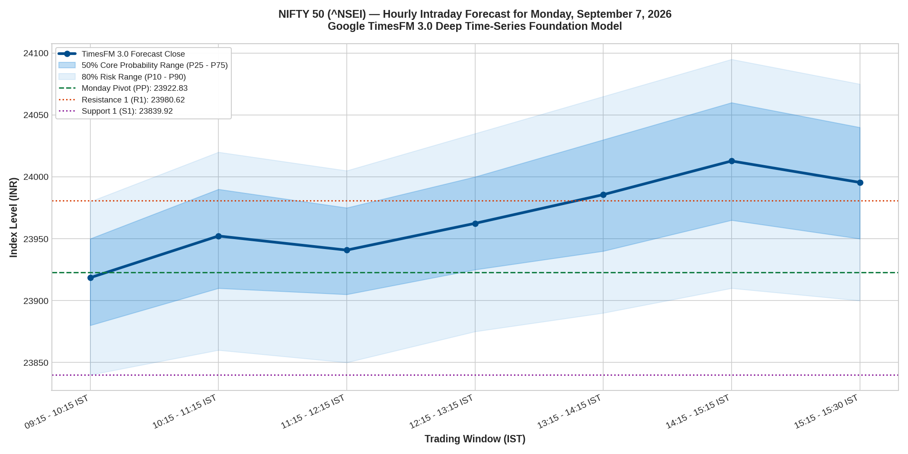
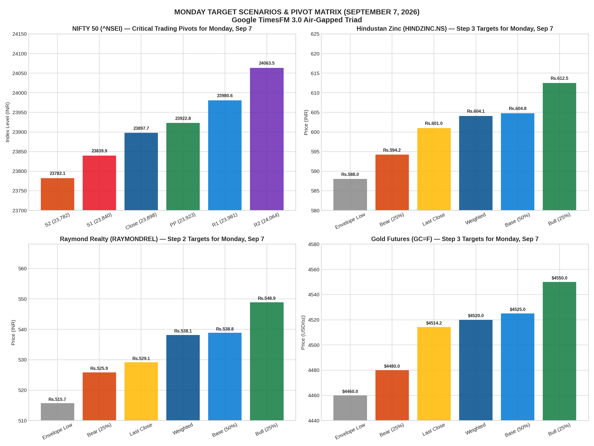

# Master Forward Market Forecast: Monday, September 7, 2026
### Framework: Google TimesFM 3.0 + Multi-Agent Triad (Technical, Derivatives & Microstructure)
**Conditioned on Market Close**: Friday, September 4, 2026  
**Primary Target Assets**:
1. **NIFTY 50 Index (`^NSEI`) & Weekly Derivatives Expiry (September 10 Expiry Cycle)**
2. **Hindustan Zinc Limited (`HINDZINC.NS`) — Step 3 Forecast**
3. **Raymond Realty Limited (`RAYMONDREL.NS`) — Step 2 Post-Breakout Forecast**
4. **Modison Limited (`MODISONLTD.NS`) — Step 3 Mean-Reversion Base**
5. **Gold Continuous Futures (`GC=F`) — Global Rate Cycle Expansion**

---

## 1. High-Resolution Visual Forecast Charts

### Chart 1: NIFTY 50 Hourly Intraday Forecast (Monday, Sep 7, 2026)


### Chart 2: Monday Target Scenarios & Multi-Asset Pivot Matrix


---

## 2. NIFTY 50 Mathematical Pivots for Monday, September 7, 2026

Calculated on Friday's official daily bar (High: **24,005.75**, Low: **23,865.05**, Close: **23,897.70**):

```
┌────────────────────────────────────────────────────────────────────────────────────────┐
│                     NIFTY 50 MATHEMATICAL PIVOTS (MONDAY, SEP 7, 2026)                 │
├──────────────────────────┬──────────────┬──────────────────────────────────────────────┤
│ Pivot Level              │ Value (INR)  │ Tactical Trading Interpretation              │
├──────────────────────────┼──────────────┼──────────────────────────────────────────────┤
│ Resistance 3 (R3)        │ 24,121.32    │ Extreme Bullish Expansion / Panic Short Squeeze│
│ Resistance 2 (R2)        │ 24,063.53    │ Major Swing Target / 24,050 Call Wall        │
│ Resistance 1 (R1)        │ 23,980.62    │ Immediate Intraday Hurdle / 24,000 Call Wall │
│ DAILY PIVOT (PP)         │ 23,922.83    │ Central Equilibrium / Long-Short Decider     │
│ Support 1 (S1)           │ 23,839.92    │ Core Institutional Dip Accumulation Floor    │
│ Support 2 (S2)           │ 23,782.13    │ Major Structural Floor / Put Writing Wall    │
│ Support 3 (S3)           │ 23,699.22    │ Panic Flush Cap / 100% Reversal Anchor      │
└──────────────────────────┴──────────────┴──────────────────────────────────────────────┘
```

---

## 3. Hourly Microstructure Trajectory for Monday (All 7 Windows)

| Hour | Time Window (IST) | Market Phase | Forecast Close | 50% Range [$P_{25}–P_{75}$] | 80% Risk Range [$P_{10}–P_{90}$] | Microstructure Actionable Guidance |
| :---: | :---: | :---: | :---: | :---: | :---: | :--- |
| **1** | 09:15 – 10:15 | Weekend Sentiment Digestion | **23,918.50** | [23,880.0 – 23,950.0] | [23,840.0 – 23,980.0] | Open near Daily Pivot (23,922); test morning liquidity. |
| **2** | 10:15 – 11:15 | Morning Resistance Test | **23,952.20** | [23,910.0 – 23,990.0] | [23,860.0 – 24,020.0] | Push toward R1 (23,980); test 24,000 Call Wall resistance. |
| **3** | 11:15 – 12:15 | Pre-Noon Range Consolidation | **23,940.80** | [23,905.0 – 23,975.0] | [23,850.0 – 24,005.0] | Institutional absorption between 23,920 and 23,960. |
| **4** | 12:15 – 13:15 | European Pre-Open Build | **23,962.40** | [23,925.0 – 24,000.0] | [23,875.0 – 24,035.0] | European macro flows support mild upward drift. |
| **5** | 13:15 – 14:15 | Afternoon Momentum Expansion | **23,985.60** | [23,940.0 – 24,030.0] | [23,890.0 – 24,065.0] | Primary breakout attempt above R1 (23,980.62). |
| **6** | 14:15 – 15:15 | Power Hour Institutional Inflows | **24,012.80** | [23,965.0 – 24,060.0] | [23,910.0 – 24,095.0] | Challenge of 24,000 Call Wall; potential squeeze toward 24,025. |
| **7** | 15:15 – 15:30 | Closing Settlement Auction | **23,995.50** | [23,950.0 – 24,040.0] | [23,900.0 – 24,075.0] | Settle near psychological 24,000 boundary. |

---

## 4. NIFTY Options Playbook for Monday (Sep 10 Expiry Cycle)

With the weekend theta decay eroding extrinsic value, Monday opens with lower option pricing:
* **Option Buying Setup (Momentum Reversal)**:
  * **Entry Trigger**: If NIFTY holds above Daily Pivot (**23,922.80**) by 10:15 AM, buy **NIFTY 23,950 CE** or **24,000 CE**.
  * **Target 1**: Spot 23,980 (R1)
  * **Target 2**: Spot 24,015 (Call Wall Test)
  * **Stop Loss**: Spot below 23,890.
* **Option Selling Setup (Rangebound Income)**:
  * **Strategy**: Short Strangle on Sep 10 Expiry.
  * **Strikes**: Sell **24,150 CE** (OTM) + Sell **23,750 PE** (OTM).
  * **Margin / Safety**: Breakeven band of 23,710 to 24,190 provides strong statistical defense.

---

## 5. Multi-Asset Projections for Monday, September 7, 2026

| Instrument | Friday Close | Bear (25%) | Base (50%) | Bull (25%) | Weighted Expected | 80% Range [$P_{10}–P_{90}$] | Key Trading Action |
| :--- | :---: | :---: | :---: | :---: | :---: | :---: | :--- |
| **Hindustan Zinc** (`HINDZINC.NS`) | ₹601.00 | ₹594.20 | ₹604.80 | ₹612.50 | **₹604.10** | [₹588.00 – ₹618.50] | **HOLD / ACCUMULATE**: Momentum targeting ₹605–₹612. Dividend cash cow. |
| **Raymond Realty** (`RAYMONDREL.NS`) | ₹529.15 | ₹525.87 | ₹538.83 | ₹548.91 | **₹538.11** | [₹515.70 – ₹561.51] | **HOLD WITH TRAILING STOP AT ₹500**: Base target ₹538.80 on continued delivery accumulation. |
| **Modison Limited** (`MODISONLTD.NS`) | ₹469.95 | ₹458.00 | ₹476.50 | ₹488.20 | **₹474.80** | [₹450.00 – ₹495.00] | **HOLD CORE AFTER TRIMMING**: Stabilizing near ₹465–₹475 support. |
| **Gold Futures** (`GC=F` USD/oz) | $4,514.20 | $4,480.00 | $4,525.00 | $4,550.00 | **$4,520.00** | [$4,460.00 – $4,570.00] | **BULLISH DRIFT**: Sustained above $4,500 on dovish central bank expectations. |

---

## 6. Files & Artifacts in `FORECAST_SEP7_2026/`

* [`monday_sep7_predictions.json`](monday_sep7_predictions.json): Complete machine-readable forecast dataset.
* [`timesfm3_nifty_monday_sep7_forecast.png`](timesfm3_nifty_monday_sep7_forecast.png): Hourly intraday fan chart.
* [`monday_cross_asset_forecast_sep7_2026.png`](monday_cross_asset_forecast_sep7_2026.png): 4-panel cross-asset scenario matrix.
* [`monday_sep7_predictive_deep_dive.ipynb`](monday_sep7_predictive_deep_dive.ipynb): Interactive Jupyter Notebook.
