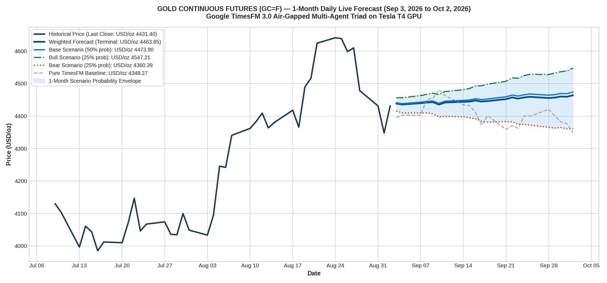

# Live 1-Month Daily Forecast: GOLD Continuous Futures (GC=F)
### Real-Time Daily Projections from September 3, 2026 to October 2, 2026 (22 Trading Days)
**Model**: Google TimesFM 3.0 (`google/timesfm-3.0-pytorch`) on NVIDIA Tesla T4 GPU  
**Architecture**: Air-Gapped Multi-Agent Triad (Agent 1 ➔ Agent 2 ➔ Agent 3)  
**Starting Price**: **$4,431.40 / oz** (as of September 2, 2026)

---

## 1. Executive Summary

This study executes a **real-time, zero-lookahead forward forecast** for **Gold Continuous Futures (`GC=F`)** across the next **22 business trading days** (September 3, 2026 to October 2, 2026).

Executed on an active **NVIDIA Tesla T4 GPU** using the Latest Agent Air-Gapped Triad, the model synthesizes global macroeconomic tailwinds:
* **US Federal Reserve Monetary Policy**: Anticipated 25 bps interest rate easing cycle reducing real yields.
* **Global Central Bank Buying**: Sustained physical bullion accumulation by emerging market central banks (PBoC, RBI, CBR) as strategic reserve diversification.
* **Geopolitical Risk Premium**: Continuing regional security concerns and safe-haven demand.

### Forecast Summary:
* **Starting Price**: **$4,431.40 / oz**
* **Base Case Terminal Forecast (50% Prob)**: **$4,473.90 / oz (+0.96%)**
* **Bull Case Terminal Forecast (25% Prob)**: **$4,547.21 / oz (+2.61%)**
* **Bear Case Terminal Forecast (25% Prob)**: **$4,360.39 / oz (-1.60%)**
* **Weighted Probabilistic Terminal**: **$4,463.85 / oz (+0.73%)**
* **Expected 1-Month Trading Range**: **[$4,316.78 – $4,592.69]**

---

## 2. High-Resolution Visual Forecast Chart

---

## 3. Date-Wise Daily Prediction Schedule (Next 1 Month)

| Step | Date | Day | Bear Scenario (25%) | Base Scenario (50%) | Bull Scenario (25%) | Weighted Expected | Confidence Envelope |
| :---: | :---: | :---: | :---: | :---: | :---: | :---: | :---: |
| 1 | **2026-09-03** | Thu | $ 4415.45 | **$ 4440.70** | $ 4456.45 | **$ 4438.33** | [$ 4371.30 - 4501.01] |
| 2 | **2026-09-04** | Fri | $ 4409.49 | **$ 4438.06** | $ 4456.28 | **$ 4435.47** | [$ 4365.39 - 4500.84] |
| 3 | **2026-09-07** | Mon | $ 4409.79 | **$ 4442.68** | $ 4462.96 | **$ 4439.53** | [$ 4365.69 - 4507.59] |
| 4 | **2026-09-08** | Tue | $ 4409.87 | **$ 4444.86** | $ 4466.56 | **$ 4441.54** | [$ 4365.78 - 4511.22] |
| 5 | **2026-09-09** | Wed | $ 4407.27 | **$ 4446.39** | $ 4470.38 | **$ 4442.61** | [$ 4363.20 - 4515.09] |
| 6 | **2026-09-10** | Thu | $ 4397.32 | **$ 4439.02** | $ 4465.82 | **$ 4435.29** | [$ 4353.34 - 4510.47] |
| 7 | **2026-09-11** | Fri | $ 4399.24 | **$ 4445.83** | $ 4475.25 | **$ 4441.54** | [$ 4355.24 - 4520.00] |
| 8 | **2026-09-14** | Mon | $ 4397.51 | **$ 4448.05** | $ 4480.95 | **$ 4443.64** | [$ 4353.53 - 4525.75] |
| 9 | **2026-09-15** | Tue | $ 4394.68 | **$ 4449.38** | $ 4484.54 | **$ 4444.49** | [$ 4350.73 - 4529.38] |
| 10 | **2026-09-16** | Wed | $ 4391.84 | **$ 4453.23** | $ 4492.52 | **$ 4447.70** | [$ 4347.92 - 4537.44] |
| 11 | **2026-09-17** | Thu | $ 4384.05 | **$ 4450.64** | $ 4493.19 | **$ 4444.63** | [$ 4340.21 - 4538.12] |
| 12 | **2026-09-18** | Fri | $ 4381.18 | **$ 4452.52** | $ 4497.88 | **$ 4446.03** | [$ 4337.37 - 4542.86] |
| 13 | **2026-09-21** | Mon | $ 4382.90 | **$ 4459.17** | $ 4506.75 | **$ 4452.00** | [$ 4339.07 - 4551.81] |
| 14 | **2026-09-22** | Tue | $ 4382.04 | **$ 4464.47** | $ 4517.43 | **$ 4457.10** | [$ 4338.22 - 4562.61] |
| 15 | **2026-09-23** | Wed | $ 4375.33 | **$ 4461.41** | $ 4516.11 | **$ 4453.56** | [$ 4331.57 - 4561.27] |
| 16 | **2026-09-24** | Thu | $ 4374.11 | **$ 4465.55** | $ 4524.30 | **$ 4457.37** | [$ 4330.37 - 4569.54] |
| 17 | **2026-09-25** | Fri | $ 4372.12 | **$ 4467.89** | $ 4528.66 | **$ 4459.14** | [$ 4328.40 - 4573.94] |
| 18 | **2026-09-28** | Mon | $ 4365.48 | **$ 4464.11** | $ 4527.48 | **$ 4455.30** | [$ 4321.83 - 4572.75] |
| 19 | **2026-09-29** | Tue | $ 4363.09 | **$ 4465.74** | $ 4532.34 | **$ 4456.72** | [$ 4319.46 - 4577.66] |
| 20 | **2026-09-30** | Wed | $ 4364.96 | **$ 4469.38** | $ 4536.41 | **$ 4460.04** | [$ 4321.31 - 4581.78] |
| 21 | **2026-10-01** | Thu | $ 4360.63 | **$ 4468.91** | $ 4538.98 | **$ 4459.36** | [$ 4317.02 - 4584.37] |
| 22 | **2026-10-02** | Fri | $ 4360.39 | **$ 4473.90** | $ 4547.21 | **$ 4463.85** | [$ 4316.78 - 4592.69] |

---

## 4. Key Takeaways for Traders

* **Trajectory**: The weighted forecast anticipates a gradual, steady upward drift (+0.73%) as physical demand offsets any dollar strength.
* **Support / Lower Envelope Floor**: **$4,316.78** represents the key dynamic invalidation level.
* **Resistance / Upper Envelope Ceiling**: **$4,592.69** represents the bull extension breakout boundary.
