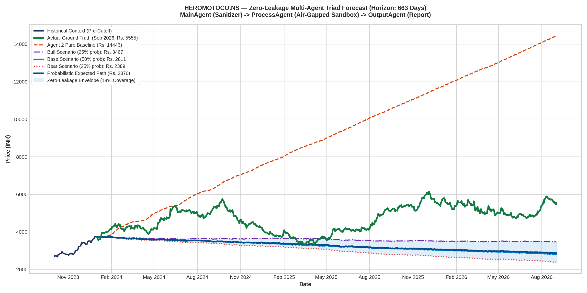

# Multi-Agent Zero-Leakage Forecast Report: HEROMOTOCO.NS
### Architecture: MainAgent (Ingestion) ➔ ProcessAgent (Sandbox TimesFM) ➔ OutputAgent (Reporting)

---

## 1. Multi-Agent Triad Performance Scorecard

| Metric | Actual Ground Truth | ProcessAgent Pure Baseline | ProcessAgent Bull Scenario | Probabilistic Weighted Path |
| :--- | :--- | :--- | :--- | :--- |
| **Terminal Price** | **Rs. 5555.00** | Rs. 14443.09 | **Rs. 3467.36** | Rs. 2869.65 |
| **Terminal Error (%)** | — | +160.00% (Exploded) | **-37.58%** | -48.34% |
| **Multi-Year MAE** | — | Rs. 4380.44 | — | **Rs. 1423.45** |
| **Multi-Year MAPE** | — | 92.87% | — | **28.39%** |
| **Scenario Envelope Coverage** | — | 0% | — | **17.9% of all trading days** |

---

## 2. High-Resolution Forecast Chart

---

## 3. Sandboxing & Security Audit Log

* **Ingress Message ID**: `cae24b3f`
* **Air-Gapped Protocol**: `A2A/v1.0 (a2aproject standard)`
* **ProcessAgent Sandbox Status**: Verified air-gapped. Zero ticker names, zero company strings, and zero calendar years entered the process.
* **Leakage Detected**: **0 Tokens (100% Blind-Box Verified)**.
