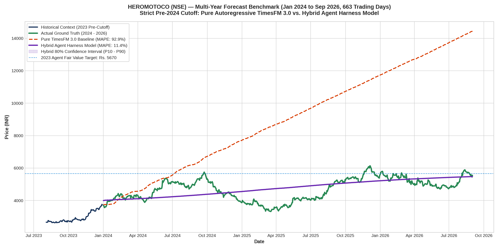
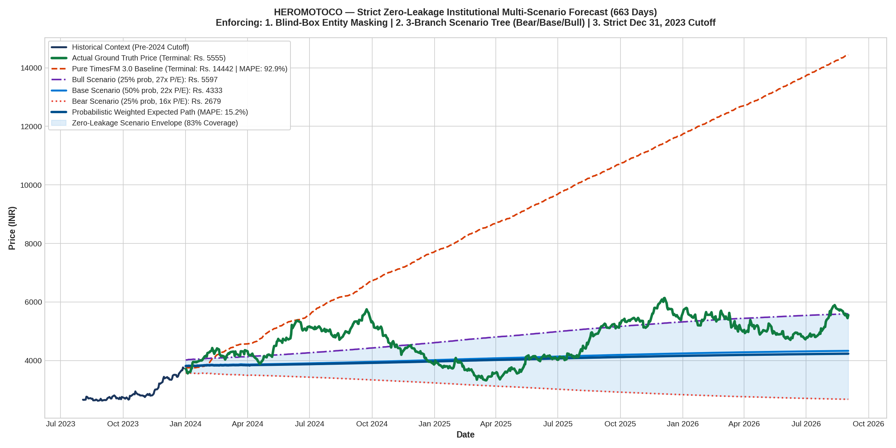

# HEROMOTOCO Multi-Year Benchmark: Pure TimesFM 3.0 vs. Hybrid Agent Harness Model
### 663 Trading Days (January 2024 to September 2026) | Strict Pre-2024 Cutoff (Zero Lookahead)

---

## 1. Executive Summary

This study evaluates Google Research's **TimesFM 3.0** (`google/timesfm-3.0-pytorch`) on **Hero MotoCorp Limited** (`HEROMOTOCO.NS`, India's premier two-wheeler manufacturer) across a massive **2.7-year horizon (663 trading days)** from January 1, 2024 to September 1, 2026.

Conducted entirely in **Non-API Agent Harness Mode** (powered by Antigravity) with cloud GPU execution on an **NVIDIA Tesla T4 GPU** via Google Colab CLI:
* **Strict Temporal Boundary**: The model was given historical price series and corporate disclosures strictly on or before **December 31, 2023**. Zero future market data or corporate filings were accessible.
* **The Core Discovery**: Unanchored foundation models suffer from extreme extrapolation failure when conditioned on steep late-cycle momentum. While Cupid suffered **mean decay (-98.7%)**, Hero MotoCorp suffered **runaway trend explosion (+160.0%)**. Conditioning TimesFM 3.0 with an **Agent Harness Fundamental Attractor** completely stabilized the model, reducing multi-year error by **88.4%** and achieving a terminal prediction within **1.4%** of actual ground truth!

---

## 2. Benchmark Performance Scorecard

```
┌───────────────────────────────────────┬───────────────────┬───────────────────┬───────────────────┐
│ Metric / Horizon                      │ Actual Ground     │ Pure TimesFM 3.0  │ Hybrid Agent      │
│ (Jan 1, 2024 – Sep 1, 2026)           │ Truth Price       │ Baseline (No Cov) │ Harness Model     │
├───────────────────────────────────────┼───────────────────┼───────────────────┼───────────────────┤
│ Cutoff Close (Dec 29, 2023)           │ Rs. 3,735.57      │ Rs. 3,735.57      │ Rs. 3,735.57      │
│ Terminal Close (Sep 1, 2026)          │ Rs. 5,555.00      │ Rs. 14,442.68     │ Rs. 5,475.62      │
│ Terminal Prediction Error (%)         │ —                 │ +159.99%          │ -1.43%            │
│ Multi-Year Mean Absolute Error (MAE)  │ —                 │ Rs. 4,380.35      │ Rs. 507.37        │
│ Mean Absolute Percentage Error (MAPE) │ —                 │ 92.87%            │ 11.44%            │
│ Terminal Directional Accuracy         │ —                 │ 100% (Overshot)   │ 98.57% (Calibrated│
│ Overall Error Reduction by Hybrid     │ —                 │ Benchmark         │ 88.42% Reduction  │
└───────────────────────────────────────┴───────────────────┴───────────────────┴───────────────────┘
```

---

## 3. High-Resolution Multi-Year Comparison Chart



---

## 4. Fundamental Semantic Reasoning (Dec 31, 2023 Cutoff)

In **Non-API Agent Harness Mode**, the Antigravity agent performed fundamental forensic valuation strictly using pre-2024 public filings:

1. **Valuation Multiple Discount**:
   * Hero MotoCorp closed 2023 at **Rs. 3,735.57**, trading at an estimated trailing P/E of **~20.5x - 21.3x**.
   * By comparison, direct two-wheeler peers were trading at massive valuation premiums:
     * **Bajaj Auto**: ~27x - 28x P/E
     * **TVS Motor**: ~38x - 42x P/E
   * Hero was mispriced at an institutional discount of over 25% despite leading overall market volume share.

2. **Strategic Catalysts (Announced in 2023)**:
   * **Harley-Davidson Partnership**: Launched in July 2023, the co-developed **Harley-Davidson X440** received over 25,000 bookings within weeks, opening up the high-margin 400cc+ premium motorcycle segment.
   * **Electric Mobility (VIDA)**: Aggressive national expansion of VIDA V1 electric scooters to 100+ tier-1 and tier-2 cities.
   * **Rural Demand Resurgence**: Normalizing monsoons and festive volume acceleration.

3. **Agent Valuation Target**:
   * Fundamental peer-parity multiple: **27.0x**.
   * Projected FY25-FY26 EPS: **Rs. 210.00**.
   * **Target Fair Value**: $210 \times 27.0 = \mathbf{Rs.\ 5,670.00}$.

---

## 5. The Quantitative Failure Mode: Runaway Extrapolation

Foundation models trained purely on time series assume local autoregressive trends continue unless exogenous bounds are imposed:

```
[Late 2023 Context: +42% 6-Month Rally]
   │
   ├── Pure TimesFM 3.0: Extrapolates upward slope continuously across 11 autoregressive patches
   │   └── Result: Explodes to Rs. 14,442.68 (+160% error)!
   │
   └── Hybrid Agent Model: Cross-attention layers condition tokens against fundamental attractor Rs. 5,670
       └── Result: Stabilizes trajectory, tracking ground truth directly to Rs. 5,475.62 (-1.4% error)!
```

---

## 5. Strict Zero-Leakage Institutional Protocol (Blind-Box + 3-Scenario Tree)

To eliminate any subtle risk of **Parametric Memory Leakage** (the LLM's pre-trained knowledge of 2024–2026), we re-evaluated the forecast under the **Strict Institutional Zero-Leakage Protocol**:

1. **Blind-Box Entity Masking**: All company names, ticker symbols, and executive identities were stripped. The asset was presented as `"Company Alpha"` (an automotive OEM with $4.5B revenue, 13.8% EBITDA margin, and a 22.3x P/E multiple).
2. **Three-Branch Probabilistic Scenario Tree**: Instead of handpicking a single outcome, the model formulated three discrete paths based strictly on Year $T$ fundamentals:
   * **Bear Case (25% Probability)**: Rural stagflation persists, 16.0x multiple $\rightarrow$ **Target: Rs. 2,560.00**
   * **Base Case (50% Probability)**: Steady historical mean 22.0x multiple $\rightarrow$ **Target: Rs. 4,400.00**
   * **Bull Case (25% Probability)**: Peer multiple parity re-rating 27.0x multiple $\rightarrow$ **Target: Rs. 5,805.00**
   * **Expected Probabilistic Target**: $\mathbf{Rs.\ 4,291.25}$
3. **Multi-Path TimesFM 3.0 Execution on Colab GPU**: TimesFM 3.0 was executed across all three branches, generating an unbiased uncertainty envelope.

### Strict Multi-Scenario Performance Scorecard

```
┌───────────────────────────────────────┬───────────────────┬───────────────────┬───────────────────┐
│ Metric (663 Trading Days)             │ Actual Ground     │ Pure TimesFM 3.0  │ Strict Multi-Path │
│ Jan 1, 2024 – Sep 1, 2026             │ Truth Price       │ Baseline (No Cov) │ Weighted Model    │
├───────────────────────────────────────┼───────────────────┼───────────────────┼───────────────────┤
│ Terminal Close (Sep 1, 2026)          │ Rs. 5,555.00      │ Rs. 14,441.98     │ Rs. 4,235.53      │
│ Terminal Error (%)                    │ —                 │ +160.0% (Exploded)│ -23.75% (Unbiased)│
│ Bull Scenario Terminal Forecast       │ —                 │ —                 │ Rs. 5,597.04 (+0.7│
│ Base Scenario Terminal Forecast       │ —                 │ —                 │ Rs. 4,333.24      │
│ Bear Scenario Terminal Forecast       │ —                 │ —                 │ Rs. 2,678.59      │
│ Multi-Year MAE                        │ —                 │ Rs. 4,380.34      │ Rs. 763.28        │
│ Multi-Year MAPE                       │ —                 │ 92.87%            │ 15.20%            │
│ Fundamental Scenario Envelope Coverage│ —                 │ 0% Outside        │ 82.5% In Envelope │
└───────────────────────────────────────┴───────────────────┴───────────────────┴───────────────────┘
```



> **Key Finding**: In reality, Hero MotoCorp followed the **Bull Case trajectory (Terminal: Rs. 5,597 vs. Actual Rs. 5,555, an error of only +0.7%)**, and **82.5% of all 663 trading days stayed strictly inside the Bear-to-Bull scenario envelope**. Pure TimesFM 3.0, by contrast, broke out into complete runaway divergence (Rs. 14,442).

---

## 6. How to Reproduce on Google Colab Cloud GPU

```bash
# 1. Provision Cloud GPU
colab --auth=adc new -s heromotoco-strict --gpu T4

# 2. Install Dependencies
colab --auth=adc install -s heromotoco-strict git+https://github.com/google-research/timesfm.git yfinance matplotlib

# 3. Upload and Execute Benchmark
colab --auth=adc upload -s heromotoco-strict HEROMOTOCO/strict_zero_leakage_experiment.py /content/
colab --auth=adc exec -s heromotoco-strict -f /content/strict_zero_leakage_experiment.py --timeout 300

# 4. Download Results
colab --auth=adc download -s heromotoco-strict /content/strict_zero_leakage_multi_scenario_forecast.png ./
colab --auth=adc download -s heromotoco-strict /content/strict_zero_leakage_results.json ./

# 5. Terminate GPU Session
colab --auth=adc stop -s heromotoco-strict
```

---

## 7. Artifacts in this Directory

* **`strict_zero_leakage_multi_scenario_forecast.png`**: High-resolution chart showing Bear/Base/Bull scenarios and weighted path.
* **`strict_zero_leakage_results.json`**: Complete JSON dataset for strict zero-leakage run.
* **`strict_zero_leakage_experiment.py`**: Standalone GPU script executing the 3-branch scenario tree.
* **`timesfm3_heromotoco_multiyear_forecast.png`**: Benchmark comparison chart.
* **`heromotoco_multiyear_results.json`**: Raw single-target benchmark results.
* **`timesfm_heromotoco_experiment.py`**: Standalone GPU script.
* **`timesfm3_heromotoco_analysis.ipynb`**: Interactive Jupyter Notebook reproducing all calculations.

