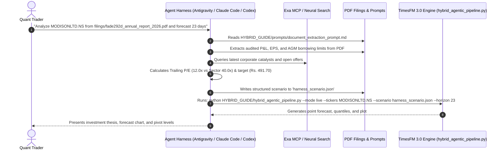

# Agent Harness Integration Guide: Non-API Hybrid Mode
### Using Antigravity, Claude Code, OpenAI Codex & OpenCode with Google TimesFM 3.0

---

## 1. The Paradigm: What is "Non-API Hybrid Mode"?

When developers build AI financial systems, they often assume their Python scripts must make direct HTTP calls to an LLM API (`google-genai`, `openai`, or `anthropic`).

However, if you are already using an **Agentic Coding Harness** such as:
* **Google Antigravity** (`agy` CLI / IDE)
* **Anthropic Claude Code** (`claude` CLI)
* **OpenAI Codex / Code Interpreter**
* **OpenCode / Aider / Cursor / Cline**

**The LLM is already running in your terminal!**

```
┌────────────────────────────────────────────────────────────────────────────────────────┐
│                          NON-API AGENT HARNESS WORKFLOW                                │
├──────────────────────────────────────────┬─────────────────────────────────────────────┤
│      Agent Harness (The Living AI)       │         TimesFM 3.0 (The Python Engine)     │
├──────────────────────────────────────────┼─────────────────────────────────────────────┤
│ • Uses `view_file` to read 200-page PDFs │ • Consumes `scenario.json` via `--scenario` │
│ • Uses MCP tools (`exa-mcp`) for news    │ • Builds dynamic cross-attention covariates │
│ • Calculates Trailing P/E & Intrinsic PEG│ • Runs GPU-accelerated patch transformer    │
│ • Employs prompt templates from repo     │ • Projects P10 to P90 volatility bounds     │
│ • Writes `scenario.json` directly to disk│ • Generates high-res charts and JSON data   │
│                                          │                                             │
│ 💡 ZERO external LLM API keys needed!    │ 💡 Pure quantitative execution!             │
│ 💡 ZERO additional API subscription fees!│ 💡 Works completely offline or on Colab!    │
└──────────────────────────────────────────┴─────────────────────────────────────────────┘
```

In this setup, your agent harness acts as the **Fundamental Quantitative Analyst**, and the repo's script acts as the **Mathematical Time-Series Execution Engine**.

---

## 2. End-to-End Workflow Architecture



---

## 3. The Expected `scenario.json` Format

When your agent harness analyzes a stock, it writes a `scenario.json` file. The schema supports both single stocks and multi-stock portfolios:

```json
{
  "MODISONLTD.NS": {
    "trailing_eps": 22.35,
    "trailing_pe": 22.35,
    "sector_pe": 40.0,
    "fair_value_target": 491.70,
    "sigmoid_steepness": 0.20,
    "sigmoid_midpoint": 11.5,
    "catalyst_summary": "FY26 PAT surged 194% YoY to Rs. 72.55 Cr. AGM raised borrowing limit to Rs. 500 Cr for capacity expansion."
  },
  "CUPID.NS": {
    "trailing_eps": 6.80,
    "trailing_pe": 40.4,
    "sector_pe": 45.0,
    "fair_value_target": 305.00,
    "sigmoid_steepness": 0.18,
    "sigmoid_midpoint": 15.0,
    "catalyst_summary": "Halwasiya takeover, strategic transition from OEM to direct-to-consumer FMCG brand."
  }
}
```

---

## 4. Exact Harness Prompts (Copy & Paste Into Your CLI)

### A. For Google Antigravity (`agy`)

Simply open your Antigravity conversation and prompt:

```text
Please execute the Hybrid TimesFM 3.0 workflow for MODISONLTD.NS:
1. Inspect the corporate filing in MODISONANALYSIS/filings/fade292d_annual_report_2026.pdf.
2. Read the prompt in HYBRID_GUIDE/prompts/document_extraction_prompt.md and extract the FY26 Net Revenue, PAT, Diluted EPS, and AGM borrowing resolutions.
3. Benchmark the trailing P/E against the electrical components sector median (40.0x) and calculate a conservative fair value re-rating target.
4. Write the results to `harness_scenario.json`.
5. Execute the quantitative engine:
   python HYBRID_GUIDE/hybrid_agentic_pipeline.py \
     --mode live \
     --tickers MODISONLTD.NS \
     --scenario harness_scenario.json \
     --horizon 23 \
     --output_dir ./modison_harness_output
6. Display the resulting forecast chart and analyze the P10-P90 prediction intervals.
```

---

### B. For Anthropic Claude Code (`claude`)

In your terminal running `claude`:

```bash
claude "I want to run a multi-asset forecast for MODISONLTD.NS and CUPID.NS using TimesFM 3.0. Follow HYBRID_GUIDE/README.md:
1. Search Exa or the local filings for both companies.
2. Formulate trailing EPS and conservative fair-value targets based on HYBRID_GUIDE/prompts/valuation_reasoner_prompt.md.
3. Save the parameters to 'portfolio_scenario.json'.
4. Run: python HYBRID_GUIDE/hybrid_agentic_pipeline.py --mode live --tickers MODISONLTD.NS,CUPID.NS --scenario portfolio_scenario.json --horizon 30 --output_dir ./claude_forecast
5. Review the generated JSON outputs and summarize the expected annualized return."
```

---

### C. For OpenAI Codex / ChatGPT Code Interpreter

When providing the codebase to Codex:

```text
You have access to a local Python environment and files.
1. Read the filing in MODISONANALYSIS/filings/fade292d_annual_report_2026.pdf using pypdf.
2. Extract the audited Profit After Tax and full-year Diluted EPS.
3. Create a dictionary with keys: 'fair_value_target', 'trailing_eps', 'trailing_pe', 'sector_pe', 'sigmoid_steepness', 'sigmoid_midpoint'.
4. Save this to 'scenario.json'.
5. Run the script:
   !python HYBRID_GUIDE/hybrid_agentic_pipeline.py --mode live --tickers MODISONLTD.NS --scenario scenario.json --horizon 23
6. Plot the forecast results.
```

---

### D. For OpenCode / Aider / Cursor / Cline

Paste this into your agent chat:

```text
Follow the Non-API Hybrid Mode documented in HYBRID_GUIDE/AGENT_HARNESS_INTEGRATION.md:
- Analyze the stock CUPID.NS.
- Look up recent corporate announcements using your web search or Exa tool.
- Formulate a 30-day fair value target and create 'cupid_scenario.json'.
- Execute `python HYBRID_GUIDE/hybrid_agentic_pipeline.py --mode live --tickers CUPID.NS --scenario cupid_scenario.json --horizon 30`.
- Report back with the terminal prediction and MAPE metrics if backtested.
```

---

## 5. How Zero-Leakage Backtesting Works in Agent Harness Mode

When using an agent harness for **historical backtesting** (e.g. testing whether the model would have predicted the Cupid rally starting in December 2023):

1. **Entity Anonymization**: 
   Instruct the harness:
   > *"Read `HYBRID_GUIDE/prompts/entity_anonymization_prompt.md`. Sanitize all occurrences of 'Cupid' or promoter names to 'Company X'. Do NOT allow any knowledge after December 31, 2023 into your context."*
2. **Execute with Strict Cutoff**:
   ```bash
   python HYBRID_GUIDE/hybrid_agentic_pipeline.py \
     --mode backtest \
     --tickers CUPID.NS \
     --cutoff 2023-12-31 \
     --scenario backtest_scenario.json \
     --horizon 64 \
     --output_dir ./cupid_backtest_harness
   ```
3. The engine enforces the December 31, 2023 market close as the final context tick, builds the dynamic covariates from your anonymized `scenario.json`, runs TimesFM 3.0, and automatically compares against the actual historical ground-truth prices from 2024 onwards.

---

## 6. Summary of Benefits: Direct API vs. Agent Harness

| Dimension | Direct Python API Mode | Agent Harness (Non-API) Mode |
| :--- | :--- | :--- |
| **Primary Use Case** | Automated headless cron jobs, production microservices | Interactive pair-programming, research, strategy development |
| **LLM Execution** | Paid API call inside Python (`google-genai` / `openai`) | Handled natively by the agent harness (Antigravity, Claude Code, Codex) |
| **API Key Needed in Python?** | **Yes** (`GEMINI_API_KEY` or `OPENAI_API_KEY`) | **No** (Zero external API keys needed in Python) |
| **File & PDF Parsing** | Script must extract text and handle token limits | Agent harness natively views files and navigates sections |
| **News Retrieval** | Requires hardcoded Exa HTTP API calls | Harness natively uses Exa MCP server or browser search |
| **Execution Command** | `python hybrid_agentic_pipeline.py --api_provider gemini` | `python hybrid_agentic_pipeline.py --scenario scenario.json` |
