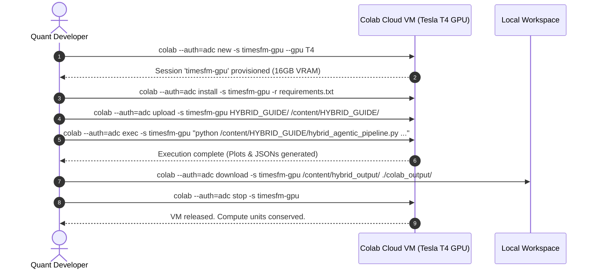

# Cloud GPU Acceleration Guide: Google Colab CLI & TimesFM 3.0
### Provisioning On-Demand GPUs (T4, L4, A100), Authentication Setup, and Automated Execution

---

## 1. Executive Summary: Why Colab CLI for TimesFM 3.0?

Google Research's **TimesFM 3.0** is a 330-Million parameter time-series foundation model. While CPU inference is supported via heuristic proxies, **production-grade forecasting and long-horizon multi-year autoregressive rollouts require CUDA GPU acceleration**.

If you do not have a high-end local NVIDIA GPU:
* You do **NOT** need to configure complex cloud infrastructure (AWS EC2, GCP Vertex AI, or RunPod).
* You can use the **Google Colab CLI (`colab`)** to provision cloud GPUs (**Tesla T4, L4, or NVIDIA A100**) on demand directly from your local terminal.
* Once the forecast is generated and charts/JSONs are downloaded, the Colab session can be stopped immediately to conserve compute units.

---

## 2. Authentication Setup: Connecting Your Terminal to Colab

The Colab CLI supports two authentication strategies via the `--auth` flag:

```
┌────────────────────────────────────────────────────────────────────────────────────────┐
│                              COLAB CLI AUTHENTICATION MODES                            │
├──────────────────────────────────────────┬─────────────────────────────────────────────┤
│ Mode 1: Application Default Creds (ADC)  │ Mode 2: Interactive Browser OAuth2          │
├──────────────────────────────────────────┼─────────────────────────────────────────────┤
│ • Best for headless servers & CLI agents │ • Best for local laptops with a web browser │
│ • Uses `gcloud auth application-default` │ • Prompts a 1-time browser Google login     │
│ • CLI flag: `--auth=adc`                 │ • CLI flag: `--auth=oauth2` (default)       │
└──────────────────────────────────────────┴─────────────────────────────────────────────┘
```

### Option A: Application Default Credentials (ADC) [Recommended]
If you have the Google Cloud SDK (`gcloud`) installed:
```bash
# Authenticate your terminal
gcloud auth application-default login

# Test connection
colab --auth=adc status
```

### Option B: Interactive Browser OAuth
If running locally on macOS, Linux desktop, or Windows WSL:
```bash
# Prompts a 1-time browser popup to log into your Google Account
colab --auth=oauth2 status
```

---

## 3. Workflow A: One-Shot Ephemeral GPU Execution (`colab run`)

The fastest way to execute a forecast without leaving zombie GPU sessions running is `colab run`. It spins up a fresh GPU VM, installs packages, runs the forecast script, downloads artifacts, and **automatically releases the VM when finished**:

```bash
colab --auth=adc run --gpu T4 HYBRID_GUIDE/hybrid_agentic_pipeline.py -- \
  --mode live \
  --tickers MODISONLTD.NS,CUPID.NS \
  --scenario HYBRID_GUIDE/sample_scenario.json \
  --horizon 14 \
  --output_dir ./colab_results
```

* Supported GPU accelerators: `--gpu T4`, `--gpu L4`, `--gpu A100`.
* High-RAM option (Colab Pro): add `--high-mem`.

---

## 4. Workflow B: Persistent GPU Session (Step-by-Step Lifecycle)

For larger batch jobs, multi-year backtests, or interactive experimentation:



### Step 1: Launch a Cloud GPU Session
```bash
colab --auth=adc new -s timesfm-gpu --gpu T4
```

### Step 2: Install Repository Dependencies
```bash
colab --auth=adc install -s timesfm-gpu git+https://github.com/google-research/timesfm.git yfinance exa-py pypdf matplotlib
```

### Step 3: Upload Code & Corporate Filings
```bash
colab --auth=adc upload -s timesfm-gpu HYBRID_GUIDE/ /content/HYBRID_GUIDE/
colab --auth=adc upload -s timesfm-gpu MODISONANALYSIS/filings/ /content/filings/
```

### Step 4: Execute TimesFM 3.0 Inference on GPU
```bash
colab --auth=adc exec -s timesfm-gpu "python /content/HYBRID_GUIDE/hybrid_agentic_pipeline.py \
  --mode live \
  --tickers MODISONLTD.NS,CUPID.NS \
  --scenario /content/HYBRID_GUIDE/sample_scenario.json \
  --horizon 20 \
  --output_dir /content/hybrid_output"
```

### Step 5: Download High-Res Charts and Datasets Back to Local Disk
```bash
colab --auth=adc download -s timesfm-gpu /content/hybrid_output/ ./colab_results/
```

### Step 6: Mandatory Teardown (Stop Session)
Always stop your session when done so compute units do not drain in the background:
```bash
colab --auth=adc stop -s timesfm-gpu
```

---

## 5. One-Click Automation: `run_colab_gpu.sh`

To automate the entire 6-step lifecycle in a single command, use the provided helper script:

```bash
chmod +x HYBRID_GUIDE/run_colab_gpu.sh

# Run live forecast for portfolio on Colab Tesla T4 GPU:
./HYBRID_GUIDE/run_colab_gpu.sh \
  --tickers MODISONLTD.NS,CUPID.NS \
  --mode live \
  --gpu T4 \
  --horizon 14
```

This script:
1. Provisions the GPU VM.
2. Installs `requirements.txt`.
3. Syncs code, prompts, and scenarios.
4. Executes the model with CUDA acceleration.
5. Downloads all forecast charts (`.png`) and metrics (`.json`) locally.
6. Automatically stops the cloud VM when finished.

---

## 6. Colab CLI Command Quick Reference

| Action | Colab CLI Command |
| :--- | :--- |
| **Check Active Sessions** | `colab --auth=adc sessions` |
| **Check GPU / System Status** | `colab --auth=adc exec -s <session> "nvidia-smi"` |
| **Install Packages** | `colab --auth=adc install -s <session> -r requirements.txt` |
| **Upload File/Folder** | `colab --auth=adc upload -s <session> <local_path> <remote_path>` |
| **Download File/Folder** | `colab --auth=adc download -s <session> <remote_path> <local_path>` |
| **Restart Kernel** | `colab --auth=adc restart-kernel -s <session>` |
| **Stop & Release VM** | `colab --auth=adc stop -s <session>` |
