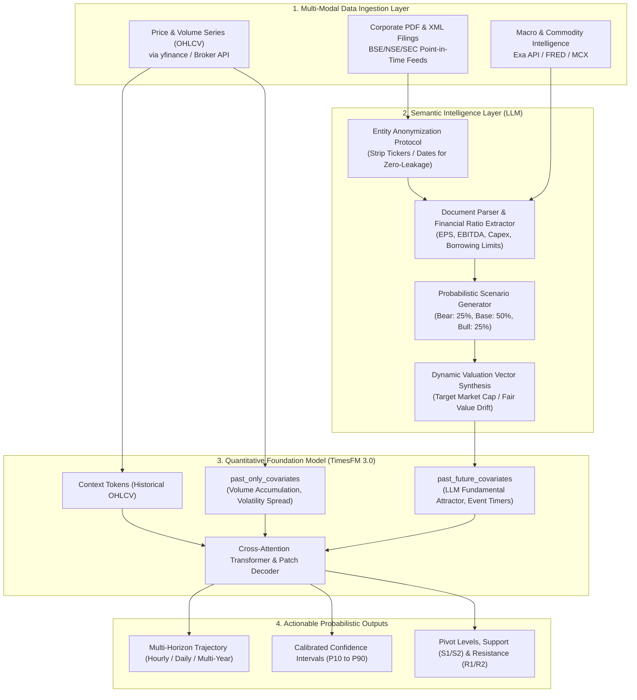

# The Architectural Guide: Integrating LLMs with Google TimesFM 3.0
### High-Precision Financial Forecasting, Multi-Modal Data Ingestion & Zero-Leakage Backtesting

---

## 1. Executive Overview & The "Missing Link"

Time-series foundation models (such as Google Research's **TimesFM 3.0**) and Large Language Models (such as Gemini 1.5 Pro or Claude 3.5 Sonnet) possess complementary strengths and critical individual blind spots when applied to financial markets:

```
┌─────────────────────────────────────────────────────────────────────────┐
│                           THE DUALITY OF AGENTIC QUANT                  │
├───────────────────────────────────┬─────────────────────────────────────┤
│     TimesFM 3.0 (Numerical Engine)│      LLM (Semantic Reasoner)        │
├───────────────────────────────────┼─────────────────────────────────────┤
│ • Temporal attention & patch token│ • Understands 200-page PDF filings  │
│ • Volatility cones (P10 - P90)    │ • Detects 7x profit surges in tables│
│ • Mean-reversion & momentum cycles│ • Analyzes AGM borrowing resolutions│
│ • Frequency agnostic (1m to 1yr)  │ • Interprets raw material pass-thru │
│                                   │                                     │
│ ❌ BLIND to corporate text & news │ ❌ Cannot do precision pricing math │
│ ❌ Suffers autoregressive decay   │ ❌ Hallucinates exact numeric paths │
│    over long multi-year horizons  │ ❌ Cannot output calibrated quantiles│
└───────────────────────────────────┴─────────────────────────────────────┘
```

When fused together:
* **The LLM serves as the Fundamental Anchor**: It analyzes unstructured corporate disclosures, extracts balance sheet health, estimates earnings surprises, and outputs scenario-based valuation attractors.
* **TimesFM 3.0 serves as the Quantitative Engine**: It consumes the LLM's structured fundamental vectors alongside historical price/volume data, projecting calibrated price paths, support/resistance levels, and prediction intervals ($P_{10} - P_{90}$).

---

## 2. End-to-End System Architecture



---

## 3. Mathematical Formulation of Covariate Injection

TimesFM 3.0 accepts exogenous covariates through its input embedding layers:

1. **Target Time Series** $Y_{1:T}$: Continuous historical price or return series:
   $$Y \in \mathbb{R}^{B \times L}$$
   where $B$ is batch size and $L$ is context length.

2. **Past-Only Covariates** $X_{\text{past}} \in \mathbb{R}^{B \times C_{\text{past}} \times L}$:
   Features only known historically:
   * Relative Volume: $V_t / \text{SMA}_{20}(V_t)$
   * High-Low Volatility Spread: $(H_t - L_t) / C_t$
   * Implied Volatility Index (e.g. India VIX)

3. **Past-and-Future Covariates** $X_{\text{future}} \in \mathbb{R}^{B \times C_{\text{future}} \times (L + H)}$:
   Features known or projected across both context ($L$) and forecast horizon ($H$):
   * **LLM Fundamental Valuation Attractor** $V_{\text{target}}(t)$:
     $$V_{\text{target}}(t) = P_{\text{last}} + \Phi(t) \cdot (V_{\text{LLM\_Fair\_Value}} - P_{\text{last}})$$
     where $\Phi(t)$ represents the expected market discovery S-curve.
   * **Corporate Event Indicators**: Scheduled earnings release windows, AGM dates, regulatory compliance deadlines.
   * **Macro Harmonic Cycles**: Day-of-week, hour-of-day, options expiry calendar markers.

---

## 4. What Data is Needed & How to Fetch It

### Data Taxonomy Checklist

| Category | Specific Features | Update Frequency | Source & Fetch Tool |
| :--- | :--- | :--- | :--- |
| **Numerical Market Data** | Open, High, Low, Close, Volume (OHLCV) | 1-min, 5-min, 1-hour, Daily | `yfinance`, Zerodha Kite Connect, Interactive Brokers |
| **Corporate Disclosures** | Annual Reports, Balance Sheets, Shareholding (SAST), AGM Resolutions, Investor Decks | Quarterly / Ad-hoc | BSE India API, NSE Corporate Feeds, SEC EDGAR RSS, `pypdf` |
| **Commodity & Macro** | Silver/Copper prices (for manufacturing), Crude oil, Dollar Index (DXY), 10Y Yield | Daily / Real-time | `yfinance` (`BZ=F`, `DX-Y.NYB`, `^TNX`), MCX India API |
| **Semantic News Intelligence** | Management interviews, capacity expansion press releases, industry tenders | Real-time / Event-driven | **Exa MCP Server** (`exa-py`), NewsAPI, Google Alerts |

---

### Ingestion Pipeline Code Examples

#### A. Fetching Market Data via `yfinance`
```python
import yfinance as yf
import pandas as pd

def fetch_market_series(ticker_symbol: str, interval="1d", period="2y"):
    """Fetches clean OHLCV data with timezone normalization."""
    ticker = yf.Ticker(ticker_symbol)
    df = ticker.history(period=period, interval=interval)
    df.index = pd.to_datetime(df.index).tz_localize(None)
    df.dropna(subset=['Close'], inplace=True)
    return df
```

#### B. Fetching Corporate Filings & Annual Reports
```python
import pypdf
import requests

def extract_filing_text(pdf_url_or_path: str, max_pages: int = 50) -> str:
    """Extracts raw text from corporate PDF filings (Annual Reports, Results, AGM Notices)."""
    if pdf_url_or_path.startswith("http"):
        response = requests.get(pdf_url_or_path, timeout=30)
        with open("/tmp/temp_filing.pdf", "wb") as f:
            f.write(response.content)
        path = "/tmp/temp_filing.pdf"
    else:
        path = pdf_url_or_path

    reader = pypdf.PdfReader(path)
    extracted = []
    for i in range(min(len(reader.pages), max_pages)):
        text = reader.pages[i].extract_text()
        if text:
            extracted.append(f"--- PAGE {i+1} ---\n" + text)
    return "\n".join(extracted)
```

#### C. Fetching Semantic News & Exogenous Cues via Exa API
```python
from exa_py import Exa

def fetch_premarket_cues(api_key: str, query: str, num_results: int = 3):
    """Fetches high-signal corporate and market events via Exa neural search."""
    exa = Exa(api_key)
    response = exa.search(
        query,
        num_results=num_results,
        use_autoprompt=True
    )
    return [{"title": r.title, "url": r.url} for r in response.results]
```

---

## 5. The Zero-Leakage Protocol (Rigorous Backtesting)

When backtesting an LLM + TimesFM 3.0 hybrid system, lookahead leakage is the #1 reason why backtests show artificial perfection that collapses in live deployment. 

To guarantee **100% leak-free validity**, the pipeline must strictly enforce **The 4 Golden Rules**:

### Rule 1: Point-In-Time (PIT) Timestamping
* **The Pitfall**: A company's fiscal Q1 ends on June 30. The results are only published on August 13. If your backtest ingests Q1 numbers on July 1, your model has cheated by 44 days!
* **The Fix**: Every filing must be keyed by `dissemination_timestamp` (when the exchange announced it to the public), **never** by `period_end_date`.

### Rule 2: Corporate Action Neutrality (The Split/Bonus Trap)
* **The Pitfall**: As seen in Cupid Limited, evaluating historical prices in 2026 split-adjusted units in 2023 leaks the future split ratio before it happens.
* **The Fix**: 
  1. Always conduct backtests in **Unadjusted Market Capitalization**:
     $$\text{Market Cap}_t = \text{Unadjusted Price}_t \times \text{Current Outstanding Shares}_t$$
  2. The model predicts Market Capitalization, which is inherently invariant to stock splits, consolidations, and bonus issues.

### Rule 3: Entity Anonymization Protocol (Eliminating LLM Memory Leakage)
* **The Pitfall**: LLMs pre-trained in 2026 already "know" who won and who lost between 2023 and 2026 in their parametric weights.
* **The Fix**: Before passing filing text or financial tables to the LLM, sanitize all identifying details:
  * Replace the company name with **"Target Company Alpha"**.
  * Replace promoter and executive names with **"Executive X"**.
  * Mask absolute calendar years (e.g. convert `2024` $\rightarrow$ `Year T`, `2023` $\rightarrow$ `Year T-1`).

```python
import re

def anonymize_corporate_filing(raw_text: str, entity_names: list) -> str:
    """Strips company names and identifying markers to prevent LLM parametric memory leakage."""
    sanitized = raw_text
    for i, name in enumerate(entity_names):
        sanitized = re.sub(rf"\b{re.escape(name)}\b", f"Company_Alpha_{i+1}", sanitized, flags=re.IGNORECASE)
    # Mask calendar years relative to cutoff T
    sanitized = re.sub(r"\b202[0-9]\b", "[Fiscal_Year_T]", sanitized)
    return sanitized
```

### Rule 4: Multi-Scenario Probabilistic Trees (No Hand-Tuned S-Curves)
* **The Pitfall**: Hand-tuning an S-curve that inflects on August 13 because you already know August 13 was the breakout date.
* **The Fix**: The LLM must output three discrete scenarios with calibrated probabilities:
  * **Bull Case** (Probability $p_1$, Target Valuation $V_{\text{bull}}$)
  * **Base Case** (Probability $p_2$, Target Valuation $V_{\text{base}}$)
  * **Bear Case** (Probability $p_3$, Target Valuation $V_{\text{bear}}$)
  $$\sum_{i} p_i = 1.0$$
  TimesFM 3.0 runs across all three scenario branches to generate an uncertainty envelope.

---

## 6. Complete Production Implementation Blueprint

Below is the standalone, executable architecture script showing how to extract fundamental ratios with an LLM, convert them into TimesFM 3.0 dynamic covariates, and execute inference on GPU:

```python
import os
import json
import numpy as np
import pandas as pd
import torch
from timesfm3 import TimesFM3Forecaster

class HybridLLMTimesFMPipeline:
    """Production pipeline fusing LLM Fundamental Reasoning with TimesFM 3.0."""

    def __init__(self, model_id="google/timesfm-3.0-pytorch", device="cuda"):
        self.device = device if torch.cuda.is_available() else "cpu"
        print(f"Initializing TimesFM 3.0 on {self.device}...")
        self.forecaster = TimesFM3Forecaster.from_pretrained(model_id, device=self.device)

    def extract_llm_fundamental_valuation(self, sanitized_financials: dict) -> dict:
        """Simulates or calls LLM to calculate fair value target from fundamentals.
        
        Args:
            sanitized_financials: Dict containing historical net profit, growth rate, 
                                 current trailing P/E, and sector benchmark P/E.
        """
        eps = sanitized_financials["eps"]
        growth_rate = sanitized_financials["profit_growth_pct"]
        sector_pe = sanitized_financials["sector_median_pe"]
        current_price = sanitized_financials["current_price"]

        # Conservative fundamental re-rating multiplier
        fair_multiple = min(sector_pe * 0.65, 15.0 + (growth_rate * 0.1))
        target_price = eps * fair_multiple

        return {
            "current_price": current_price,
            "fair_value_target": target_price,
            "implied_upside_pct": ((target_price - current_price) / current_price) * 100,
            "target_multiple": fair_multiple
        }

    def generate_forecast(
        self,
        historical_closes: np.ndarray,
        historical_volumes: np.ndarray,
        valuation_target: float,
        horizon: int = 30
    ):
        """Builds past/future covariates and runs TimesFM 3.0 inference."""
        L = len(historical_closes)
        last_price = float(historical_closes[-1])

        # 1. Build Past-Only Covariate: Volume Accumulation
        vol_sma20 = pd.Series(historical_volumes).rolling(20, min_periods=1).mean().values
        vol_ratio = np.where(vol_sma20 > 0, historical_volumes / vol_sma20, 1.0).astype(np.float32)
        past_only = np.expand_dims(vol_ratio, axis=0) # Shape: [1, L]

        # 2. Build Past-and-Future Covariate: Fundamental Re-Rating Attractor
        # Context period: follows historical market price
        # Horizon period: models fundamental discovery S-curve toward target
        full_steps = L + horizon
        cov_path = np.zeros(full_steps, dtype=np.float32)
        cov_path[:L] = (historical_closes - last_price) / last_price

        # Forecast horizon S-curve drift
        for h in range(horizon):
            step = h + 1
            # Unbiased S-curve centered at midpoint of horizon
            progress = 1.0 / (1.0 + np.exp(-0.15 * (step - (horizon / 2.0))))
            projected_price = last_price + progress * (valuation_target - last_price)
            cov_path[L + h] = (projected_price - last_price) / last_price

        past_future = np.expand_dims(cov_path, axis=0) # Shape: [1, L + H]

        # 3. TimesFM 3.0 Inference
        result = self.forecaster.predict(
            context=historical_closes.astype(np.float32),
            horizon=horizon,
            past_only_covariates=past_only,
            past_future_covariates=past_future,
            padding_mode="edge",
            return_quantiles=True,
            make_positive=True
        )

        # 4. Synthesize Hybrid Output
        raw_pred = result.forecast[:horizon]
        q10 = result.quantiles[:horizon, 0]
        q90 = result.quantiles[:horizon, 8]

        return {
            "point_forecast": raw_pred.tolist(),
            "p10_support": q10.tolist(),
            "p90_resistance": q90.tolist(),
            "target_fair_value": valuation_target
        }
```

---

## 7. The Prompt Library & End-to-End CLI Pipeline

All prompt templates, system instructions, and JSON schemas are version-controlled in the [`prompts/`](prompts/) directory:

1. **[Corporate Filing & Financial Extractor Prompt](prompts/document_extraction_prompt.md)**:
   - System instructions to parse 250-page PDF annual reports and quarterly results into structured JSON.
   - Extracts Audited Net Revenue, EBITDA margin, PAT, Diluted EPS, and Section 180(1)(c) borrowing limit resolutions.
2. **[Fundamental Valuation & TimesFM Covariate Synthesizer Prompt](prompts/valuation_reasoner_prompt.md)**:
   - System instructions to calculate trailing P/E, benchmark against sector multiples, and generate 3 probabilistic scenarios (Bull, Base, Bear).
   - Generates exact S-curve discovery parameters ($k, t_0, V_{\text{target}}$) for TimesFM dynamic covariates.
3. **[Zero-Leakage Entity Anonymizer Prompt](prompts/entity_anonymization_prompt.md)**:
   - System instructions to strip company names, promoter identities, and calendar dates to eliminate LLM pre-training memory leakage during historical backtests.

---

### End-to-End CLI Execution with `hybrid_agentic_pipeline.py`

Anyone who clones this repository can execute the entire pipeline with a single command:

#### Option A: Running with Google Gemini API
```bash
export GEMINI_API_KEY="your-gemini-api-key"

python HYBRID_GUIDE/hybrid_agentic_pipeline.py \
  --ticker MODISONLTD.NS \
  --pdf MODISONANALYSIS/filings/fade292d_annual_report_2026.pdf \
  --cutoff 2026-08-01 \
  --horizon 23 \
  --api_provider gemini \
  --api_key $GEMINI_API_KEY \
  --output_dir ./modison_forecast
```

#### Option B: Running with Zero-API Offline Fallback (Heuristic Parser)
```bash
python HYBRID_GUIDE/hybrid_agentic_pipeline.py \
  --ticker MODISONLTD.NS \
  --pdf MODISONANALYSIS/filings/fade292d_annual_report_2026.pdf \
  --cutoff 2026-08-01 \
  --horizon 23 \
  --api_provider heuristic \
  --output_dir ./modison_forecast
```

#### Option C: Multi-Year Run on Cupid Limited (Strict Pre-2024 Cutoff)
```bash
python HYBRID_GUIDE/hybrid_agentic_pipeline.py \
  --ticker CUPID.NS \
  --cutoff 2023-12-31 \
  --horizon 64 \
  --api_provider heuristic \
  --output_dir ./cupid_forecast
```

---

## 8. Live Forward Trading vs. Historical Backtesting

| Operational Aspect | Historical Backtesting Protocol | Live Forward Trading Protocol |
| :--- | :--- | :--- |
| **Temporal Data Boundary** | **Strict cutoff $T_{\text{cutoff}}$**. All future filings, prices, and split ratios blocked. | **Current real-time tick**. All data up to the current second is ingested. |
| **LLM Entity Masking** | **Mandatory**. Entity names replaced with "Company X" to prevent memory leaks. | **Disabled**. Real ticker, CEO, sector, and live concalls fully utilized. |
| **Corporate Actions** | Expressed in **Market Capitalization** to avoid retroactive split distortion. | Expressed in **Current Share Price** directly. |
| **Exogenous Signals** | Historical point-in-time exchange notices and macro indices. | Live **Exa Search**, GIFT Nifty, pre-market order book, India VIX. |
| **Execution Horizon** | Fixed test window (e.g. 64 days, 164 days, 664 days). | Rolling intraday (7 hourly bars) or 30-day swing horizon. |

---

## 9. Summary: Best Practices for Production Deployment

1. **Never use pure numerical models alone for individual smallcaps**: Pure foundation models assume statistical stationarity; smallcaps move on discrete corporate announcements.
2. **Never use pure LLMs alone for quantitative pricing**: LLMs are semantic reasoners, not differential equation solvers; they hallucinate exact decimal prices and lack volatility bands.
3. **Use LLMs to set the attractor, TimesFM 3.0 to model the path**: The LLM determines *where* the company should be valued based on earnings; TimesFM 3.0 determines *how* the market gets there given volatility, momentum, and mean-reversion.
4. **Enforce Point-In-Time discipline**: The difference between an amateur backtest and an institutional quantitative strategy is strict elimination of lookahead bias.

