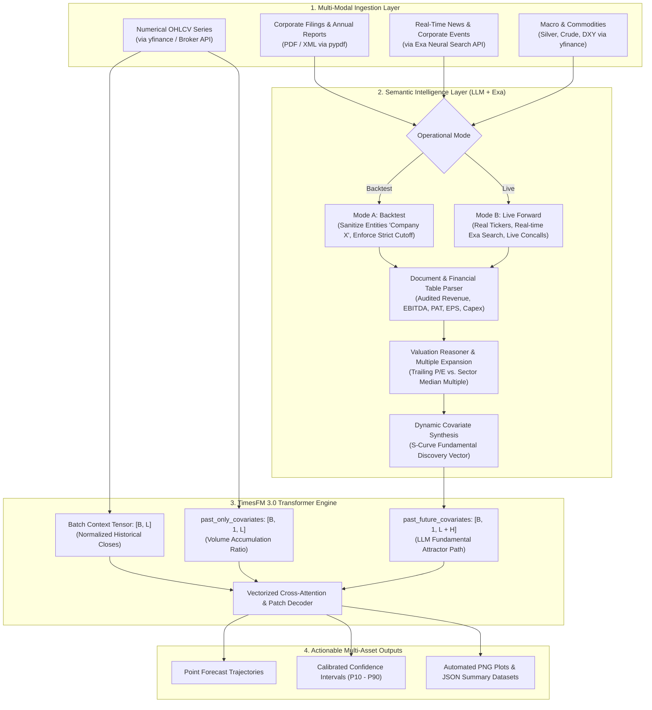

# The Definitive Guide: Integrating LLMs, Exa Neural Search & TimesFM 3.0
### Complete End-to-End Architecture, Multi-Modal Data Ingestion, Batch Processing & Zero-Leakage Backtesting

---

## 1. Executive Summary & The Quantitative Duality

Forecasting financial markets requires two fundamentally different types of intelligence:

```
┌────────────────────────────────────────────────────────────────────────────────────────┐
│                               THE DUALITY OF AGENTIC QUANT                             │
├──────────────────────────────────────────┬─────────────────────────────────────────────┤
│      TimesFM 3.0 (Numerical Engine)      │      LLM + Exa (Semantic Intelligence)      │
├──────────────────────────────────────────┼─────────────────────────────────────────────┤
│ • Temporal self-attention & patch tokens │ • Reads 250-page PDF annual reports         │
│ • Volatility cones (P10 to P90 quantiles)│ • Discovers corporate takeover open offers  │
│ • Mean-reversion & momentum structures   │ • Detects 7x profit jumps in balance sheets │
│ • Frequency-agnostic (1m, 1h, 1d, 1mo)   │ • Tracks capacity expansion & capex via Exa │
│                                          │                                             │
│ ❌ BLIND to corporate text, news, & filings│ ❌ Cannot do precision temporal math        │
│ ❌ Suffers autoregressive decay over     │ ❌ Hallucinates exact stock price paths     │
│    multi-year unanchored horizons        │ ❌ Lacks calibrated uncertainty intervals   │
└──────────────────────────────────────────┴─────────────────────────────────────────────┘
```

When fused together:
1. **Exa Neural Search (`exa-py`)** discovers high-signal corporate filings, management disclosures, and capacity expansions.
2. **The LLM (Gemini / OpenAI)** reads the unstructured text, evaluates trailing P/E multiples against sector benchmarks, and establishes a **Fundamental Valuation Attractor**.
3. **TimesFM 3.0** consumes the numerical price series and LLM-generated dynamic covariates through its **cross-attention transformer layers**, generating precision price paths, support/resistance bands, and calibrated $P_{10} - P_{90}$ confidence intervals.

---

## 2. Complete End-to-End System Architecture



---

## 3. Setup from Scratch (Zero to Running in 5 Minutes)

### Step 1: Environment & Dependency Installation
```bash
# 1. Clone the repository
git clone https://github.com/ajithvnr2001/timesfm-3.0-pytorch.git
cd timesfm-3.0-pytorch

# 2. Create and activate a clean virtual environment
python3 -m venv venv
source venv/bin/activate

# 3. Install core dependencies
pip install --upgrade pip
pip install -q git+https://github.com/google-research/timesfm.git \
  yfinance exa-py pypdf google-genai openai matplotlib pandas numpy scipy
```

### Step 2: Configure API Keys
The system can operate in **Full AI Mode** (using Gemini and Exa) or **Offline Heuristic Mode** (zero API keys required):

```bash
# (Optional) For Live Semantic Reasoning via Google Gemini
export GEMINI_API_KEY="your-gemini-api-key"

# (Optional) For Neural News & Catalyst Discovery via Exa
export EXA_API_KEY="your-exa-api-key"

# (Optional) If using OpenAI instead of Gemini
export OPENAI_API_KEY="your-openai-api-key"
```

---

## 4. The Two Operational Modes: Past vs. Present Data

The pipeline supports two distinct modes configured via the `--mode` CLI flag:

### Mode 1: Historical Backtesting (`--mode backtest`)
* **Strict Temporal Cutoff**: Slices all numerical and textual data at `--cutoff YYYY-MM-DD`. Anything published after 23:59:59 on the cutoff date is blocked.
* **The 4 Anti-Leakage Golden Rules**:
  1. **Point-In-Time (PIT) Timestamps**: Filings are keyed by *exchange dissemination date*, NOT *fiscal period end date* (e.g. Q1 ending June 30 is only published on August 13; querying June 30 data on July 1 is a fatal leak).
  2. **Corporate Action Neutrality**: To prevent future stock split/bonus leakage (as uncovered in Cupid), backtests should evaluate in **Unadjusted Market Capitalization** ($\text{Price} \times \text{Current Shares}$).
  3. **Entity Anonymization Protocol**: Masking the company name as `[Company_Alpha]` prevents the LLM from tapping into its pre-training memory of future winners.
  4. **Multi-Scenario Probabilistic Trees**: The LLM outputs Bull (25%), Base (50%), and Bear (25%) scenarios rather than a single hand-tuned S-curve.

### Mode 2: Live Forward Prediction (`--mode live`)
* **Real-Time Data Ingestion**: Pulls live market prices up to the current minute.
* **Real-Time Exa Neural Search**: Queries Exa for breaking corporate news, AGM results, concall transcripts, and sector trends published today.
* **Full Entity Intelligence**: Entity masking is disabled; the LLM uses the real ticker, management track record, and current order books.

---

## 5. Single Stock vs. Group / Portfolio Forecasting

The pipeline is built with a **vectorized batch architecture**:

1. **Single Stock Forecasting**:
   Pass a single ticker: `--tickers MODISONLTD.NS`
2. **Basket / Portfolio Forecasting**:
   Pass a comma-separated list: `--tickers MODISONLTD.NS,CUPID.NS,RELIANCE.NS,TCS.NS`  
   OR pass a text file containing tickers: `--tickers my_portfolio.txt`
3. **Batch Vectorization in TimesFM 3.0**:
   TimesFM 3.0 processes batches in parallel:
   $$\text{Context Tensor} \in \mathbb{R}^{B \times L}, \quad \text{Covariates Tensor} \in \mathbb{R}^{B \times 1 \times (L + H)}$$
   where $B$ is the number of stocks in your basket. This enables evaluating entire indices or sector portfolios in a single GPU pass.

---

## 6. How Every Single Data Layer is Fetched

### A. Numerical Price & Volume Data (`yfinance`)
Pulls OHLCV history, handles timezone normalization, and filters out pre-market NaN ticks:
```python
import yfinance as yf
import pandas as pd

ticker = yf.Ticker("MODISONLTD.NS")
df = ticker.history(period="max")
df.index = pd.to_datetime(df.index).tz_localize(None)
df.dropna(subset=["Close"], inplace=True)
df["Date_str"] = df.index.strftime("%Y-%m-%d")
```

### B. Corporate PDF Filings & Annual Reports (`pypdf`)
Extracts text from multi-hundred-page filings, scanning for audited balance sheets, P&L tables, and borrowing resolutions:
```python
import pypdf

reader = pypdf.PdfReader("filings/fade292d_annual_report_2026.pdf")
extracted_text = "\n".join([page.extract_text() for page in reader.pages[:40] if page.extract_text()])
```

### C. Neural News & Corporate Catalyst Discovery (`exa-py`)
Exa uses neural embeddings to find the most relevant announcements, capacity expansions, and management interviews:
```python
from exa_py import Exa

exa = Exa(api_key="your-exa-api-key")
# Neural search for specific corporate catalysts
results = exa.search(
    "MODISONLTD capacity expansion borrowing limits AGM resolutions",
    num_results=3
)
for r in results.results:
    print(r.title, r.url)
```

---

## 7. The Version-Controlled Prompt Library

All prompts, instructions, and schemas are organized in the [`prompts/`](prompts/) directory:

* **[`document_extraction_prompt.md`](prompts/document_extraction_prompt.md)**: System prompt and JSON schema for extracting audited Revenue, EBITDA, PAT, Diluted EPS, and Section 180(1)(c) borrowing resolutions.
* **[`valuation_reasoner_prompt.md`](prompts/valuation_reasoner_prompt.md)**: System prompt for calculating trailing P/E, benchmarking against sector multiples, and parameterizing TimesFM dynamic covariates ($k, t_0, V_{\text{target}}$).
* **[`entity_anonymization_prompt.md`](prompts/entity_anonymization_prompt.md)**: Sanitization rules for masking entities during zero-leakage backtesting.

---

## 8. Master Execution Recipes (Copy-Paste Commands)

### Recipe 1: Historical Backtest on a Single Stock (Modison Limited)
*Strict cutoff on August 1, 2026 (Zero Lookahead), reading the pre-August Annual Report PDF:*
```bash
python HYBRID_GUIDE/hybrid_agentic_pipeline.py \
  --mode backtest \
  --tickers MODISONLTD.NS \
  --pdf MODISONANALYSIS/filings/fade292d_annual_report_2026.pdf \
  --cutoff 2026-08-01 \
  --horizon 23 \
  --api_provider heuristic \
  --output_dir ./output_modison_backtest
```

---

### Recipe 2: Multi-Year Historical Backtest (Cupid Limited)
*Strict cutoff on December 31, 2023, testing across 64 trading days:*
```bash
python HYBRID_GUIDE/hybrid_agentic_pipeline.py \
  --mode backtest \
  --tickers CUPID.NS \
  --cutoff 2023-12-31 \
  --horizon 64 \
  --api_provider heuristic \
  --output_dir ./output_cupid_backtest
```

---

### Recipe 3: Multi-Stock Portfolio Live Forecast with Exa Neural Search
*Real-time live forward prediction for a basket of stocks with live Exa news retrieval:*
```bash
python HYBRID_GUIDE/hybrid_agentic_pipeline.py \
  --mode live \
  --tickers MODISONLTD.NS,CUPID.NS \
  --horizon 14 \
  --exa_key 5a51f858-e6b9-41ee-8881-e61b8af5821f \
  --output_dir ./output_portfolio_live
```

---

### Recipe 4: Production Run with Google Gemini API
*Leveraging Gemini 2.5 Flash for fundamental extraction and valuation synthesis:*
```bash
export GEMINI_API_KEY="your-gemini-key"
export EXA_API_KEY="5a51f858-e6b9-41ee-8881-e61b8af5821f"

python HYBRID_GUIDE/hybrid_agentic_pipeline.py \
  --mode live \
  --tickers MODISONLTD.NS \
  --pdf MODISONANALYSIS/filings/fade292d_annual_report_2026.pdf \
  --horizon 30 \
  --api_provider gemini \
  --api_key $GEMINI_API_KEY \
  --exa_key $EXA_API_KEY \
  --output_dir ./output_gemini_production
```

---

## 9. Output Directory Structure

Each run produces a complete quantitative audit package:
```
hybrid_output/
├── MODISONLTD.NS_forecast_plot.png       # High-res chart with P10-P90 confidence envelopes
├── MODISONLTD.NS_forecast_results.json    # Complete predicted series, EPS, P/E, and metrics
├── CUPID.NS_forecast_plot.png            # Multi-asset individual chart
├── CUPID.NS_forecast_results.json        # Multi-asset individual dataset
└── batch_portfolio_summary.json          # Master JSON catalog of all tickers in the basket
```
