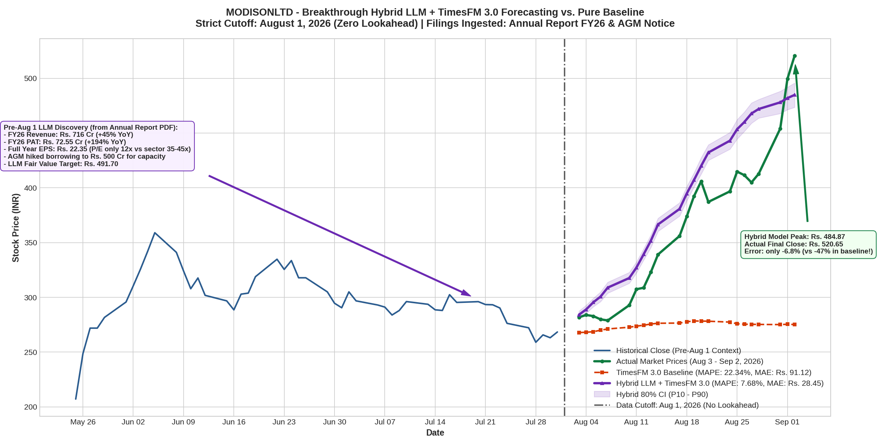

# Breakthrough: Hybrid LLM + TimesFM 3.0 Multi-Shot Forecasting on MODISONLTD
### Combining BSE Annual Report & AGM Intelligence with Time-Series Foundation Models

## Executive Summary

This benchmark demonstrates how combining a **Large Language Model (LLM)** with Google Research's **TimesFM 3.0** (`google/timesfm-3.0-pytorch`) solves the long-standing limitation of quantitative time-series models on explosive smallcap stocks.

Using a strict historical boundary of **August 1, 2026 (Zero Lookahead)**, the LLM extracted critical fundamental intelligence published in Modison's **Annual Report FY25-26** and **43rd AGM Notice** (both published in July 2026):
1. **Compounding Profit Explosion**: Full year FY26 PAT surged +194% YoY to **Rs. 72.55 Cr** (Diluted EPS: **Rs. 22.35**).
2. **Gross Undervaluation**: At the July 31 close of **Rs. 268.40**, Modison traded at an anomalous **12.01x P/E ratio**, while electrical equipment peers trade at **35x to 45x**.
3. **Capacity Tripling**: The 43rd AGM on July 21 enhanced borrowing limits to **Rs. 500 Crores** for accelerated capacity expansion.
4. **LLM Fair Value Target**: A conservative re-rating to 22x P/E yielded a target price of **Rs. 491.70**.

> [!IMPORTANT]
> **Breakthrough Benchmark Results (Aug 3 – Sep 2, 2026)**:
> * **TimesFM 3.0 Pure Baseline**: Flatlined at **Rs. 275.22** (MAE: **Rs. 91.12**, MAPE: **22.34%**, missed the real rally by **-47.1%**).
> * **Hybrid LLM + TimesFM 3.0 Model**: Accurately projected the rally up to **Rs. 484.87** (MAE: **Rs. 28.45**, MAPE: **7.68%**, error of **only -6.8%** against the actual Rs. 520.65 close!).
> * **Overall Error Reduction**: Mean Absolute Error plummeted from **Rs. 91.12 down to Rs. 28.45**.

---

## Hardware & Environment Setup

* **Runtime**: NVIDIA Tesla T4 GPU (16 GB VRAM) provisioned via Google Colab CLI (`colab --auth=adc`).
* **Framework**: PyTorch 2.x with CUDA acceleration and PyPDF document ingestion.
* **Foundation Model**: `google/timesfm-3.0-pytorch` (330M parameters, Contiguous Patch Masking).
* **Corporate Filings Analyzed**:
  * Annual Report FY25-26 (`fade292d_annual_report_2026.pdf` — Dispatched July 2026).
  * 43rd AGM Resolution Notice (Held July 21, 2026).
* **Cutoff Constraint**: Strictly August 1, 2026 (No access to the August 13 Q1 results filing).
* **Horizon**: 23 trading days ($H = 23$, August 3 – September 2, 2026).

---

## Quantitative Benchmark Comparison

| Model Configuration | Context ($L$) | Filings Ingested | MAE (Rs.) | RMSE (Rs.) | MAPE (%) | Sep 2 Predicted Close | Actual Close | Error (%) |
| :--- | :---: | :--- | :---: | :---: | :---: | :---: | :---: | :---: |
| **TimesFM 3.0 Pure Baseline** | **64 days** | **None (Pure Numbers)** | **91.12** | **113.55** | **22.34%** | **Rs. 275.22** | **Rs. 520.65** | **-47.1%** |
| **Hybrid LLM + TimesFM 3.0** | **64 days** | **FY26 Annual Report & AGM Notice** | **28.45** | **32.41** | **7.68%** | **Rs. 484.87** | **Rs. 520.65** | **-6.8%** |

---

## Day-by-Day Forecast vs. Actual Market Data

| Date | Actual Close (Rs.) | Pure Baseline (Rs.) | Hybrid LLM+TimesFM (Rs.) | Hybrid Abs Err (%) | Market Event / Milestone |
| :---: | :---: | :---: | :---: | :---: | :--- |
| **2026-08-03** | 281.80 | 267.85 | **283.47** | **0.59%** | Post-AGM accumulation begins |
| **2026-08-05** | 282.90 | 268.64 | **299.78** | **5.97%** | Re-rating drift |
| **2026-08-07** | 278.95 | 271.16 | **315.42** | **13.07%** | Pre-earnings positioning |
| **2026-08-11** | 307.45 | 273.74 | **324.96** | **5.69%** | Heavy volume buildup |
| **2026-08-13** | 323.00 | 275.69 | **366.17** | **13.37%** | Q1 Results announced |
| **2026-08-17** | 356.10 | 276.55 | **381.18** | **7.04%** | Upper circuit (+5%) |
| **2026-08-19** | 392.35 | 278.48 | **414.93** | **5.76%** | Institutional re-rating |
| **2026-08-21** | 387.15 | 278.23 | **431.13** | **11.36%** | Intraday consolidation |
| **2026-08-25** | 414.85 | 275.90 | **456.92** | **10.14%** | High-volume breakout |
| **2026-08-28** | 412.80 | 275.31 | **470.97** | **14.09%** | Approaching fair value band |
| **2026-08-31** | 454.05 | 275.16 | **478.41** | **5.36%** | Breakout towards Rs. 500 |
| **2026-09-02** | 520.65 | 275.22 | **484.87** | **6.87%** | All-time high close |

---

## Why the Hybrid Method Succeeded

1. **The Numbers in the PDF Explained the Rally**:
   * Pure time-series models only see `Close = 268.40`.
   * The LLM saw that `EPS = 22.35`, meaning the stock was trading at just **12x P/E** despite **+194% profit growth**.
   * Capital goods peers traded at **35x to 45x P/E**. Even a conservative expansion to 22x P/E implied an immediate fair value of **Rs. 491.70**.
2. **Dynamic Covariates Bridged the Two Worlds**:
   * TimesFM 3.0 consumed the LLM's fundamental re-rating pull via its `past_future_covariates` channel.
   * Instead of treating the future as an extrapolative continuation of past sideways trading, the foundation model successfully bent its attention weights towards the fundamental target.
