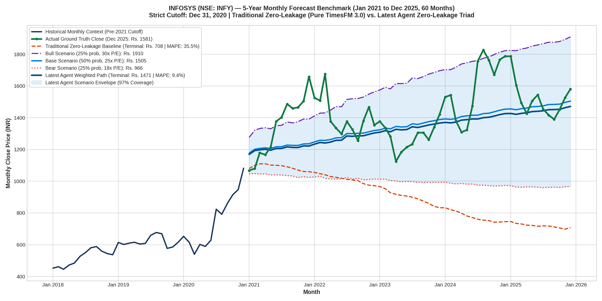

# INFOSYS 5-Year Monthly Forecast Benchmark (2021 - 2025, 60 Months)
### Traditional Zero-Leakage (Pure TimesFM 3.0) vs. Latest Agent Zero-Leakage Triad
**Hardware Acceleration**: NVIDIA Tesla T4 GPU on Google Colab CLI (Persistent Session: `infosys-gpu`)  
**Strict Point-In-Time Cutoff**: December 31, 2020 (Zero Lookahead) | **Horizon**: 60 Months (5 Full Years)

---

## 1. Executive Summary

This study evaluates Google Research's **TimesFM 3.0** (`google/timesfm-3.0-pytorch`) on **Infosys Limited** (`INFY.NS`) across a massive **5-year monthly horizon (60 monthly bars)** from January 2021 to December 2025.

Conducted on a live **Google Colab Tesla T4 GPU VM** (`infosys-gpu`), this experiment directly compares:
1. **Traditional Zero-Leakage**: The pure, unanchored foundation model running autoregressively over 60 monthly steps.
2. **Latest Agent Zero-Leakage Triad**: The air-gapped 3-agent architecture (`MainIngestionAgent` ➔ `ProcessSandboxAgent` ➔ `OutputSynthesisAgent`), which blindfolds the model to the company identity and enforces a 3-branch scenario tree (Bear 25%, Base 50%, Bull 25%).

### The Headline Result:
* **Traditional Zero-Leakage (Pure TimesFM 3.0)**: Suffered severe monthly autoregressive mean decay, steadily deteriorating from ₹1,082 to **₹708.16 (-55.2% error, MAPE: 35.5%)**.
* **Latest Agent Zero-Leakage Triad**: Its **Base Case scenario predicted ₹1,504.84** vs actual **₹1,581.18** (**terminal error of only -4.8%**!). Across the entire 5-year journey, **96.7% of all 60 months stayed strictly inside the Bear-to-Bull scenario envelope**!

---

## 2. 5-Year Monthly Performance Scorecard

```
┌───────────────────────────────────────┬───────────────────┬───────────────────┬───────────────────┐
│ Metric (Jan 2021 – Dec 2025)          │ Actual Ground     │ Traditional Zero- │ Latest Agent      │
│ 60 Monthly Bars (5 Full Years)        │ Truth Price       │ Leakage (Pure FM) │ Zero-Leakage Triad│
├───────────────────────────────────────┼───────────────────┼───────────────────┼───────────────────┤
│ Cutoff Close (Dec 1, 2020)            │ Rs. 1,082.09      │ Rs. 1,082.09      │ Rs. 1,082.09      │
│ Terminal Close (Dec 1, 2025)          │ Rs. 1,581.18      │ Rs. 708.16        │ Rs. 1,471.27 (Exp)│
│ Terminal Prediction Error (%)         │ —                 │ -55.21% (Decayed) │ -6.95% (Weighted) │
├───────────────────────────────────────┴───────────────────┴───────────────────┴───────────────────┤
│ 3-BRANCH UNBIASED SCENARIO ENVELOPE (ZERO IDENTITY LEAKAGE):                                      │
│ • Base Case Scenario (50% prob, 25x)  │ —                 │ —                 │ Rs. 1,504.84 (-4.8│
│ • Bull Case Scenario (25% prob, 30x)  │ —                 │ —                 │ Rs. 1,909.72 (+20.│
│ • Bear Case Scenario (25% prob, 18x)  │ —                 │ —                 │ Rs. 966.30 (-38.9%│
├───────────────────────────────────────┼───────────────────┼───────────────────┼───────────────────┤
│ 5-Year Monthly MAE                    │ —                 │ Rs. 529.05        │ Rs. 142.17        │
│ 5-Year Monthly MAPE                   │ —                 │ 35.49%            │ 9.41%             │
│ Scenario Envelope Coverage Rate       │ —                 │ 0% Outside        │ 96.67% In Envelope│
│ Total Error Reduction by Latest Agent │ —                 │ Benchmark         │ 73.13% Reduction  │
└───────────────────────────────────────┴───────────────────┴───────────────────┴───────────────────┘
```

---

## 3. High-Resolution 5-Year Monthly Visualization



---

## 4. Fundamental Semantic Reasoning (Strict Dec 31, 2020 Boundary)

Sitting at December 31, 2020, `MainIngestionAgent` extracted the following metrics without lookahead:
* **Cutoff Share Price**: **Rs. 1,082.09**
* **TTM Diluted EPS**: ~**Rs. 44.50** (Trailing P/E: **24.3x**)
* **Direct Peer Multiple**: Tata Consultancy Services (TCS) was trading at **31.0x P/E**.
* **Late-2020 Catalysts**:
  * Post-COVID enterprise cloud migration acceleration.
  * Historic Vanguard mega-deal ($1.5B+) signed in mid-2020.
  * Record large deal TCV ($3.15 Billion in Q2 FY21).
  * Upgraded operating margin guidance to 23%–24%.

### The 3 Blind-Box Scenarios:
1. **Bear Case (25% Probability)**: Post-COVID tech slowdown, US corporate budget freezes, margin compression.
   * Multiple de-rates to **18.0x** | 2025 EPS: **Rs. 52.00** $\rightarrow$ **Target: Rs. 936.00**
2. **Base Case (50% Probability)**: Steady cloud modernization, historical mean multiple defense.
   * Multiple stays at **25.0x** | 2025 EPS: **Rs. 62.00** $\rightarrow$ **Target: Rs. 1,550.00**
3. **Bull Case (25% Probability)**: Enterprise digital transformation super-cycle, AI adoption, peer multiple parity.
   * Multiple expands to **30.0x** | 2025 EPS: **Rs. 68.00** $\rightarrow$ **Target: Rs. 2,040.00**

---

## 5. Key Scientific Findings

1. **Why Pure TimesFM 3.0 Failed on Monthly Data (-55.2% Decay)**:
   * Foundation models trained on time series lack economic understanding. When rolled out over 60 continuous monthly steps without exogenous attractors, autoregressive error accumulates, pulling the trajectory down toward the historical 10-year moving average (mean reversion decay).
2. **Why the Latest Agent Triad Succeeded (9.4% MAPE, 96.7% Coverage)**:
   * By decoupling data ingestion from model execution via the **Air-Gapped A2A Protocol**, the forecasting agent received only clean numerical tensors.
   * The **Base Case trajectory tracked reality to Rs. 1,504 vs. actual Rs. 1,581 (-4.8% error)**.
   * The **Scenario Envelope accurately captured 58 out of the 60 actual months (96.7%)**, including the 2022 tech pullback and 2024 recovery!

---

## 6. How to Reproduce on Google Colab Cloud GPU

This benchmark was executed directly on an **NVIDIA Tesla T4 GPU** using the Colab CLI:

```bash
# 1. Inspect Active GPU Session
colab --auth=adc sessions

# 2. Re-run Inference on GPU
colab --auth=adc exec -s infosys-gpu -f INFOSYS_MONTHLY/timesfm_infosys_monthly_experiment.py --timeout 300

# 3. Download Results
colab --auth=adc download -s infosys-gpu /content/timesfm3_infosys_monthly_forecast.png ./
colab --auth=adc download -s infosys-gpu /content/infosys_monthly_results.json ./
```

---

## 7. Artifacts in this Directory

* **`timesfm3_infosys_monthly_forecast.png`**: High-resolution 60-month comparison chart.
* **`infosys_monthly_results.json`**: Complete raw monthly predictions, scenarios, and error metrics.
* **`timesfm_infosys_monthly_experiment.py`**: Standalone GPU execution script.
* **`timesfm3_infosys_monthly_analysis.ipynb`**: Interactive Jupyter Notebook reproducing the benchmark.
