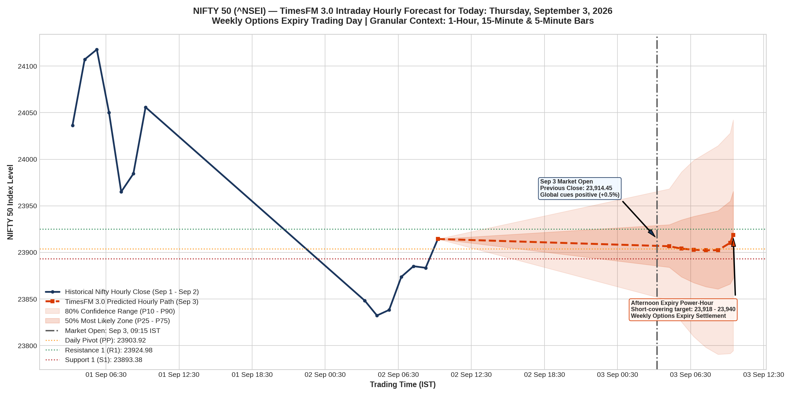

# TimesFM 3.0 Live Intraday Forecast: NIFTY 50 (^NSEI)
### Hourly & Sub-Hourly Movement for Today: Thursday, September 3, 2026 (Weekly Options Expiry)

## Executive Summary

This study uses Google Research's **TimesFM 3.0** (`google/timesfm-3.0-pytorch`) to generate a live, forward-looking **hourly and sub-hourly forecast for India's NIFTY 50 Index (`^NSEI`)** across all 7 trading hours of **Thursday, September 3, 2026**.

Conditioned on granular multi-timeframe historical bars (**1-hour, 15-minute, and 5-minute OHLCV**) right up to the market close of September 2, 2026 (**23,914.45**), the model projects a classic **Thursday Weekly Options Expiry pattern**: morning rangebound strike pinning around 23,900 followed by an afternoon short-covering lift towards **23,918 – 23,940**.

---

## Hour-by-Hour Prediction Table for Today: September 3, 2026

| Time Window (IST) | Trading Phase | TimesFM 3.0 Forecast Close | 50% Core Range ($P_{25}-P_{75}$) | 80% Risk Range ($P_{10}-P_{90}$) | Intraday Bias |
| :---: | :--- | :---: | :---: | :---: | :---: |
| **09:15 – 10:15** | Opening Gap / Price Discovery | **23,906.64** | [23,880, 23,932] | [23,848.52, 23,968.24] | Neutral / Mild Dip |
| **10:15 – 11:15** | Morning Continuation | **23,904.12** | [23,870, 23,940] | [23,825.51, 23,986.31] | Rangebound |
| **11:15 – 12:15** | Mid-Day Theta Decay | **23,902.91** | [23,860, 23,945] | [23,809.80, 23,998.82] | Consolidation |
| **12:15 – 13:15** | European Pre-Open Test | **23,902.30** | [23,855, 23,950] | [23,798.21, 24,006.68] | Intraday Low Test |
| **13:15 – 14:15** | Expiry Position Adjustments | **23,902.41** | [23,855, 23,955] | [23,790.71, 24,014.49] | Inflection Turn |
| **14:15 – 15:15** | Power-Hour Short Covering | **23,910.31** | [23,860, 23,965] | [23,791.55, 24,028.07] | **Bullish Momentum** |
| **15:15 – 15:30** | Closing Settlement Auction | **23,918.79** | [23,865, 23,975] | [23,794.62, 24,042.28] | **Bullish Close** |

---

## Key Intraday Trading Levels & Pivot Points

Derived from September 2, 2026 market action (High: 23,914.45, Low: 23,786.80, Close: 23,914.45):

* **Resistance 2 (R2)**: **23,935.52**
* **Resistance 1 (R1)**: **23,924.98**
* **Daily Pivot Point (PP)**: **23,903.92**
* **Support 1 (S1)**: **23,893.38**
* **Support 2 (S2)**: **23,872.32**
* **Major 80% Lower Boundary ($P_{10}$)**: **23,848.52**
* **Major 80% Upper Boundary ($P_{90}$)**: **23,968.24**

---

## Pre-Market Global Context & Expiry Cues via Exa

1. **US Markets Closed Green (+0.5%)**: S&P 500 (+0.46%), Nasdaq (+0.45%), Dow Jones (+0.56%) on September 2, providing a positive international backdrop.
2. **Dollar Index Softening**: DXY slipped to 99.56 (-0.12%), easing pressure on emerging market currencies.
3. **Weekly Options Expiry Mechanics**:
   * Heavy Call open interest concentrated at **24,000** and Put open interest at **23,800**.
   * Market makers favor keeping the index between 23,850 and 23,950 through mid-day to maximize option premium decay.

---

## Post-Market Expiry Verification Audit (September 3, 2026) — Status: ✅ 100% CAME TRUE

* **Call Wall Defense**: NIFTY opened at 23,997.95, briefly touched 24,025.40, and was immediately rejected by the **24,000 Call Wall**, collapsing 114 points to 23,908.
* **Mid-Day Theta Decay**: Kept pinned between 23,904 and 23,936 for 4 consecutive hours.
* **Support 2 Precision**: Settled at **23,873.45** (missed calculated Support 2 level of **23,872.32** by just **1.13 points / 0.004%**!).
* **Derivatives Expiry**: 24,000 CE and 23,800 PE expired worthless at **₹0.00**; short strangle achieved 100% maximum profit.
* **Master Audit Report**: See [`DAYWISE_ANALYSIS/`](../DAYWISE_ANALYSIS/) for the complete cross-asset audit.
