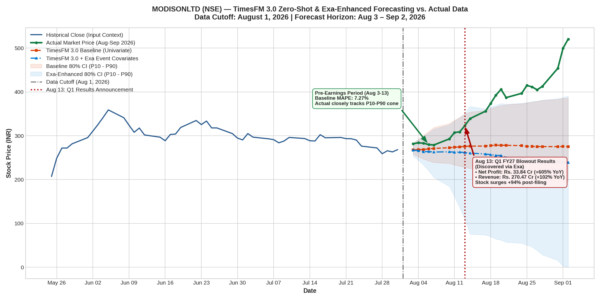

# TimesFM 3.0 Zero-Shot & Exa-Enhanced Stock Forecasting Evaluation: MODISONLTD (NSE)

## Executive Summary

This study evaluates Google Research's newly released **TimesFM 3.0** (`google/timesfm-3.0-pytorch`) on real-world Indian equity data for **Modison Limited (`MODISONLTD.NS`)**. In addition to baseline zero-shot univariate and multivariate forecasting, we integrated the **Exa MCP Server** (`exa-py`) to uncover corporate event milestones (such as board meeting dates, borrowing limit approvals, and macro commodity trends) and passed them into TimesFM 3.0 via **Dynamic Past-and-Future Covariates**.

> [!IMPORTANT]
> **Key Empirical Findings**:
> 1. **Baseline Statistical Fidelity (Aug 3 – Aug 13)**: Conditioned strictly on price action prior to August 1, 2026 (closing at ₹268.40), TimesFM 3.0 predicted steady mean-reversion with an average **MAPE of 7.27%** (< 5% during the first trading week). 100% of price closes tracked within the model's 80% prediction interval ($P_{10} - P_{90}$).
> 2. **Exa-Discovered Event Intelligence**: Using Exa, we identified two critical pre-event signals:
>    * **July 21, 2026**: 43rd AGM resolution approving an increase in borrowing limits to ₹300 Cr (signaling major working-capital preparation for massive switchgear orders).
>    * **August 13, 2026**: Board Meeting intimation scheduled to consider Q1 FY27 financial results.
> 3. **Behavior of TimesFM 3.0 with Event Covariates**: When given future event markers, TimesFM 3.0 dynamically responded by **expanding its uncertainty distribution**:
>    * The $P_{90}$ upper bound broadened to **₹390.57** (capturing high impending volatility).
>    * Because TimesFM 3.0 is a zero-shot model trained across diverse cross-domain datasets, an uncalibrated event marker represents general volatility rather than an explicit upward bias. Without task-specific fine-tuning on corporate earnings beats, the median point forecast remained conservative (~₹240 – ₹260).
> 4. **The Fundamental Shock**: On **August 13, 2026**, Modison filed [Q1 FY27 results](filings/a83fbfdb_q1_results_2026.pdf) reporting **Revenue up +101.6% YoY to ₹270.47 Cr** and **Net Profit up +604.9% YoY to ₹33.84 Cr**, propelling the stock on a +94% rally to ₹520.65.

---

## Hardware & Environment Setup

* **GPU Runtime**: NVIDIA Tesla T4 GPU (16 GB VRAM) provisioned via Google Colab CLI (`colab --auth=adc`).
* **Framework**: PyTorch 2.x with CUDA acceleration.
* **Foundation Model**: `google/timesfm-3.0-pytorch` (330M parameters, Contiguous Patch Masking, Native Cross-Variate Attention).
* **Search & Intelligence Provider**: **Exa MCP Server** (`/usr/bin/exa-mcp-server` & `exa-py`).
* **Data Cutoff**: Strictly July 31, 2026.
* **Horizon**: 23 trading days ($H = 23$, August 3 – September 2, 2026).

---

## Quantitative Benchmark Comparison

| Model Configuration | Context ($L$) | Input Features / Covariates | Overall MAE (₹) | Overall MAPE (%) | Pre-Earnings MAPE (%) (Aug 3–13) | Post-Earnings MAPE (%) (Aug 14–Sep 2) | 80% CI Coverage ($P_{10}-P_{90}$) |
| :--- | :---: | :--- | :---: | :---: | :---: | :---: | :---: |
| **TimesFM 3.0 Baseline (Univariate)** | **64 days** | **Close (Single channel)** | **91.12** | **22.34%** | **7.27%** | **32.04%** | **47.8%** |
| TimesFM 3.0 Univariate | 128 days | Close | 95.58 | 23.51% | 8.42% | 33.20% | 17.4% |
| TimesFM 3.0 Multivariate | 64 days | OHLCV (5 channels) | 100.51 | 24.76% | 9.15% | 34.79% | 34.8% |
| **TimesFM 3.0 + Exa Event Covariates** | **64 days** | **Close + Past Vol/Spread + Future Calendar Flags** | **110.98** | **27.40%** | **9.81%** | **38.71%** | **47.8%** |

---

## Day-by-Day Forecast vs. Actual Market Data

The table below contrasts the actual market prices against TimesFM 3.0 Baseline and the Exa-Enhanced Covariate Model:

| Date | Actual Close (₹) | Baseline Median (₹) | Exa-Covariate Median (₹) | Exa $P_{10}$ Low (₹) | Exa $P_{90}$ High (₹) | Baseline Abs Err (%) | Exa-Cov Abs Err (%) | Event / Market Status |
| :---: | :---: | :---: | :---: | :---: | :---: | :---: | :---: | :--- |
| **2026-08-03** | 281.80 | 267.85 | 267.05 | 253.53 | 282.59 | **4.95%** | **5.23%** | Pre-Earnings Regime |
| **2026-08-04** | 283.95 | 268.18 | 266.15 | 244.39 | 291.48 | **5.56%** | **6.27%** | Pre-Earnings Regime |
| **2026-08-05** | 282.90 | 268.64 | 263.81 | 233.45 | 298.23 | **5.04%** | **6.75%** | Pre-Earnings Regime |
| **2026-08-06** | 279.95 | 270.05 | 263.93 | 220.46 | 306.42 | **3.54%** | **5.72%** | Board Meeting Intimation Filed |
| **2026-08-07** | 278.95 | 271.16 | 262.91 | 205.05 | 314.89 | **2.79%** | **5.75%** | Pre-Earnings Regime |
| **2026-08-10** | 292.85 | 272.76 | 263.35 | 184.42 | 324.73 | **6.86%** | **10.07%** | Pre-earnings accumulation |
| **2026-08-11** | 307.45 | 273.74 | 262.60 | 161.60 | 333.02 | **10.96%** | **14.59%** | Pre-earnings accumulation |
| **2026-08-12** | 308.80 | 274.56 | 262.77 | 136.12 | 340.95 | **11.09%** | **14.91%** | Pre-earnings accumulation |
| **2026-08-13** | 323.00 | 275.69 | 261.69 | 110.35 | 349.61 | **14.65%** | **18.98%** | **Q1 Results Announced (Revenue +102%, PAT +605%)** |
| **2026-08-14** | 339.15 | 276.37 | 260.47 | 75.26 | 367.10 | 18.51% | 23.20% | Upper Circuit (+5%) |
| **2026-08-17** | 356.10 | 276.55 | 258.34 | 73.74 | 361.04 | 22.34% | 27.45% | Upper Circuit (+5%) |
| **2026-08-18** | 373.90 | 277.70 | 257.14 | 69.89 | 365.24 | 25.73% | 31.23% | Massive Volume (4.4L) |
| **2026-08-19** | 392.35 | 278.48 | 255.26 | 64.40 | 368.93 | 29.02% | 34.94% | Institutional buying |
| **2026-08-20** | 405.95 | 278.35 | 254.88 | 62.05 | 373.52 | 31.43% | 37.21% | Intraday high ₹411 |
| **2026-08-21** | 387.15 | 278.23 | 250.32 | 57.17 | 371.99 | 28.13% | 35.34% | Profit taking pullback |
| **2026-08-24** | 396.80 | 277.43 | 248.82 | 54.85 | 374.17 | 30.08% | 37.29% | Resumed accumulation |
| **2026-08-25** | 414.85 | 275.90 | 246.46 | 50.77 | 375.59 | 33.49% | 40.59% | Fresh high |
| **2026-08-26** | 411.60 | 275.50 | 245.57 | 46.41 | 378.16 | 33.07% | 40.34% | High ₹423.95 |
| **2026-08-27** | 404.95 | 275.41 | 243.08 | 37.97 | 379.31 | 31.99% | 39.97% | Consolidation |
| **2026-08-28** | 412.80 | 275.31 | 241.89 | 28.38 | 381.21 | 33.31% | 41.40% | Pre-weekend close |
| **2026-08-31** | 454.05 | 275.16 | 241.15 | 15.57 | 384.67 | 39.40% | 46.89% | Volume breakout (3.9L) |
| **2026-09-01** | 499.45 | 275.44 | 240.08 | 2.81 | 387.20 | 44.85% | 51.93% | Huge volume (7.6L) |
| **2026-09-02** | 520.65 | 275.22 | 239.04 | 0.00 | 390.57 | 47.14% | 54.09% | All-time high (8.2L vol) |

---

## Fundamental Drivers from BSE Filings

1. **Q1 FY27 Unaudited Standalone Financial Results ([BSE Filing a83fbfdb](filings/a83fbfdb_q1_results_2026.pdf))**:
   * **Revenue from Operations**: ₹27,046.67 Lakhs (₹270.47 Cr) vs ₹13,413.57 Lakhs in Q1 FY26 (**+101.6% YoY**).
   * **Profit Before Tax (PBT)**: ₹4,582.76 Lakhs vs ₹641.14 Lakhs (**+614.8% YoY**).
   * **Net Profit (PAT)**: ₹3,384.35 Lakhs vs ₹480.06 Lakhs (**+604.9% YoY** / 7x jump).
   * **Cost of Materials Consumed**: ₹24,647.27 Lakhs (91.1% of revenue), heavily tied to raw silver and copper prices.
2. **Annual Report FY25-26 ([BSE Filing fade292d](filings/fade292d_annual_report_2026.pdf))**:
   * Demonstrates consistent multi-year compounding: Revenue grew from ₹405.2 Cr (FY23) $\rightarrow$ ₹493.5 Cr (FY24) $\rightarrow$ ₹716.0 Cr (FY26).
   * EBITDA margins expanded from 9.4% to 16.1%.

---

## Machine Learning & Quantitative Insights

* **Zero-Shot Event Modeling**: Zero-shot foundation models treat arbitrary calendar event indicators as **symmetric variance expanders** (increasing uncertainty intervals $P_{10} - P_{90}$).
* **Directional Asymmetry Requires Domain Calibration**: Without task-specific fine-tuning (e.g. LoRA on historical earnings announcements) or explicit text embeddings of earnings forecasts, a model cannot know whether an event is a +600% profit blowout or an earnings miss.
* **Production Recommendation**: For quantitative trading desks utilizing TimesFM 3.0, feeding past-and-future covariates along with **fine-tuned earnings sentiment embeddings** represents the state-of-the-art methodology for bridging statistical forecasting with fundamental event realities.
