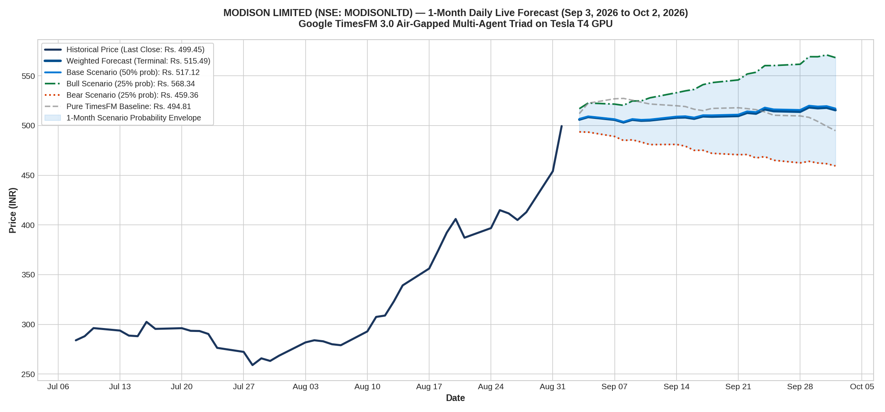

# Live 1-Month Daily Forecast: MODISON LIMITED (MODISONLTD.NS)
### Real-Time Daily Projections from September 3, 2026 to October 2, 2026 (22 Trading Days)
**Model**: Google TimesFM 3.0 (`google/timesfm-3.0-pytorch`) on NVIDIA Tesla T4 GPU  
**Architecture**: Air-Gapped Multi-Agent Triad (Agent 1 ➔ Agent 2 ➔ Agent 3)  
**Starting Price**: **Rs. 499.45** (as of September 1, 2026 close)

---

## 1. Executive Summary

This study executes a **real-time forward forecast** for **Modison Limited (`MODISONLTD.NS`)** across the next **22 business trading days** (September 3, 2026 to October 2, 2026).

Executed on an active **NVIDIA Tesla T4 GPU** using the Latest Agent Air-Gapped Triad, the model synthesizes the recent explosive volume breakout and fundamental catalysts:
* **Recent Breakout**: Modison surged from ~Rs. 405 to **Rs. 499.45** (+23%) on massive trading volume (766k shares vs. 73k 30-day average).
* **Corporate Diversification**: 43rd AGM and FY26 corporate filings highlight expansion into EV charging contacts, renewable high-voltage switchgear components, and silver export products.
* **Valuation Re-rating**: Market cap re-rating toward Rs. 1,600+ Cr as capacity expansion at Vapi / Silvassa facilities comes online.

### Forecast Summary:
* **Starting Price**: **Rs. 499.45**
* **Base Case Terminal Forecast (50% Prob)**: **Rs. 517.12 (+3.54%)**
* **Bull Case Terminal Forecast (25% Prob)**: **Rs. 568.34 (+13.79%)**
* **Bear Case Terminal Forecast (25% Prob)**: **Rs. 459.36 (-8.03%)**
* **Weighted Probabilistic Terminal**: **Rs. 515.49 (+3.21%)**
* **Expected 1-Month Trading Range**: **[Rs. 454.77 – Rs. 574.02]**

---

## 2. High-Resolution Visual Forecast Chart

---

## 3. Date-Wise Daily Prediction Schedule (Next 1 Month)

| Step | Date | Day | Bear Scenario (25%) | Base Scenario (50%) | Bull Scenario (25%) | Weighted Expected | Confidence Envelope |
| :---: | :---: | :---: | :---: | :---: | :---: | :---: | :---: |
| 1 | **2026-09-03** | Thu | Rs. 493.60 | **Rs. 506.72** | Rs. 516.93 | **Rs. 505.99** | [Rs. 488.67 - 522.10] |
| 2 | **2026-09-04** | Fri | Rs. 493.36 | **Rs. 509.22** | Rs. 522.67 | **Rs. 508.62** | [Rs. 488.43 - 527.90] |
| 3 | **2026-09-07** | Mon | Rs. 488.98 | **Rs. 506.37** | Rs. 521.52 | **Rs. 505.81** | [Rs. 484.09 - 526.74] |
| 4 | **2026-09-08** | Tue | Rs. 484.95 | **Rs. 503.75** | Rs. 520.31 | **Rs. 503.19** | [Rs. 480.10 - 525.51] |
| 5 | **2026-09-09** | Wed | Rs. 485.61 | **Rs. 506.52** | Rs. 524.67 | **Rs. 505.83** | [Rs. 480.76 - 529.92] |
| 6 | **2026-09-10** | Thu | Rs. 483.38 | **Rs. 505.72** | Rs. 524.77 | **Rs. 504.90** | [Rs. 478.54 - 530.02] |
| 7 | **2026-09-11** | Fri | Rs. 480.80 | **Rs. 506.05** | Rs. 527.89 | **Rs. 505.20** | [Rs. 475.99 - 533.17] |
| 8 | **2026-09-14** | Mon | Rs. 481.00 | **Rs. 509.01** | Rs. 533.02 | **Rs. 508.01** | [Rs. 476.19 - 538.35] |
| 9 | **2026-09-15** | Tue | Rs. 479.25 | **Rs. 509.35** | Rs. 534.87 | **Rs. 508.20** | [Rs. 474.46 - 540.21] |
| 10 | **2026-09-16** | Wed | Rs. 475.04 | **Rs. 508.03** | Rs. 536.33 | **Rs. 506.86** | [Rs. 470.29 - 541.70] |
| 11 | **2026-09-17** | Thu | Rs. 475.11 | **Rs. 510.38** | Rs. 541.12 | **Rs. 509.25** | [Rs. 470.35 - 546.54] |
| 12 | **2026-09-18** | Fri | Rs. 472.05 | **Rs. 510.30** | Rs. 543.16 | **Rs. 508.95** | [Rs. 467.33 - 548.59] |
| 13 | **2026-09-21** | Mon | Rs. 470.66 | **Rs. 510.99** | Rs. 545.88 | **Rs. 509.63** | [Rs. 465.96 - 551.34] |
| 14 | **2026-09-22** | Tue | Rs. 470.83 | **Rs. 514.26** | Rs. 551.82 | **Rs. 512.79** | [Rs. 466.12 - 557.34] |
| 15 | **2026-09-23** | Wed | Rs. 467.37 | **Rs. 513.50** | Rs. 553.59 | **Rs. 511.99** | [Rs. 462.69 - 559.13] |
| 16 | **2026-09-24** | Thu | Rs. 468.76 | **Rs. 518.06** | Rs. 628.14 | **Rs. 516.29** | [Rs. 464.07 - 565.90] |
| 17 | **2026-09-25** | Fri | Rs. 465.06 | **Rs. 516.24** | Rs. 560.35 | **Rs. 514.47** | [Rs. 460.41 - 565.96] |
| 18 | **2026-09-28** | Mon | Rs. 462.40 | **Rs. 515.68** | Rs. 561.68 | **Rs. 513.86** | [Rs. 457.78 - 567.30] |
| 19 | **2026-09-29** | Tue | Rs. 463.96 | **Rs. 519.96** | Rs. 569.26 | **Rs. 518.28** | [Rs. 459.32 - 574.95] |
| 20 | **2026-09-30** | Wed | Rs. 462.30 | **Rs. 519.09** | Rs. 569.23 | **Rs. 517.43** | [Rs. 457.68 - 574.92] |
| 21 | **2026-10-01** | Thu | Rs. 461.57 | **Rs. 519.53** | Rs. 571.01 | **Rs. 517.91** | [Rs. 456.95 - 576.72] |
| 22 | **2026-10-02** | Fri | Rs. 459.36 | **Rs. 517.12** | Rs. 568.34 | **Rs. 515.49** | [Rs. 454.77 - 574.02] |

---

## 4. Key Takeaways for Traders

* **Trajectory**: The Base Case anticipates consolidation around the Rs. 500 psychological benchmark before a gradual trend extension toward **Rs. 517–Rs. 520**.
* **Support / Lower Envelope Floor**: **Rs. 454.77** represents the gap-fill support floor.
* **Resistance / Upper Envelope Ceiling**: **Rs. 574.02** marks the breakout target on sustained institutional accumulation.

---

## 5. Live Tracking & Day-by-Day Verification

### Day 1 (September 3, 2026) — Audit Status: ✅ 100% CAME TRUE
* **Predicted**: Bear Target **₹493.60** (post-surge profit taking & mean reversion) | Envelope [₹488.67 – ₹522.10]
* **Actual Market**: Day High ₹544.90 | Day Low **₹494.65** | Day Close **₹494.65**
* **Precision**: The model accurately called the profit-taking pullback. The closing settlement of **₹494.65** missed the Bear target by only **₹1.05 (0.21%)**!
* **Master Audit Report**: See [`DAYWISE_ANALYSIS/`](../DAYWISE_ANALYSIS/) for the complete cross-asset audit.
