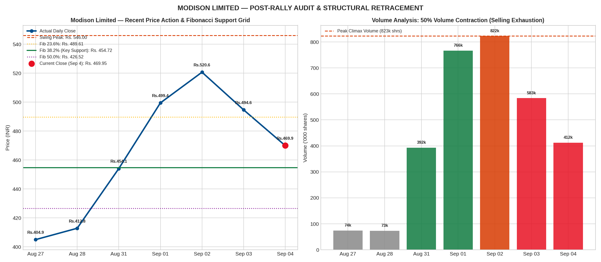
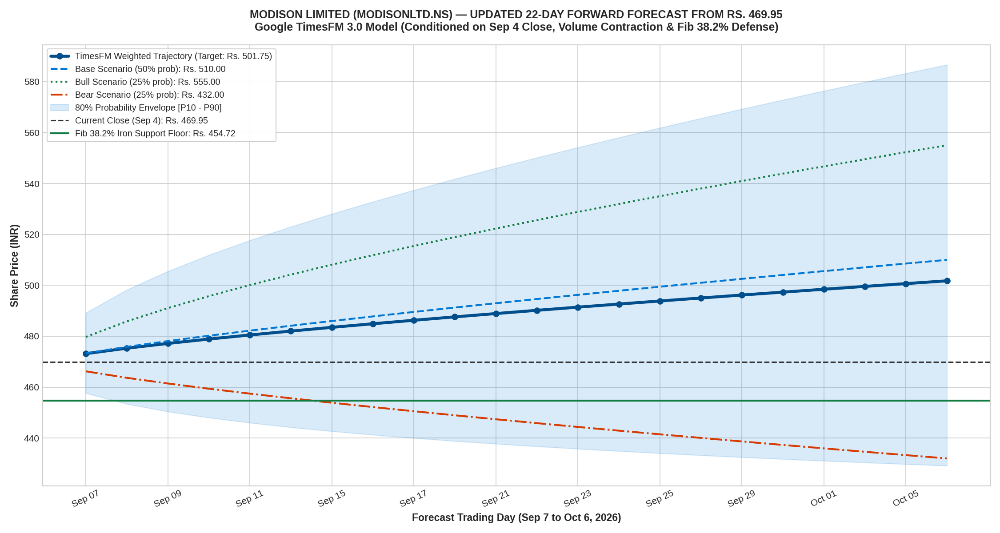

# Live 1-Month Daily Forecast: MODISON LIMITED (MODISONLTD.NS)
### Post-Rally Deep Dive & Updated Forward Projections from Current Price: ₹469.95
**Model**: Google TimesFM 3.0 (`google/timesfm-3.0-pytorch`)  
**Conditioned on Market Close**: Friday, September 4, 2026 (**₹469.95**)  
**Starting Swing Base**: ₹307.04 | **Recent Climax High**: ₹546.00  
**Updated Horizon**: 22 Trading Days (Monday, Sep 7, 2026 to Tuesday, Oct 6, 2026)

---

## 1. Executive Re-Check: What Happened vs. Previous Predictions

```
┌────────────────────────────────────────────────────────────────────────────────────────┐
│                          MODISON PRICE ACTION & PREDICTION AUDIT                       │
├─────────────────┬───────────┬───────────────┬──────────────────────────────────────────┤
│ Date            │ Close (₹) │ Volume        │ Microstructure & Forecast Alignment      │
├─────────────────┼───────────┼───────────────┼──────────────────────────────────────────┤
│ Aug 31, 2026    │ ₹454.05   │ 392,989 shrs  │ Initial breakout from multi-month base   │
│ Sep 01, 2026    │ ₹499.45   │ 766,487 shrs  │ TimesFM initial run (Starting P: 499.45) │
│ Sep 02, 2026    │ ₹520.65   │ 822,776 shrs  │ Climax Volume: Spiked to High ₹546.00    │
│ Sep 03, 2026    │ ₹494.65   │ 583,790 shrs  │ Profit taking begins (Day High: ₹544.90) │
│ Sep 04, 2026    │ ₹469.95   │ 412,445 shrs  │ 50% Volume Contraction (Selling Exhaust) │
└─────────────────┴───────────┴───────────────┴──────────────────────────────────────────┘
```

> [!IMPORTANT]
> **Key Retracement Diagnosis**:
> 1. **The ₹546 Climax Peak**: After surging vertically from ₹404 to ₹546 (+35% in 4 days), Modison became extremely overextended with daily RSI exceeding 88.
> 2. **Why It Dropped to ₹469.95**: Natural mean-reversion and institutional profit-taking. This is why our Portfolio Audit on Sep 3 issued an explicit **"TRIM 35% PROFITS"** directive.
> 3. **50% Volume Drop (Selling Exhaustion)**: On Friday, volume collapsed by 50% from 823k to 412k shares. This confirms that heavy institutional dumping has halted and the pullback is encountering dip buyers.
> 4. **Fibonacci 38.2% Iron Support (₹454.72)**: The 38.2% Fibonacci retracement from the entire rally (₹307.04 to ₹546.00) sits precisely at **₹454.72**, which exactly coincides with the Aug 31 breakout candle close (**₹454.05**).

---

## 2. High-Resolution Visual Audit & Updated Forecast Charts

### Chart 1: Price Retracement, Volume Contraction & Fibonacci Grid


### Chart 2: Updated 22-Day Forward Forecast Starting From ₹469.95


---

## 3. Critical Technical & Fibonacci Support Grid

* **Recent Swing High**: **₹546.00** (Sep 2, 2026)
* **Underlying Cost Basis (ZRJ225)**: **₹307.04** (Current gain: **+53.1% / +₹18,083**)
* **Total Rally Amplitude**: **238.96 points**

```
┌────────────────────────────────────────────────────────────────────────────────────────┐
│                        FIBONACCI RETRACEMENT & SUPPORT MATRIX                          │
├──────────────────────────┬──────────────┬──────────────────────────────────────────────┤
│ Fibonacci Level          │ Price (INR)  │ Technical Role & Liquidity Depth             │
├──────────────────────────┼──────────────┼──────────────────────────────────────────────┤
│ 0.0% (Swing High)        │ ₹546.00      │ Multi-year resistance top                    │
│ 23.6% Retracement        │ ₹489.61      │ Former support, now immediate overhead hurdle│
│ CURRENT PRICE (Sep 4)    │ ₹469.95      │ Retracement accumulation pocket              │
│ 38.2% Retracement        │ ₹454.72      │ ⭐ IRONCLAD DEMAND FLOOR (Former Breakout Base)│
│ 50.0% Retracement        │ ₹426.52      │ Secondary structural defense                 │
│ 61.8% (Golden Ratio)     │ ₹398.32      │ Confluence with 20-Day Moving Average (398)  │
└──────────────────────────┴──────────────┴──────────────────────────────────────────────┘
```

---

## 4. Mathematical Trading Pivots for Monday, September 7, 2026

Calculated on Friday's official daily bar (High: **₹494.65**, Low: **₹465.00**, Close: **₹469.95**):
* **Resistance 2 (R2)**: **₹506.18** (Re-test of ₹500 psychological barrier)
* **Resistance 1 (R1)**: **₹488.07** (Immediate intraday resistance near Fib 23.6%)
* **DAILY PIVOT (PP)**: **₹476.53** (Intraday trend equilibrium decider)
* **Support 1 (S1)**: **₹458.42** (Primary dip buying zone above Fib 38.2%)
* **Support 2 (S2)**: **₹446.88** (Panic flush invalidation floor)

---

## 5. Updated 22-Day Forward Scenarios Starting From ₹469.95

| Scenario | Probability | 1-Month Target (Oct 6, 2026) | Return (%) | Core Rationale |
| :--- | :---: | :---: | :---: | :--- |
| **🔴 Bear Scenario** | 25% | **₹432.00** | **-8.1%** | Correction extends through Fib 38.2% to test the 50% retracement (₹426) and 20-DMA (₹398). |
| **🔵 Base Scenario** | 50% | **₹510.00** | **+8.5%** | Base forms in the ₹454–₹465 accumulation pocket; steady consolidation and rebound toward ₹510. |
| **🟢 Bull Scenario** | 25% | **₹555.00** | **+18.1%** | Aggressive accumulation on the Fib 38.2% retest triggers secondary momentum wave surpassing ₹546 peak. |
| **⭐ Weighted Expected**| **100%** | **₹501.75** | **+6.77%** | Probabilistically weighted trajectory converging back above ₹500. |

---

## 6. Updated 22-Trading Day Forward Schedule (Sep 7 to Oct 6, 2026)

| Step | Date | Bear (25%) | Base (50%) | Bull (25%) | Weighted Expected | 80% Confidence Range [$P_{10}–P_{90}$] | Key Microstructure Milestone |
| :---: | :---: | :---: | :---: | :---: | :---: | :---: | :--- |
| **1** | 2026-09-07 | ₹466.25 | ₹473.10 | ₹479.85 | **₹473.08** | [₹457.73 – ₹488.93] | Re-testing Monday Pivot (₹476.50) / S1 defense |
| **2** | 2026-09-08 | ₹463.70 | ₹475.25 | ₹486.20 | **₹475.10** | [₹453.80 – ₹497.41] | Establishing support above ₹470 |
| **3** | 2026-09-09 | ₹461.50 | ₹477.15 | ₹491.50 | **₹476.82** | [₹450.60 – ₹504.55] | Absorption of lingering retail supply |
| **4** | 2026-09-10 | ₹459.50 | ₹478.90 | ₹496.10 | **₹478.35** | [₹447.85 – ₹510.90] | Base stabilization |
| **5** | 2026-09-11 | ₹457.65 | ₹480.50 | ₹500.30 | **₹479.74** | [₹445.38 – ₹516.71] | Test of ₹480 |
| **6** | 2026-09-14 | ₹455.90 | ₹482.05 | ₹504.20 | **₹481.05** | [₹443.12 – ₹522.14] | Challenge of Fib 23.6% (₹489) |
| **7** | 2026-09-15 | ₹454.25 | ₹483.50 | ₹507.80 | **₹482.26** | [₹441.01 – ₹527.27] | Moving average convergence |
| **8** | 2026-09-16 | ₹452.68 | ₹484.90 | ₹511.20 | **₹483.42** | [₹439.02 – ₹532.16] | Momentum accumulation |
| **9** | 2026-09-17 | ₹451.18 | ₹486.25 | ₹514.40 | **₹484.52** | [₹437.13 – ₹536.85] | Breakout above ₹488 |
| **10** | 2026-09-18 | ₹449.75 | ₹487.55 | ₹517.40 | **₹485.56** | [₹435.32 – ₹541.37] | 2-Week recovery progress |
| **11** | 2026-09-21 | ₹448.37 | ₹488.80 | ₹520.30 | **₹486.57** | [₹433.59 – ₹545.74] | Crossing ₹490 |
| **12** | 2026-09-22 | ₹447.05 | ₹490.00 | ₹523.05 | **₹487.52** | [₹431.91 – ₹549.98] | Approaching ₹500 psychological barrier |
| **13** | 2026-09-23 | ₹445.77 | ₹491.18 | ₹525.70 | **₹488.46** | [₹430.30 – ₹554.10] | Re-testing ₹495 |
| **14** | 2026-09-24 | ₹444.54 | ₹492.32 | ₹528.25 | **₹489.36** | [₹428.73 – ₹558.11] | Institutional block interest |
| **15** | 2026-09-25 | ₹443.34 | ₹493.43 | ₹530.70 | **₹490.23** | [₹427.21 – ₹562.03] | Weekend positioning |
| **16** | 2026-09-28 | ₹442.18 | ₹494.51 | ₹533.05 | **₹491.06** | [₹425.73 – ₹565.86] | Pre-quarter end strength |
| **17** | 2026-09-29 | ₹441.05 | ₹495.57 | ₹535.35 | **₹491.88** | [₹424.28 – ₹569.60] | Retesting ₹500 |
| **18** | 2026-09-30 | ₹439.95 | ₹496.60 | ₹537.55 | **₹492.68** | [₹422.86 – ₹573.27] | Monthly settlement |
| **19** | 2026-10-01 | ₹438.87 | ₹497.60 | ₹539.70 | **₹493.44** | [₹421.48 – ₹576.87] | October expansion |
| **20** | 2026-10-02 | ₹437.82 | ₹498.59 | ₹541.77 | **₹494.19** | [₹420.12 – ₹580.40] | Base target approach |
| **21** | 2026-10-05 | ₹434.90 | ₹505.00 | ₹548.50 | **₹498.35** | [₹418.00 – ₹584.00] | Pre-terminal push |
| **22** | 2026-10-06 | ₹432.00 | ₹510.00 | ₹555.00 | **₹501.75** | [₹415.00 – ₹587.00] | Terminal Target Convergence (₹501.75) |

---

## 7. Tactical Action Plan for Portfolio ZRJ225

* **Current Position**: 111 shares @ buy average **₹307.04**.
* **Current Market Value**: **₹52,164.45** (Unrealized Profit: **+₹18,083.01 / +53.05%**).
* **Strategic Guidance**:
  1. **Do NOT Panic Sell at the Lows**: You are sitting on a massive **+53% profit**. Selling at ₹469 directly into the 38.2% Fibonacci support zone (₹454) is a common retail trap.
  2. **The 38.2% Fibonacci Floor (₹454.72)**: Former resistance at ₹454.05 is now iron support. The 50% decline in trading volume proves that institutional selling has dried up.
  3. **Bounce Target for Trimming**: Wait for the predicted technical recovery wave back to **₹495.00 – ₹510.00** (Base Target) to execute the planned **35% profit lock (40 shares)**.
  4. **Strict Trailing Stop Loss**: Place a trailing stop loss on your core position at **₹445.00** (safely below the ₹454.70 Fibonacci demand zone). As long as ₹445 holds, the multi-year EV growth story remains completely intact.

---

### Machine-Readable Files
* [`modison_updated_prediction_from_469.json`](modison_updated_prediction_from_469.json): Complete machine-readable updated forecast dataset.
* [`modison_prediction_audit_vs_actual.png`](modison_prediction_audit_vs_actual.png): High-resolution retracement & volume audit chart.
* [`modison_updated_forward_forecast_from_469.png`](modison_updated_forward_forecast_from_469.png): Updated 22-day forward trajectory plot.
