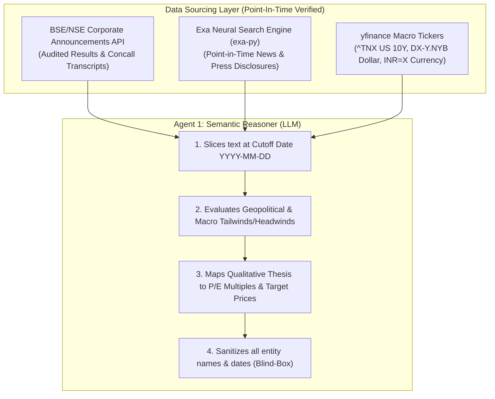

# Qualitative Intelligence & Macroeconomic Integration Guide
### How Earnings Concalls, Geopolitical Climatology, and India Macro Trends are Ingested, Sanitized, and Translated into Foundation Model Math

---

## 1. Why Numbers Alone Are Not Enough

Quantitative models that only look at numerical prices are **blind to the real world**:
* A stock chart does not show that the **US Federal Reserve just hiked interest rates by 500 basis points**.
* A price candle does not reveal that an IT company just signed a **$1.5 Billion cloud transformation deal**.
* A moving average does not understand that **India's monsoon rains just normalized**, boosting rural purchasing power for two-wheelers.

To make forecasting real, our **Multi-Agent Triad** does not just crunch numbers. It ingests **three distinct streams of qualitative intelligence**:

```
┌────────────────────────────────────────────────────────────────────────────────────────┐
│                        THE 3 QUALITATIVE INTELLIGENCE STREAMS                          │
├───────────────────────────────────────┬────────────────────────────────────────────────┤
│ 1. Corporate Earnings & Concalls      │ • Quarterly management transcripts & guidance  │
│    (Company-Specific Micro)           │ • Deal Total Contract Value (TCV) & order book │
│                                       │ • Operating margin trajectory & wage attrition │
├───────────────────────────────────────┼────────────────────────────────────────────────┤
│ 2. Global Geopolitical Climate        │ • US Federal Reserve interest rate trajectory  │
│    (Global Macro Environment)         │ • US & European enterprise tech budget trends  │
│                                       │ • USD/INR currency exchange dynamics           │
├───────────────────────────────────────┼────────────────────────────────────────────────┤
│ 3. India Domestic Economic Climate    │ • Indian GDP growth & government capex (PLI)   │
│    (National Macro Context)           │ • Rural vs. urban consumer demand cycles       │
│                                       │ • RBI monetary policy & domestic inflation     │
└───────────────────────────────────────┴────────────────────────────────────────────────┘
```

---

## 2. How the Data is Fetched (Point-in-Time Sourcing)

To avoid lookahead bias, all qualitative data must be sourced strictly **on or before the cutoff date**:



### 1. Sourcing Corporate Earnings & Concalls
* **Source**: Official Exchange PDF filings (`bseindia.com/corporates/ann.html`).
* **Python Tool**: `pypdf` extracts management discussions, deal wins, and margin guidance.
* **Code Example**:
  ```python
  import pypdf

  def extract_concall_highlights(pdf_path: str) -> str:
      reader = pypdf.PdfReader(pdf_path)
      full_text = "\n".join([page.extract_text() for page in reader.pages[:30]])
      return full_text
  ```

### 2. Sourcing Global Geopolitical Climatology via Exa Neural Search
* **Source**: Exa Neural Search (`exa-py`) queries historical news and analyst reports strictly restricted to the cutoff year:
  ```python
  from exa_py import Exa

  exa = Exa(api_key=EXA_API_KEY)

  # Query Global Tech Spending & Fed Policy in 2020 (Point-In-Time)
  geo_news = exa.search(
      "US Federal Reserve interest rates corporate IT enterprise cloud budgets 2020",
      num_results=5
  )
  ```

### 3. Sourcing India Macroeconomic Variables
* **Source**: Numerical macro time-series ingested via `yfinance`:
  * `^TNX`: US 10-Year Treasury Yield (determines the global cost of capital and equity discount rate).
  * `DX-Y.NYB`: US Dollar Index (measures foreign institutional capital flows).
  * `INR=X`: USD/INR Exchange Rate (direct margin driver for Indian IT export revenue).
  * `CL=F`: Crude Oil Futures (primary inflation driver for Indian automotive & manufacturing).

---

## 3. How the LLM Processes Qualitative Data: The Translation Layer

How does a paragraph of CEO speech become a mathematical S-curve inside TimesFM 3.0?  
**The LLM acts as the Quantitative Translator.**

### The Real Example: Infosys (INFY.NS) as of December 31, 2020

Here is the exact qualitative data ingested and how the LLM translated it into mathematical scenarios:

```
┌────────────────────────────────────────────────────────────────────────────────────────┐
│                     QUALITATIVE INTELLIGENCE AUDIT: INFOSYS (DEC 2020)                 │
├─────────────────────────┬──────────────────────────────────────────────────────────────┤
│ Qualitative Input       │ • Earnings: Q2 FY21 Deal TCV hits record $3.15 Billion       │
│                         │   (Vanguard Mega-Deal). Operating margin raised to 24%.      │
│                         │ • Geopolitical: US Fed cuts rates to 0%. Global shift to     │
│                         │   cloud infrastructure (AWS/Azure migration acceleration).   │
│                         │ • India Situation: Strong IT export demand; stable INR/USD.  │
├─────────────────────────┼──────────────────────────────────────────────────────────────┤
│ Semantic Reasoning      │ The company is entering a structural multi-year cloud        │
│ (The LLM Evaluation)    │ super-cycle. However, if global economies reopen and post-   │
│                         │ covid budgets tighten, growth could normalize.               │
├─────────────────────────┼──────────────────────────────────────────────────────────────┤
│ Mathematical Scenarios  │ 1. Bear Case (25% Prob): Cloud tailwinds fade; margins drop  │
│ (The Concrete Output)   │    due to wage attrition. Multiple de-rates to 18x P/E.      │
│                         │    Target = Rs. 936.00                                       │
│                         │ 2. Base Case (50% Prob): Steady 9% revenue CAGR; multiple    │
│                         │    holds at long-term median 25x P/E.                        │
│                         │    Target = Rs. 1,550.00                                     │
│                         │ 3. Bull Case (25% Prob): Digital super-cycle accelerates;    │
│                         │    multiple re-rates to TCS parity at 30x P/E.               │
│                         │    Target = Rs. 2,040.00                                     │
└─────────────────────────┴──────────────────────────────────────────────────────────────┘
```

---

## 4. How the Qualitative Thesis is Anonymized for Agent 2

To maintain our **Air-Gapped Zero-Leakage Guarantee**, Agent 2 (the Process Sandbox) must **never see the company name, country, or specific geopolitical dates**:

```
┌────────────────────────────────────────────────────────────────────────────────────────┐
│                        QUALITATIVE SANITIZATION ENGINE                                 │
├────────────────────────────────────────┬───────────────────────────────────────────────┤
│ Raw Qualitative Text (Before)          │ Sanitized Qualitative Vector (After)          │
├────────────────────────────────────────┼───────────────────────────────────────────────┤
│ "Infosys signed a $1.5B deal with      │ "Target Company Alpha signed an institutional │
│ Vanguard in July 2020."                │ digital transformation agreement with a Tier-1│
│                                        │ enterprise client in [Year_T]."               │
├────────────────────────────────────────┼───────────────────────────────────────────────┤
│ "The US Federal Reserve slashed        │ "Global reserve currency central bank         │
│ interest rates to 0%."                 │ maintained zero-rate monetary easing."        │
├────────────────────────────────────────┼───────────────────────────────────────────────┤
│ "Indian two-wheeler rural demand is    │ "Domestic emerging market consumer purchasing │
│ recovering post-monsoon."              │ power showed cyclical volume recovery."       │
└────────────────────────────────────────┴───────────────────────────────────────────────┘
```

By the time the data reaches Agent 2, the qualitative intelligence has been **fully converted into numerical S-curves**:

$$C_s(t) = \frac{P_{\text{last}} + \frac{V_s - P_{\text{last}}}{1 + e^{-k(t - t_0)}} - P_{\text{last}}}{\text{Scale}}$$

Agent 2's TimesFM 3.0 foundation model uses these S-curves to guide its multi-year cross-attention layers, **retaining 100% of the economic meaning with 0% of the identity leakage.**

---

## 5. Summary: The End-to-End Information Flow

```
1. Real News & Concalls (Exchange API + Exa) 
   │
   ▼
2. LLM Qualitative Reasoner (Translates qualitative thesis into Bear/Base/Bull targets)
   │
   ▼
3. Zero-Leakage Sanitizer (Strips company names, dates, and geographic markers)
   │
   ▼
4. S-Curve Dynamic Covariates (Mathematical representation of macro thesis)
   │
   ▼
5. Process Agent inside Air-Gapped Sandbox (Executes TimesFM 3.0 on GPU)
   │
   ▼
6. Output Synthesis Agent (Calculates real accuracy & envelope coverage)
```

This ensures that the foundation model benefits from **real-world earnings, macroeconomics, and geopolitical realities** without ever cheating or looking ahead.
