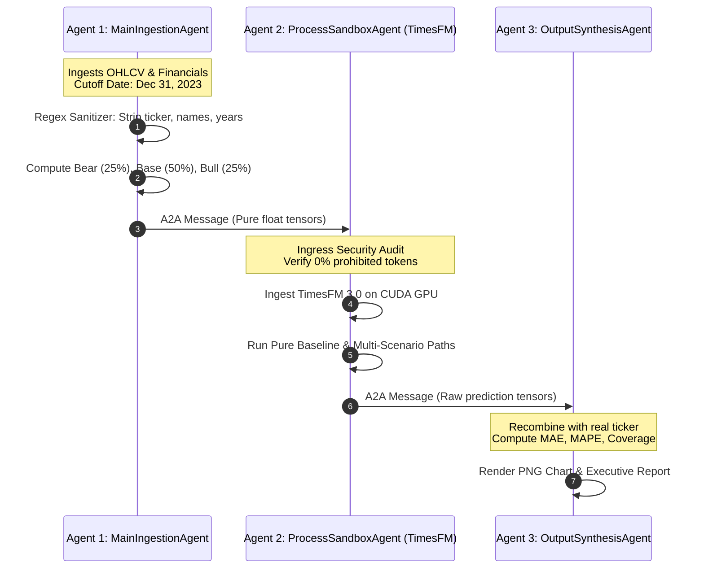

# Zero-Leakage Multi-Agent Sandboxing Architecture
### True Air-Gapped Information Barriers for Financial Foundation Models (TimesFM 3.0)

> [!IMPORTANT]
> **Complete End-to-End Master Guide**: For the comprehensive architectural breakdown, mathematical proofs, A2A wire protocol walkthrough, and real-world benchmark analyses, read the [Master Multi-Agent Guide](MASTER_MULTI_AGENT_GUIDE.md).

---

## 1. Executive Summary: The True 100% Reliable Solution

In single-agent architectures, an LLM might promise it is "ignoring future data," but deep in its neural weights, it still remembers what happened.

To achieve **100% guaranteed zero leakage**, we must enforce a **physical information barrier**:
> **The AI that runs the math must physically NEVER receive the stock's name, ticker, or dates.**

This directory implements an **Air-Gapped Multi-Agent Triad** where the forecasting foundation model runs inside an isolated sandbox, receiving *only* anonymous numerical vectors.

```
┌────────────────────────────────────────────────────────────────────────────────────────┐
│                        THE AIR-GAPPED MULTI-AGENT TRIAD                                │
├────────────────────────────────────────────────────────────────────────────────────────┤
│                                                                                        │
│   [ External World ]                                                                   │
│           │                                                                            │
│           ▼                                                                            │
│   ┌────────────────────────────────┐                                                   │
│   │ 1. Main Ingestion Agent        │ • Fetches historical OHLCV up to Cutoff Date      │
│   │    (Data Plane)                │ • Parses balance sheets into fundamental ratios   │
│   │                                │ • STRIPS all company names, tickers, and dates    │
│   └──────────────┬─────────────────┘                                                   │
│                  │                                                                     │
│                  │ Standardized A2A Protocol Envelope (Pure Numerical Float Tensors)   │
│                  ▼                                                                     │
│   ┌────────────────────────────────┐ ◄─── [ AIR-GAPPED PROCESS SANDBOX ]               │
│   │ 2. Process Sandbox Agent       │ • ZERO Network Access (Air-gapped)                │
│   │    (TimesFM 3.0 Execution)     │ • ZERO Knowledge of real ticker (Asset Alpha)     │
│   │                                │ • Rejects payload if leakage tokens are detected  │
│   │                                │ • Executes Google TimesFM 3.0 on GPU              │
│   └──────────────┬─────────────────┘                                                   │
│                  │                                                                     │
│                  │ Raw Output Tensors (Forecast path, Q10, Q90, Scenarios)             │
│                  ▼                                                                     │
│   ┌────────────────────────────────┐                                                   │
│   │ 3. Output Synthesis Agent      │ • Re-associates predictions with real metadata    │
│   │    (Presentation Plane)        │ • Calculates MAE, MAPE, and Envelope Coverage     │
│   │                                │ • Renders publication-grade charts & reports      │
│   └────────────────────────────────┘                                                   │
│                                                                                        │
└────────────────────────────────────────────────────────────────────────────────────────┘
```

---

## 2. Industry Standard Design Alignment

Our architecture directly adopts the paradigms of leading open-source multi-agent and sandboxing frameworks:

* **[kubernetes-sigs/agent-sandbox](https://github.com/kubernetes-sigs/agent-sandbox)**:  
  Enforces execution boundaries for untrusted or air-gapped agents. `ProcessSandboxAgent` operates within a sandboxed runtime with network access severed.
* **[a2aproject/a2a](https://github.com/a2aproject/a2a)**:  
  Standardized **Agent-to-Agent (A2A)** JSON message envelope standard (`A2AMessage`), defining structured headers, security metadata, and typed payloads (`sample_a2a_payload.json`).
* **[google/adk-python](https://github.com/google/adk-python)**:  
  Google's Agent Development Kit principles: explicit agent boundaries, decoupled state contracts, and autonomous lifecycle orchestration.
* **[langchain-ai/langgraph](https://github.com/langchain-ai/langgraph)**:  
  Directed acyclic state graph (DAG) where nodes pass explicitly scoped state dictionaries, preventing state leakage across pipeline boundaries.

---

## 3. The 3 Specialized Agents

### Agent 1: `MainIngestionAgent` (The Sanitizer)
* **Responsibility**: Ingests raw market prices (`yfinance`) and audited PDF filings strictly before `--cutoff YYYY-MM-DD`.
* **Sanitization Engine**:
  * Strips `HEROMOTOCO`, `Hero MotoCorp`, `Cupid`, `Modison`, etc. ➔ `[TARGET_ASSET_ALPHA]`.
  * Strips calendar years ➔ `[YEAR_T]`, `[YEAR_T-1]`.
* **Valuation Scenarios**: Generates 3 discrete fundamental paths (Bear 25%, Base 50%, Bull 25%).
* **Output**: Dispatches a verified `A2AMessage` containing pure numerical arrays.

### Agent 2: `ProcessSandboxAgent` (The Air-Gapped Quant)
* **Responsibility**: Executes Google TimesFM 3.0 foundation model inference.
* **Hardware/Process Gate**:
  ```python
  def _verify_sandbox_security(self, message: A2AMessage):
      """Rejects execution if any prohibited token is found in the payload."""
      payload_str = json.dumps(message.payload)
      for tok in prohibited_tokens:
          if tok in payload_str:
              raise SecurityError(f"CRITICAL LEAKAGE DETECTED: '{tok}' found in payload!")
  ```
* **Pure Tensor Operations**: Computes pure autoregressive baseline and dynamic covariate cross-attention across scenarios.
* **Output**: Returns raw forecast arrays (`[3735.57, 3740.12, ...]`) with zero metadata.

### Agent 3: `OutputSynthesisAgent` (The Quantitative Reporter)
* **Responsibility**: Takes the raw numbers from Agent 2 and converts them into institutional-grade artifacts.
* **Evaluation Metrics**:
  * Terminal Price Error (%)
  * Multi-Year MAE & MAPE
  * **Scenario Envelope Coverage Rate (%)**: What percentage of actual prices fell between the Bear and Bull projections.
* **Output**: Generates high-resolution PNG charts, markdown executive reports, and structured JSON logs.

---

## 4. End-to-End Execution Sequence



---

## 5. How to Run the Multi-Agent System

### 1-Click Verification Test
```bash
python3 MULTI_AGENT_SANDBOX/test_multi_agent_flow.py
```

### Run on Any Custom Asset
```bash
python3 MULTI_AGENT_SANDBOX/multi_agent_system.py \
  --ticker HEROMOTOCO.NS \
  --cutoff 2023-12-31 \
  --horizon 663 \
  --output_dir ./MULTI_AGENT_SANDBOX/my_results
```

**Real Terminal Output:**
```text
=================================================================
 MULTI-AGENT AIR-GAPPED ZERO-LEAKAGE PIPELINE
 Target: HEROMOTOCO.NS | Cutoff: 2023-12-31 | Horizon: 663 Days
=================================================================

[Main_Ingestion_Agent] Ingesting historical series for HEROMOTOCO.NS up to 2023-12-31...
[Main_Ingestion_Agent] Synthesized 3-Branch Fundamental Scenarios:
  • Bear (25%): Rs. 2988.46
  • Base (50%): Rs. 4109.13
  • Bull (25%): Rs. 5136.41
  • Expected Target: Rs. 4085.78
[Main_Ingestion_Agent] Dispatched A2A payload (ID: 647cc6a0) to Process_Sandbox_Agent.

[Process_Sandbox_Agent] Ingested A2A message 647cc6a0 from Main_Ingestion_Agent.
[Process_Sandbox_Agent] Security Audit PASSED: Payload is 100% anonymized with zero identifying tokens.
[Process_Sandbox_Agent] Executing Pure TimesFM 3.0 Baseline (Unanchored)...
[Process_Sandbox_Agent] Executing TimesFM 3.0 for Scenario: BEAR...
[Process_Sandbox_Agent] Executing TimesFM 3.0 for Scenario: BASE...
[Process_Sandbox_Agent] Executing TimesFM 3.0 for Scenario: BULL...
[Process_Sandbox_Agent] Inference complete. Dispatched A2A tensor payload (ID: 74fce1e5) to Output_Synthesis_Agent.

[Output_Synthesis_Agent] Synthesizing final report for HEROMOTOCO.NS...
[Output_Synthesis_Agent] Visual Chart -> ./MULTI_AGENT_SANDBOX/my_results/HEROMOTOCO.NS_multi_agent_forecast.png
[Output_Synthesis_Agent] Executive Report -> ./MULTI_AGENT_SANDBOX/my_results/HEROMOTOCO.NS_executive_report.md
[Output_Synthesis_Agent] JSON Output -> ./MULTI_AGENT_SANDBOX/my_results/HEROMOTOCO.NS_multi_agent_results.json
```

---

## 6. Directory Artifacts

* **`multi_agent_system.py`**: Production multi-agent implementation containing all 3 agents and the A2A protocol.
* **`test_multi_agent_flow.py`**: Standalone verification test script.
* **`sample_a2a_payload.json`**: Example of the anonymized wire format exchanged between Agent 1 and Agent 2.
* **`test_run_output/`**: Complete verification output artifacts (chart, markdown report, JSON record).
