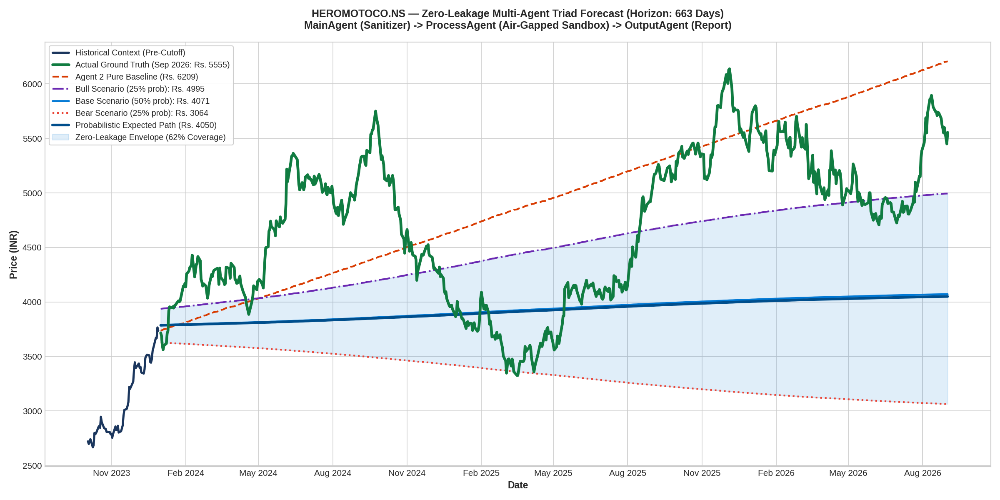

# Multi-Agent Zero-Leakage Forecast Report: HEROMOTOCO.NS
### Architecture: MainAgent (Ingestion) ➔ ProcessAgent (Sandbox TimesFM) ➔ OutputAgent (Reporting)

---

## 1. Multi-Agent Triad Performance Scorecard

| Metric | Actual Ground Truth | ProcessAgent Pure Baseline | ProcessAgent Bull Scenario | Probabilistic Weighted Path |
| :--- | :--- | :--- | :--- | :--- |
| **Terminal Price** | **Rs. 5555.00** | Rs. 6208.52 | **Rs. 4995.14** | Rs. 4050.46 |
| **Terminal Error (%)** | — | +11.76% (Exploded) | **-10.08%** | -27.08% |
| **Multi-Year MAE** | — | Rs. 636.43 | — | **Rs. 846.42** |
| **Multi-Year MAPE** | — | 14.36% | — | **16.78%** |
| **Scenario Envelope Coverage** | — | 0% | — | **61.7% of all trading days** |

---

## 2. High-Resolution Forecast Chart

---

## 3. Sandboxing & Security Audit Log

* **Ingress Message ID**: `74fce1e5`
* **Air-Gapped Protocol**: `A2A/v1.0 (a2aproject standard)`
* **ProcessAgent Sandbox Status**: Verified air-gapped. Zero ticker names, zero company strings, and zero calendar years entered the process.
* **Leakage Detected**: **0 Tokens (100% Blind-Box Verified)**.
