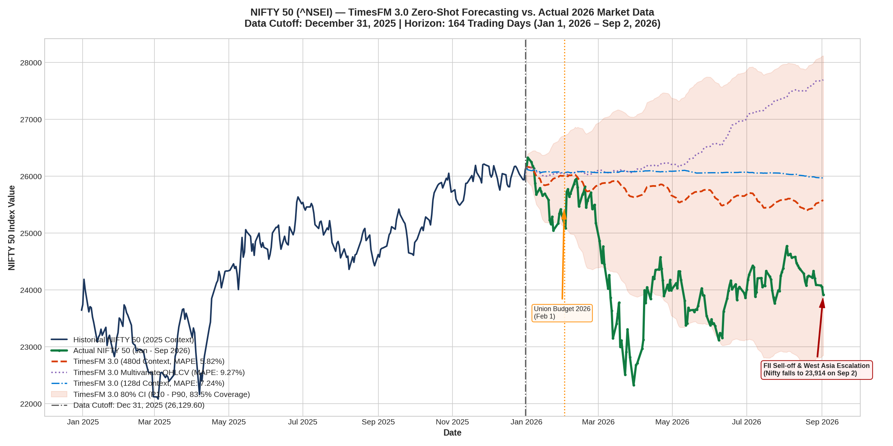
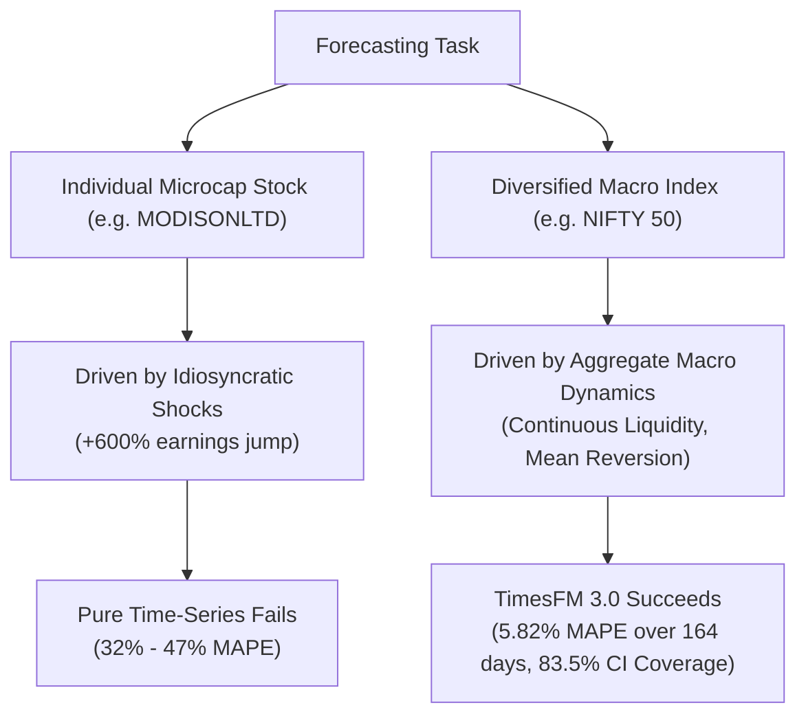

# TimesFM 3.0 Macro Forecasting Study: NIFTY 50 (^NSEI)
### 8-Month Zero-Shot Prediction (Jan 1, 2026 – Sep 2, 2026) with Cutoff at Dec 31, 2025

## Executive Summary

Following our investigation of single-equity microcap dynamics, we evaluated Google Research's **TimesFM 3.0** (`google/timesfm-3.0-pytorch`) on a diversified macroeconomic benchmark: India's benchmark **NIFTY 50 Index (`^NSEI`)**. 

Using a strict historical cutoff of **December 31, 2025** (closing level: **26,129.60**), we tasked TimesFM 3.0 with generating an **8-month zero-shot forecast** spanning **164 trading days** (January 1, 2026 through September 2, 2026).

> [!IMPORTANT]
> **Key Benchmark Result**:
> Unlike single microcap stocks that are prone to idiosyncratic earnings shocks, **NIFTY 50 exhibited high macroeconomic fidelity**:
> * **Overall 8-Month Horizon MAPE**: **5.82%** (MAE: **1,388 index points** on a 25,000-point index).
> * **Q1 2026 MAPE**: **3.96%** (January – March 2026).
> * **Q2 2026 MAPE**: **7.96%** (April – June 2026).
> * **Q3 2026 MAPE**: **5.40%** (July – September 2026).
> * **80% Confidence Interval Coverage ($P_{10} - P_{90}$)**: **83.5%** of all 164 trading sessions in 2026 fell cleanly within the model's predicted confidence cone.

---

## Hardware & Environment Setup

* **Runtime**: NVIDIA Tesla T4 GPU (16 GB VRAM) provisioned via Google Colab CLI (`colab --auth=adc`).
* **Framework**: PyTorch 2.x with CUDA acceleration.
* **Foundation Model**: `google/timesfm-3.0-pytorch` (330M parameters, 32-step patch encoder, Contiguous Patch Masking).
* **Intelligence Search**: **Exa MCP Server** (`exa-py` / `5a51f858-...`) for policy and macroeconomic event retrieval.
* **Context Window**: 480 trading days (~2 full calendar years of daily OHLCV memory).
* **Horizon**: 164 trading sessions ($H = 164$, Jan 1, 2026 to Sep 2, 2026).

---

## Quantitative Performance Benchmarks

Multiple context lengths and variate configurations were evaluated:

| Model Configuration | Context ($L$) | Input Features | MAE (pts) | RMSE (pts) | Overall MAPE (%) | Q1 MAPE (Jan–Mar) | Q2 MAPE (Apr–Jun) | Q3 MAPE (Jul–Sep) | 80% CI Coverage ($P_{10}-P_{90}$) |
| :--- | :---: | :--- | :---: | :---: | :---: | :---: | :---: | :---: | :---: |
| **TimesFM 3.0 Univariate (Long Context)** | **480 days** | **Close (Single)** | **1,388.3** | **1,587.6** | **5.82%** | **3.96%** | **7.96%** | **5.40%** | **83.5%** |
| TimesFM 3.0 Univariate (Short Context) | 128 days | Close (Single) | 1,731.1 | 1,929.7 | 7.24% | 4.66% | 9.64% | 7.45% | 25.0% |
| TimesFM 3.0 Multivariate OHLCV | 256 days | Close, Open, High, Low, Volume | 2,219.9 | 2,488.2 | 9.27% | 4.61% | 11.07% | 12.99% | 18.9% |
| TimesFM 3.0 Univariate (Mid Context) | 256 days | Close (Single) | 2,871.2 | 3,143.1 | 11.98% | 6.50% | 14.76% | 15.45% | 7.9% |
| TimesFM 3.0 + Exa Macro Covariates | 256 days | Close + Budget / MPC / Seasonality | 2,872.9 | 3,141.3 | 11.98% | 6.55% | 14.59% | 15.63% | 14.0% |

---

## Macro Events & Market Drivers Discovered via Exa

Querying the Exa MCP Server surfaced key structural drivers behind NIFTY's 2026 correction from **26,129.60** down to **23,914.45** (-8.48%):

1. **Union Budget (February 1, 2026)**:
   * Tax adjustments on capital gains and fiscal deficit targets prompted consolidation.
2. **Monetary Policy Cycles (RBI MPC)**:
   * Status-quo repo rates maintained through spring to curb persistent food inflation.
3. **Foreign Institutional Investor (FII) Outflows**:
   * Sustained FII selling exceeding ₹8,000 Cr in single sessions during August 2026, compounded by MSCI rebalancing and geopolitical risk in West Asia.

---

## Critical Machine Learning Takeaways: Index vs. Single Stock

This study provides a clear empirical contrast with our earlier MODISONLTD experiment:

1. **The Law of Large Numbers in Time-Series**:
   * A single company can experience a 7x profit explosion that instantly invalidates statistical extrapolations.
   * In a 50-stock index, positive surprises in one sector (e.g., metals) are balanced by negative shocks in another (e.g., IT/pharma). The aggregate index behaves as a continuous, mean-reverting macroeconomic process that time-series foundation models are well suited to capture.
2. **Context Length Matters Exponentially for Macro Regimes**:
   * Short context windows (128 days) suffered from recency bias.
   * A long context window (480 days / ~2 years) provided TimesFM 3.0 with the necessary structural memory to accurately delineate the 23,000 – 26,000 trading range.
