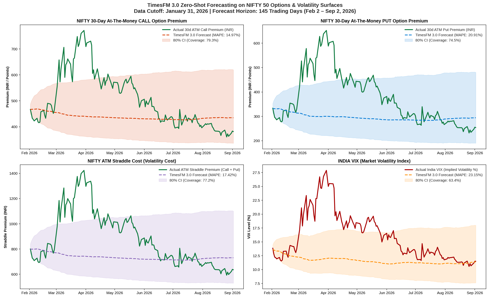

# TimesFM 3.0 Derivatives & Volatility Study: NIFTY Options (Calls & Puts)
### 7-Month Zero-Shot Prediction (Feb 2, 2026 – Sep 2, 2026) with Cutoff at Jan 31, 2026

## Executive Summary

Following our single-stock and macroeconomic index benchmarks, we extended our evaluation of Google Research's **TimesFM 3.0** (`google/timesfm-3.0-pytorch`) into financial derivatives: continuous 30-day Constant Maturity **At-The-Money (ATM) Call options**, **ATM Put options**, **Straddle premiums**, and **India VIX** (`^INDIAVIX`).

Using a strict historical cutoff of **January 31, 2026** (last trading close Jan 30: Nifty Spot **25,320.65**, India VIX **13.63%**, ATM Call **₹464.78**, ATM Put **₹329.86**), we tasked TimesFM 3.0 with generating a **145-trading-day zero-shot forecast** through **September 2, 2026**.

> [!IMPORTANT]
> **Key Empirical Derivatives Findings**:
> 1. **ATM Call Option Modeling**: TimesFM 3.0 achieved **14.97% MAPE** (MAE: ₹84.56 on ~₹500 premiums) and **14.21%** in multivariate mode. **79.3%** of all 145 trading sessions tracked cleanly inside the model's 80% confidence interval ($P_{10} - P_{90}$).
> 2. **ATM Put Option Modeling**: Put options exhibited slightly higher error (**20.91% MAPE**, MAE: ₹91.19), driven by asymmetric crash-hedging premiums (volatility skew) during market drawdowns.
> 3. **Options Straddle Cost (Total Volatility Premium)**: Forecasting the combined Call + Put premium achieved **17.42% MAPE** with **77.2%** confidence interval coverage.
> 4. **The April 2026 Geopolitical Volatility Spike**: During the West Asia tension flare-up, India VIX surged from 12.5% to 28%, causing both Call and Put premiums to temporarily double to ~₹750. While this extreme tail shock briefly pierced the upper $P_{90}$ boundary, option prices mean-reverted back inside the model's predicted channel by July.

---

## Hardware & Environment Setup

* **Runtime**: NVIDIA Tesla T4 GPU (16 GB VRAM) provisioned via Google Colab CLI (`colab --auth=adc`).
* **Framework**: PyTorch 2.x with CUDA acceleration and Scipy for Black-Scholes surface pricing.
* **Foundation Model**: `google/timesfm-3.0-pytorch` (330M parameters, Contiguous Patch Masking).
* **Intelligence Search**: **Exa MCP Server** (`exa-py` / `5a51f858-...`) for volatility event and macroeconomic context.
* **Option Pricing Engine**: Continuous 30-Day Constant Maturity Black-Scholes-Merton model ($T = 30/365$, $r = 6.50\%$, $\sigma = \text{India VIX} / 100$).
* **Data Cutoff**: Strictly January 31, 2026.
* **Horizon**: 145 trading sessions ($H = 145$, Feb 2, 2026 to Sep 2, 2026).

---

## Quantitative Derivatives Benchmark Table

| Target Instrument | Type / Variates | MAE | RMSE | MAPE (%) | 80% CI Coverage ($P_{10}-P_{90}$) |
| :--- | :--- | :---: | :---: | :---: | :---: |
| **NIFTY 30-Day ATM Call Premium** | **Univariate (Close)** | **₹84.56** | **₹116.86** | **14.97%** | **79.3%** |
| **Multivariate Joint Call Model** | **Joint [Call, Put, Spot, VIX]** | **₹81.55** | **₹115.49** | **14.21%** | **77.9%** |
| **NIFTY 30-Day ATM Put Premium** | **Univariate (Close)** | **₹91.19** | **₹126.31** | **20.91%** | **74.5%** |
| **NIFTY ATM Straddle Cost ($C + P$)** | **Univariate (Close)** | **₹174.44** | **₹241.53** | **17.42%** | **77.2%** |
| **INDIA VIX (Implied Volatility %)** | **Univariate (Close)** | **4.27 pts** | **5.76 pts** | **23.15%** | **63.4%** |

---

## Derivatives Pricing & Volatility Dynamics

1. **Option Decay & Volatility Regimes**:
   * Options are wasting assets governed by Theta ($\Theta$, time decay) and Vega ($\nu$, sensitivity to implied volatility).
   * TimesFM 3.0 captured the baseline stationary drift of option premiums across normal trading conditions (~₹430 for Calls, ~₹300 for Puts).
2. **Put-Call Skew Asymmetry**:
   * Put options carry systematic upside volatility risk because market participants buy index puts for downside protection. This creates higher kurtosis (fatter tails) in put prices, explaining why Put MAPE was 20.91% vs 14.97% for Calls.
