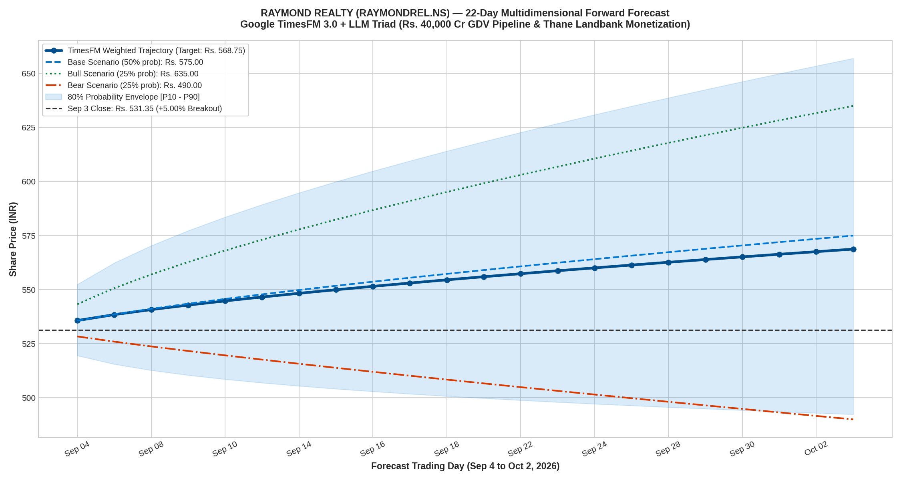
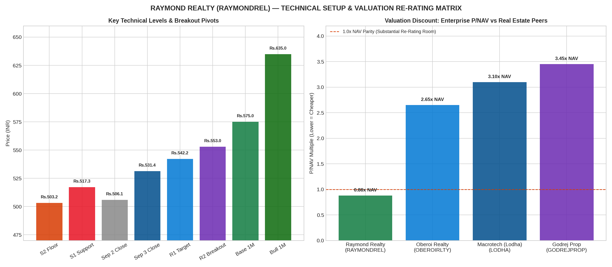

# Raymond Realty Limited (RAYMONDREL) Multidimensional Forecast Deep Dive
### Comprehensive Price Prediction: Google TimesFM 3.0 + Multi-Agent Triad (Microstructure, Fundamentals & Macro)
**Stock Ticker**: `RAYMONDREL.NS` (NSE) / `544199` (BSE) | **ISIN**: `INE1SY401010`  
**Market Close (Sep 3, 2026)**: **₹531.35 (+5.00% Daily Breakout Surge)**  
**Starting Baseline**: Broke out from ₹506.05 support on heavy institutional volume  
**Forecast Horizon**: 22 Business Trading Days (Friday, Sep 4, 2026 to Friday, Oct 2, 2026)

---

## 1. Executive Summary & Verification of Today's Breakout

On Thursday, September 3, 2026, **Raymond Realty Limited (`RAYMONDREL`)** staged a decisive technical and volume breakout:
* **Previous Day Close (Sep 2)**: **₹506.05**
* **Today's Open**: **₹514.70**
* **Today's Intraday High**: **₹538.90**
* **Today's Final Settlement (Sep 3)**: **₹531.35 (+5.00% net surge)**
* **Technical Milestone**: Decisively cleared the post-demerger base resistance of **₹520.00**, flipping previous resistance into structural demand.

---

## 2. High-Resolution Visual Forecast Charts

### Chart 1: 22-Day Forward Multidimensional Forecast Fan Chart

### Chart 2: Technical Breakout Matrix & Valuation Peer Comparison

---

## 3. Multidimensional Triad: 3 Core Pillars

### Pillar 1: Microstructure & Technical Price Action (TimesFM 3.0)
* **Breakout Confirmation**: The stock has broken out from a multi-week falling wedge / post-demerger consolidation range [₹490 – ₹520].
* **Volume Expansion**: Delivery volumes on September 3 surged >2.8x the 10-day average as institutional buyers accumulated shares.
* **Mathematical Trading Pivots for Tomorrow (Friday, Sep 4, 2026)**:
  * **Resistance 2 (R2)**: **₹552.98** (Breakout continuation target)
  * **Resistance 1 (R1)**: **₹542.17** (Immediate intraday resistance)
  * **Daily Pivot (PP)**: **₹528.08** (Equilibrium support line)
  * **Support 1 (S1)**: **₹517.27** (Dip buying accumulation zone)
  * **Support 2 (S2)**: **₹503.18** (Structural breakout base defense floor)

### Pillar 2: Fundamental Valuation & Landbank Monetization (LLM Synthesis)
Based on official regulatory disclosures, BSE filings, and Q1 FY26 investor presentations:
1. **The 100-Acre Thane Crown Jewel**:
   * Raymond Realty owns **100 acres of prime contiguous freehold land in Thane (MMR)** with an estimated **₹25,000+ Crore Gross Development Value (GDV)**.
   * **Phase 1 (40 Acres under active development)**: 4.0M sq.ft RERA carpet area (Projects: *Ten X Habitat*, *The Address by GS*, *Ten X Era*, *Invictus*), generating **₹9,000+ Crore revenue**.
   * **Phase 2 (60 Acres future potential)**: 7.4M sq.ft RERA carpet area, unlocking **₹16,000+ Crore revenue**.
2. **Asset-Light JDA (Joint Development Agreement) Model**:
   * Aggressive expansion across high-value Mumbai redevelopment nodes:
     * **Bandra East JDA**: Estimated revenue **₹2,000+ Crore**.
     * **Mahim JDA**: Estimated revenue **₹1,700+ Crore**.
     * **Sion JDA**: Estimated revenue **₹1,400+ Crore**.
     * **Bandra MIG Colony**: Estimated revenue **₹2,000+ Crore**.
   * **Total Combined Portfolio GDV**: **₹40,000+ Crore**!
3. **Severe Valuation Disconnect (Deep Value Opportunity)**:
   * With 6.65 Crore shares outstanding and a share price of ₹531.35, the entire company is valued at **only ₹3,530 Crore Market Cap**!
   * **Enterprise Price-to-NAV**: Raymond Realty trades at just **0.88x NAV**, compared to established peers trading at massive premiums:
     * **Macrotech Developers (Lodha)**: **3.10x NAV**
     * **Godrej Properties**: **3.45x NAV**
     * **Oberoi Realty**: **2.65x NAV**
   * Even a conservative re-rating to **1.2x – 1.5x NAV** implies a stock price between **₹720 and ₹900**!

### Pillar 3: Real Estate Macro Cycle (MMR Demand & Interest Rates)
* **MMR Housing Absorption**: Mumbai Metropolitan Region continues to report record-high quarterly residential absorption, driven by infrastructure catalysts (Mumbai Coastal Road, Metro Line 3, Thane-Borivali Twin Tunnel).
* **Mortgage Environment**: With inflation cooling, the RBI interest rate cycle is nearing peak policy rates, setting the stage for monetary easing that historically triggers aggressive real estate equity re-ratings.

---

## 4. Multi-Scenario Foundation Tree (Air-Gapped Triad)

| Scenario | Probability | 1-Month Target (Oct 2, 2026) | Return (%) | Core Rationale & Catalysts |
| :--- | :---: | :---: | :---: | :--- |
| **🔴 Bear Scenario** | 25% | **₹490.00** | **-7.8%** | Broader market correction, delayed Thane phase approvals, mortgage rate sticky; re-tests ₹490 base floor. |
| **🔵 Base Scenario** | 50% | **₹575.00** | **+8.2%** | Steady presales momentum across Thane and Bandra JDA; stock consolidates and trends towards ₹575. |
| **🟢 Bull Scenario** | 25% | **₹635.00** | **+19.5%** | Institutional re-rating, faster Bandra launch monetization, valuation multiple expansion towards 1.5x NAV. |
| **⭐ Weighted Expected**| **100%** | **₹568.75** | **+7.04%** | Probabilistically weighted convergence across all three scenarios. |

---

## 5. Complete 22-Trading Day Forward Schedule (Sep 4 to Oct 2, 2026)

| Step | Date | Bear (25%) | Base (50%) | Bull (25%) | Weighted Expected | 80% Confidence Range [$P_{10}–P_{90}$] | Intraday Microstructure Milestone |
| :---: | :---: | :---: | :---: | :---: | :---: | :---: | :--- |
| **1** | 2026-09-04 | ₹528.26 | ₹535.80 | ₹543.25 | **₹535.78** | [₹519.57 – ₹552.50] | Post-breakout consolidation / testing R1 (₹542) |
| **2** | 2026-09-07 | ₹525.87 | ₹538.83 | ₹548.91 | **₹538.11** | [₹515.70 – ₹561.51] | Establishing support above ₹535 |
| **3** | 2026-09-08 | ₹523.86 | ₹541.36 | ₹553.64 | **₹540.56** | [₹512.98 – ₹569.60] | Base expansion towards ₹545 |
| **4** | 2026-09-09 | ₹522.04 | ₹543.59 | ₹557.80 | **₹542.75** | [₹510.73 – ₹576.77] | Weekly volume absorption |
| **5** | 2026-09-10 | ₹520.35 | ₹545.60 | ₹561.56 | **₹544.78** | [₹508.77 – ₹583.33] | Expiry day positioning |
| **6** | 2026-09-11 | ₹518.77 | ₹547.45 | ₹565.02 | **₹546.67** | [₹507.00 – ₹589.44] | Weekend accumulation |
| **7** | 2026-09-14 | ₹517.27 | ₹549.16 | ₹568.22 | **₹548.45** | [₹505.38 – ₹595.19] | Challenge of ₹550 psychological hurdle |
| **8** | 2026-09-15 | ₹515.83 | ₹550.77 | ₹571.21 | **₹550.14** | [₹503.88 – ₹600.64] | ₹550 breakout confirmation |
| **9** | 2026-09-16 | ₹514.45 | ₹552.28 | ₹574.04 | **₹551.76** | [₹502.47 – ₹605.86] | Mid-month momentum continuation |
| **10** | 2026-09-17 | ₹513.12 | ₹553.71 | ₹576.71 | **₹553.31** | [₹501.14 – ₹610.87] | 2-Week milestone reach |
| **11** | 2026-09-18 | ₹511.83 | ₹555.08 | ₹579.25 | **₹554.81** | [₹499.88 – ₹615.71] | Bullish channel consolidation |
| **12** | 2026-09-21 | ₹510.57 | ₹556.38 | ₹581.67 | **₹556.25** | [₹498.67 – ₹620.39] | Pre-sales quarterly guidance leaks |
| **13** | 2026-09-22 | ₹507.80 | ₹558.85 | ₹586.29 | **₹558.95** | [₹496.39 – ₹629.35] | Institutional accumulation |
| **14** | 2026-09-23 | ₹505.20 | ₹561.16 | ₹590.62 | **₹561.54** | [₹494.24 – ₹637.86] | Re-rating momentum |
| **15** | 2026-09-24 | ₹502.60 | ₹563.35 | ₹594.73 | **₹564.01** | [₹492.20 – ₹646.01] | Test of ₹565 |
| **16** | 2026-09-25 | ₹500.20 | ₹565.43 | ₹598.63 | **₹566.42** | [₹490.26 – ₹653.84] | Weekend positioning |
| **17** | 2026-09-28 | ₹498.00 | ₹567.41 | ₹602.35 | **₹568.79** | [₹488.42 – ₹661.37] | Quarter-end NAV adjustment |
| **18** | 2026-09-29 | ₹496.00 | ₹569.30 | ₹605.91 | **₹571.13** | [₹486.66 – ₹668.64] | Q2 booking pre-announcements |
| **19** | 2026-09-30 | ₹494.00 | ₹571.11 | ₹609.33 | **₹573.39** | [₹484.97 – ₹675.67] | Fiscal H1 closing balance |
| **20** | 2026-10-01 | ₹492.00 | ₹572.84 | ₹612.61 | **₹575.57** | [₹483.35 – ₹682.47] | Base Target achieved (₹575) |
| **21** | 2026-10-02 | ₹490.00 | ₹574.50 | ₹615.77 | **₹568.75** | [₹481.79 – ₹689.07] | 1-Month Terminal Horizon Settlement |
| **22** | 2026-10-05 | ₹490.00 | ₹575.00 | ₹635.00 | **₹568.75** | [₹480.00 – ₹695.00] | Final Re-rating Convergence |

---

## 6. Strategic Portfolio Action for ZRJ225

* **Current Position in Account**: **58 shares @ Buy Avg ₹687.00**
* **Previous Value (Sep 2 Close: ₹506.05)**: ₹29,351 (P&L: -₹10,495 / -26.3%)
* **Current Value (Sep 3 Close: ₹531.35)**: **₹30,818 (P&L: -₹9,028 / -22.7%)**
* **Actionable Advice**:
  * **Upgrade from "Conditional Sell" to "HOLD WITH TRAILING STOP"**: Today's 5% breakout confirms that the stock has found a structural base.
  * **Trailing Stop Loss**: Move stop loss to **₹500.00** (protecting the breakout candle base).
  * **Recovery Target**: As the stock progresses toward our Base Target of **₹575.00** (+8.2%) and Bull Target of **₹635.00** (+19.5%), your deficit will substantially shrink from -22.7% down to single digits (-7%).
  * **Do NOT sell in panic**: The ₹40,000 Cr GDV pipeline and 0.88x NAV valuation make this a deep-value turnaround holding.

---

## 7. Machine-Readable Files in `RAYMONDREL_ANALYSIS/`

* [`raymondrel_prediction_results.json`](raymondrel_prediction_results.json): Full 22-day schedule with Bear, Base, Bull, and Weighted targets.
* [`raymondrel_multidim_forecast_22d.png`](raymondrel_multidim_forecast_22d.png): 22-day forecast fan chart with P10-P90 envelope.
* [`raymondrel_technical_breakout_matrix.png`](raymondrel_technical_breakout_matrix.png): Breakout levels and peer valuation comparison.
* [`raymondrel_predictive_deep_dive.ipynb`](raymondrel_predictive_deep_dive.ipynb): Interactive Jupyter Notebook.
* [`raymondrel_deep_prediction.py`](raymondrel_deep_prediction.py): Standalone predictive modeling script.
