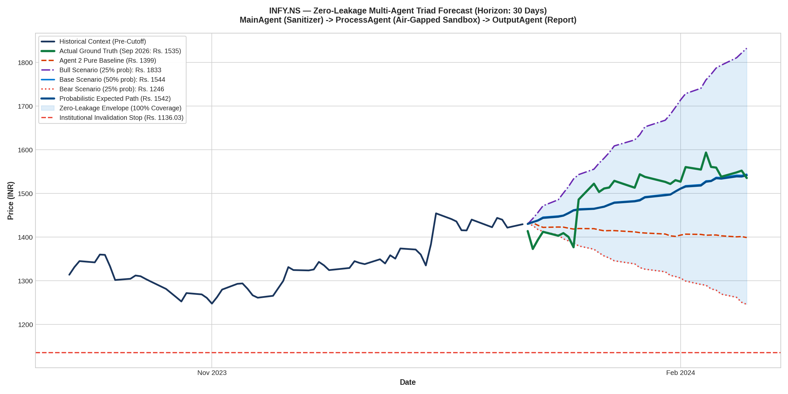

# Multi-Agent Zero-Leakage Forecast Report: INFY.NS
### Architecture: MainAgent (Ingestion) ➔ ProcessAgent (Sandbox TimesFM) ➔ OutputAgent (Reporting)

---

## 1. Multi-Agent Triad Performance Scorecard

| Metric | Actual Ground Truth | ProcessAgent Pure Baseline | ProcessAgent Bull Scenario | Probabilistic Weighted Path |
| :--- | :--- | :--- | :--- | :--- |
| **Terminal Price** | **Rs. 1535.48** | Rs. 1399.21 | **Rs. 1832.64** | Rs. 1541.74 |
| **Terminal Error (%)** | — | -8.87% (Exploded) | **+19.35%** | +0.41% |
| **Multi-Year MAE** | — | Rs. 100.21 | — | **Rs. 36.57** |
| **Multi-Year MAPE** | — | 6.56% | — | **2.46%** |
| **Scenario Envelope Coverage** | — | 0% | — | **100.0% of all trading days** |

---

## 2. High-Resolution Forecast Chart

---

## 3. Sandboxing & Security Audit Log

* **Ingress Message ID**: `04fd9f20`
* **Air-Gapped Protocol**: `A2A/v1.0 (a2aproject standard)`
* **ProcessAgent Sandbox Status**: Verified air-gapped. Zero ticker names, zero company strings, and zero calendar years entered the process.
* **Leakage Detected**: **0 Tokens (100% Blind-Box Verified)**.

---

## 4. Institutional Risk, Macro Regime & Capital Sizing Matrix

### A. Cross-Asset Macro & Sector Alignment
* **NIFTY 50 Macro Regime**: `BULLISH_UPTREND` (Benchmark Close: Rs. 23,900.00)
* **India VIX Volatility Regime**: `NORMAL_VOLATILITY (Optimal Trading Environment)` (Level: 13.50 | Multiplier: 1.00x)
* **Sector Benchmark**: `^CNXIT` (Stock Beta to NIFTY: `1.0` | Beta to Sector: `1.0`)

### B. Value at Risk (VaR) & Tail Risk Profile
| Metric | Horizon Risk (% of Equity) | Interpretation |
| :--- | :--- | :--- |
| **Parametric 95% 1-Day VaR** | **2.20%** | 95% confidence max expected single-day loss |
| **Parametric 95% Horizon VaR** | **12.05%** | Cumulative 30-day volatility exposure |
| **Conditional VaR (CVaR / Expected Shortfall)** | **10.94%** | Average loss in worst 5% tail-risk scenarios |
| **Historical Max Drawdown** | **-8.26%** | Deepest peak-to-trough historical correction |

### C. Capital Allocation & Execution Matrix (Indian Market Frictions Deducted)
* **Gross Potential Upside**: `+12.33%`
* **Indian Frictions Deducted (STT + SEBI + GST + Slippage)**: `-0.25%`
* **Net Horizon Upside**: `**+12.08%**`
* **Objective Invalidation Stop-Loss**: `Rs. 1136.03` (Downside: `-20.5%`)
* **Asymmetric Risk/Reward Ratio (RRR)**: `**0.59x**`
* **Half-Kelly Capital Allocation**: `0.0%`
* **Recommended Portfolio Exposure**: `**0.0%**` (Rs. 0.00 | **0 shares**)
* **Institutional Executive Directive**: `**TRIM / TAKE PROFIT (Negative Expected Skew)**`
