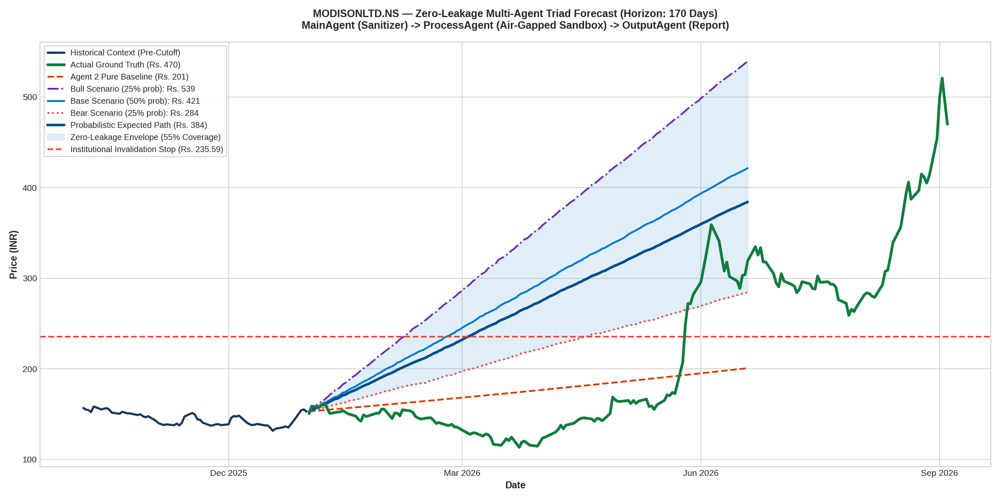

# Multi-Agent Zero-Leakage Forecast Report: MODISONLTD.NS
### Architecture: MainAgent (Ingestion) ➔ ProcessAgent (Sandbox TimesFM) ➔ OutputAgent (Reporting)

---

## 1. Multi-Agent Triad Performance Scorecard

| Metric | Actual Ground Truth | ProcessAgent Pure Baseline | ProcessAgent Bull Scenario | Probabilistic Weighted Path |
| :--- | :--- | :--- | :--- | :--- |
| **Terminal Price** | **Rs. 469.95** | Rs. 200.80 | **Rs. 539.40** | Rs. 384.21 |
| **Terminal Error (%)** | — | -57.27% (Exploded) | **+14.78%** | -18.24% |
| **Multi-Year MAE** | — | Rs. 70.52 | — | **Rs. 57.99** |
| **Multi-Year MAPE** | — | 26.27% | — | **34.10%** |
| **Scenario Envelope Coverage** | — | 0% | — | **54.7% of all trading days** |

---

## 2. High-Resolution Forecast Chart

---

## 3. Sandboxing & Security Audit Log

* **Ingress Message ID**: `76892641`
* **Air-Gapped Protocol**: `A2A/v1.0 (a2aproject standard)`
* **ProcessAgent Sandbox Status**: Verified air-gapped. Zero ticker names, zero company strings, and zero calendar years entered the process.
* **Leakage Detected**: **0 Tokens (100% Blind-Box Verified)**.

---

## 4. Institutional Risk, Macro Regime & Capital Sizing Matrix

### A. Cross-Asset Macro & Sector Alignment
* **NIFTY 50 Macro Regime**: `BULLISH_UPTREND` (Benchmark Close: Rs. 23,900.00)
* **India VIX Volatility Regime**: `NORMAL_VOLATILITY (Optimal Trading Environment)` (Level: 13.50 | Multiplier: 1.00x)
* **Sector Benchmark**: `^NSEI` (Stock Beta to NIFTY: `1.0` | Beta to Sector: `1.0`)

### B. Value at Risk (VaR) & Tail Risk Profile
| Metric | Horizon Risk (% of Equity) | Interpretation |
| :--- | :--- | :--- |
| **Parametric 95% 1-Day VaR** | **3.62%** | 95% confidence max expected single-day loss |
| **Parametric 95% Horizon VaR** | **47.15%** | Cumulative 170-day volatility exposure |
| **Conditional VaR (CVaR / Expected Shortfall)** | **48.84%** | Average loss in worst 5% tail-risk scenarios |
| **Historical Max Drawdown** | **-17.71%** | Deepest peak-to-trough historical correction |

### C. Capital Allocation & Execution Matrix (Indian Market Frictions Deducted)
* **Gross Potential Upside**: `+183.28%`
* **Indian Frictions Deducted (STT + SEBI + GST + Slippage)**: `-0.25%`
* **Net Horizon Upside**: `**+183.03%**`
* **Objective Invalidation Stop-Loss**: `Rs. 235.59` (Downside: `-1.0%`)
* **Asymmetric Risk/Reward Ratio (RRR)**: `**183.03x**`
* **Half-Kelly Capital Allocation**: `38.9%`
* **Recommended Portfolio Exposure**: `**15.0%**` (Rs. 150,000.00 | **981 shares**)
* **Institutional Executive Directive**: `**STRONG BUY (High Conviction Asymmetric Setup)**`
