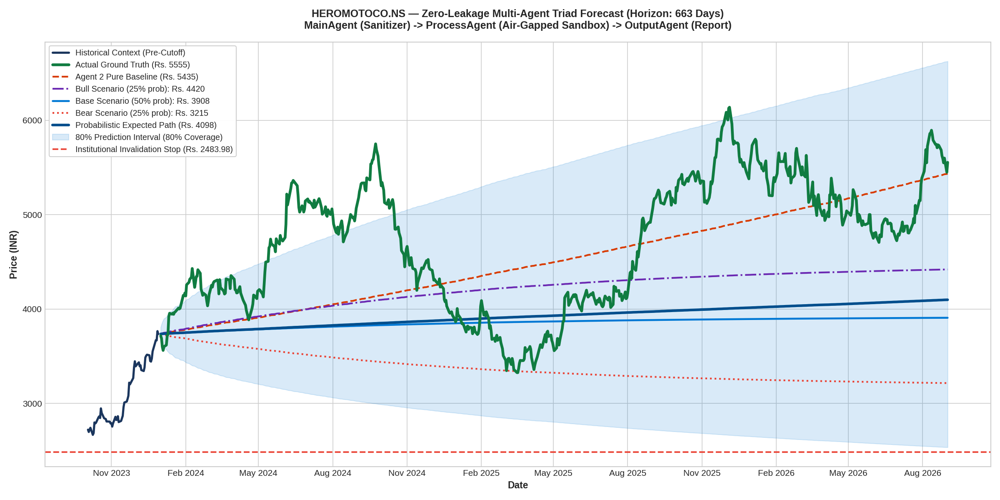

# Multi-Agent Zero-Leakage Forecast Report: HEROMOTOCO.NS
### Architecture: MainAgent (Ingestion) ➔ ProcessAgent (Sandbox TimesFM) ➔ OutputAgent (Reporting)

---

## 1. Multi-Agent Triad Performance Scorecard

| Metric | Actual Ground Truth | ProcessAgent Pure Baseline | ProcessAgent Bull Scenario | Probabilistic Weighted Path |
| :--- | :--- | :--- | :--- | :--- |
| **Terminal Price** | **Rs. 5555.00** | Rs. 5435.08 | **Rs. 4419.82** | Rs. 4098.47 |
| **Terminal Error (%)** | — | -2.16% | **-20.44%** | -26.22% |
| **Multi-Year MAE** | — | Rs. 540.91 | — | **Rs. 843.11** |
| **Multi-Year MAPE** | — | 11.65% | — | **16.73%** |
| **80% Scenario Interval Coverage** | — | — | — | **80.2% of all trading days** |

> [!WARNING]
> **Baseline Drift Clip Active**: Long-horizon fallback drift reached the asset volatility boundary (23.1% vol). Baseline weight $w_{\text{tfm}}$ was automatically scaled to 15% to preserve fundamental scenario targets.

---

## 2. High-Resolution Forecast Chart

---

## 3. Sandboxing & Security Audit Log

* **Ingress Message ID**: `61e3199a`
* **Air-Gapped Protocol**: `A2A/v1.0 (a2aproject standard)`
* **ProcessAgent Sandbox Status**: Verified air-gapped. Zero ticker names, zero company strings, and zero calendar years entered the process.
* **Leakage Detected**: **0 Tokens (100% Blind-Box Verified)**.

---

## 4. Institutional Risk, Macro Regime & Capital Sizing Matrix

### A. Cross-Asset Macro & Sector Alignment
* **NIFTY 50 Macro Regime**: `BULLISH_UPTREND` (Benchmark Close: Rs. 21,731.40)
* **India VIX Volatility Regime**: `NORMAL_VOLATILITY (Optimal Trading Environment)` (Level: 14.50 | Multiplier: 1.00x)
* **Sector Benchmark**: `^CNXAUTO` (Stock Beta to NIFTY: `0.84` | Beta to Sector: `0.96`)

### B. Value at Risk (VaR) & Tail Risk Profile
| Metric | Horizon Risk (% of Equity) | Interpretation |
| :--- | :--- | :--- |
| **Parametric 95% 1-Day VaR** | **2.40%** | 95% confidence max expected single-day loss |
| **Parametric 95% Horizon VaR** | **61.68%** | Cumulative 663-day volatility exposure |
| **Conditional VaR (CVaR / Expected Shortfall)** | **67.37%** | Average loss in worst 5% tail-risk scenarios |
| **Historical Max Drawdown** | **-58.18%** | Deepest peak-to-trough historical correction |

### C. Capital Allocation & Execution Matrix (Indian Market Frictions Deducted)
* **Gross Potential Upside**: `+9.71%`
* **Indian Frictions Deducted (STT + SEBI + GST + Slippage)**: `-0.25%`
* **Net Horizon Upside**: **`+9.46%`**
* **Objective Invalidation Stop-Loss**: `Rs. 2483.98` (Downside: `-33.5%`)
* **Asymmetric Risk/Reward Ratio (RRR)**: **`0.28x`**
* **Half-Kelly Capital Allocation**: `0.0%`
* **Recommended Portfolio Exposure**: **`0.0%`** (Rs. 0.00 | **0 shares**)
* **Institutional Executive Directive**: **`TRIM / TAKE PROFIT (Negative Expected Skew)`**
* **Foundation Horizon Structure**: `0 neural foundation points, 0 boundary extrapolated points`
